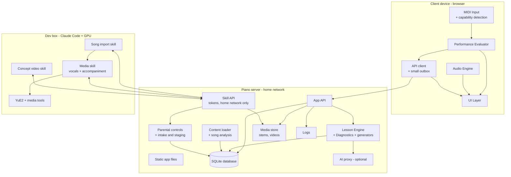
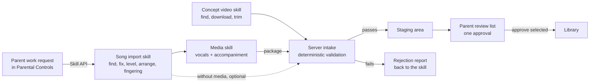

# Family Piano Tutor — Architecture v0.16

Sep 24, 2026 · @Someone

**What changed in v0.16** (from the feasibility tests, `feasibility/RESULTS.md`): the piano site is served at the server's fixed IP address with the server's own certificate authority, because the router cannot hold local DNS names and no public issuer certifies an `.internal` name (2.5). On the iPad A16, MIDIWeb Browser trusts that certificate authority and offers Web MIDI, and saved data, Wake Lock, audio, speech, video and 60 fps staff scrolling all passed. **MIDI itself is untested:** the Jikada JK-825 has no MIDI, so a new keyboard is needed (2.3). MIDIWeb Browser's full-screen mode is lost when the app relaunches, and a page cannot turn it on, but the page can detect it and show a reminder (2.2). In full-screen mode the top of the screen ignores taps, so the top strip of every screen shows status only (3). The YuE2 media spike was run with generally positive results (12).

**What changed in v0.15** (from the v0.14 review): the skill map is a **branching map** (prerequisites create forks and joins), not a single line, so several skills can be in progress at once. A skill passes at 3 stars; **Guided sessions may use pieces that need one Current skill beyond the passed skills**, while Free Play and the library unlock only from passed skills (6.8, 8.1). **Stacked practice aids are for practice and do not pass a skill**; only whole-item attempts pass (7.5). A student who has trouble gets gentle **"Try it another way"** options after 3 tries, and a **stuck** skill gets more support practice in the session, never a "failed" message and never a free pass (8.1). **Rhythm skills also need timing stars to pass.** There is no minimum practice to pass and no daily cap on new skills. **Mastery is a stored running value** updated after every attempt, with the best-so-far kept (8.2). Handling of content changes behind a student's progress moves to future enhancements (section 14).

**What changed in v0.14:** the dev box (Claude Code, the three skills, and YuE2) reaches the piano server only through a new Skill API, and parents queue content requests in Parental Controls; the server runs no Claude or GPU work. Tempo uses four presets (50%, 75%, 90%, 100%). Practice now centres on normal play-along with a smooth automatic rewind (section 3, "Play and smooth rewind"); wait mode becomes an optional aid built later, with no vocals or accompaniment.

**What changed in v0.13** (from the v0.12 review): all data now lives in one server database on the home network, so any device a child signs into picks up their progress; the Lesson Engine moves to the server; the performance evaluator is fully specified, including a practice-aid factor so 5 stars are only possible at full conditions; songs unlock by their place on the skill map; song media (vocals, accompaniment) and concept videos are produced by Claude skills before the parent's single approval; a parent mode (PIN login/logout) replaces a separate preview page; new sections cover security, backup, logging and testing; Bluetooth MIDI, headphones, placement and notifications move to a future enhancements list. See section 15 for the full decisions log.

## 1. Purpose and goals

A private, family-only piano tutor for kids that teaches like Simply Piano but plays only parent-approved songs. It runs in a browser on the home network, listens to a digital piano over MIDI, and adapts each practice session to the student.

**Goals**

- Interactive lessons with real-time right/wrong feedback from the MIDI keyboard.
- A proven learning sequence, adapted from an established piano method, stored as a skill map.
- Flexible progression: pass with good-enough accuracy, and automatically revisit weak spots.
- Every session mixes review with new material.
- A curated song library the parent controls; students choose only from approved songs.
- Progress tracking a parent can read: history, rate of progress, strengths, weaknesses.
- Scoring that encourages enjoyment and the pursuit of excellence without demanding perfection, based on an objective standard so parents do not need to be piano experts.
- An optional AI advisor, only where it proves useful (section 9).

**Non-goals (v1)**

- Microphone or acoustic-piano listening.
- Selling or publishing the app; multi-family accounts; access from outside the home network.
- Flashy game graphics or animation-heavy rewards.
- Bluetooth MIDI and headphone use (see future enhancements, section 14).

**Guiding principles**

- The app decides right and wrong from MIDI data; AI only advises.
- **Home-network only:** the app needs the family's piano server on the local network, but never the internet. Practice, progress and parental controls work with the internet down. Only the Claude skills (run by the parent) and the optional AI advisor need internet.
- **One source of truth:** app files, the database, the song library and media all live on the piano server. Any qualified device works for any child. The server is purely a server: Claude skills and GPU work run on the dev box.
- Nothing reaches the student that the parent has not approved. Content the app generates by fixed rules from approved material (drills, sight-reading pieces, fingering) counts as approved, because the parent approved the rules and the material it is built from.
- Hardware- and host-independent: the app runs on any device and server that meet the requirements in section 2. The family's current setup is configuration, not code.
- Missing optional hardware (for example a sustain pedal) turns off the features that need it; it never breaks practice.
- Build in small, testable chunks; each milestone produces something a child can use.

## 2. Platform and deployment requirements

The app is a web client plus a small server on the home network. The server holds the app files, the database, the song library and media. The family's current hardware is recorded separately in 2.7 and can change without code changes.

### 2.1 Client device requirements

- **Browser features:** Web MIDI, Web Audio and Screen Wake Lock, on a page served over HTTPS; storage that survives an app relaunch.
- **Network:** Wi-Fi access to the piano server on the home network. No internet needed.
- **Screen:** about 10 inches or larger, landscape. Touch is recommended; mouse or trackpad also works.
- **Performance:** smooth 60 fps staff scrolling; any recent mid-range tablet or laptop.

**Web MIDI:** a browser feature that lets a web page receive notes from a MIDI keyboard. The first time, the browser asks to allow MIDI access.

**Secure origin (HTTPS):** browsers only offer Web MIDI to pages loaded over HTTPS, the same privacy rule used for camera and microphone. It stops random websites from reading or controlling connected devices; it is not about piracy. Each client device trusts the piano server's certificate authority once (2.5).

**Screen stays awake:** a child playing the piano does not touch the screen, and piano notes do not count as activity, so the app holds a screen wake lock while practising (tested: the Wake Lock API stops Auto-Lock in MIDIWeb Browser; a silent looping video does not).

**Brief network drops:** if Wi-Fi drops mid-attempt, the client keeps the finished attempt in a small local outbox and sends it when the server is reachable again. If the server cannot be reached at startup, the app shows "Can't reach the piano server" with a retry button.

### 2.2 Supported client profiles

| Profile | Web MIDI | Touch | Child lockdown | Notes |
| --- | --- | --- | --- | --- |
| Chromebook (Chrome) | Built in | Touchscreen models only | Family Link supervised account; app pinning | Also good for development |
| Android tablet (Chrome) | Built in | Yes | Family Link; screen pinning | Typically $150–300 |
| iPad (MIDIWeb Browser app) | Supplied by the app | Yes | MIDIWeb Browser full-screen mode (address bar hidden), set by hand; the app shows a reminder when it is off. Stricter option: Guided Access, which also stops the app being closed | Safari and other iPad browsers lack Web MIDI. Full-screen mode survives lock/wake and app switches but is lost when the app relaunches, and a page cannot turn it on. Guided Access must be started by a parent each session, so it is optional |
| Desktop (Chrome or Edge on Windows, macOS, Linux) | Built in | Usually no | OS parental controls | Development and parent use |

Every new device passes the device qualification test (2.6) before children use it.

**Full-screen reminder (iPad):** the page cannot switch MIDIWeb Browser to full screen (the Fullscreen API is not offered there), but it can tell when full screen is off: the page is shorter than the screen by the height of the app's bars (87 px on the iPad A16, 0 px in full screen), and a resize event fires the moment it changes. The app checks on every load and resize and, when the gap is above the device's threshold, shows a calm reminder on the student picker to turn full screen on. The threshold is stored in the DeviceProfile (5). This is a nudge, not a lockdown.

### 2.3 Piano (MIDI keyboard) requirements

- **Connection:** class-compliant USB MIDI, standard on most digital pianos. (Bluetooth MIDI is a future enhancement.) Check the specifications say so: some budget keyboards have a USB port only for playing music files or a flash drive (the Jikada JK-825 is one). Before buying, look for "USB MIDI" or "class compliant", velocity-sensitive keys and a sustain pedal jack; test a new keyboard on a computer before the iPad.
- **Port selection:** the app chooses the piano's MIDI input by name and ignores virtual ports (for example MIDIWeb Browser's own "MIDIWeb Out" and iPadOS's "Network Session 1", which appear even with no keyboard).
- **Sound:** the piano plays through its own speakers; app audio (metronome, accompaniment, vocals, spoken lessons) plays through the client device's speakers. The parent sets a comfortable balance during qualification. Headphone use is a future enhancement.
- **Velocity-sensitive keys:** needed for dynamics scoring (about Level 3 and up).
- **Key count:** set by the parent (61 or 88 keys; other sizes can be added later as a key range). Notes outside the configured range are never used for practice or learning: arrangements are octave-shifted where possible, otherwise the song or skill shows "Needs 88 keys" and is unavailable. 61 keys covers about Level 4; later repertoire needs 88.
- **Sustain pedal:** optional.

### 2.4 Optional capabilities and graceful degradation

The app detects what the current setup supports and turns features on or off. Missing hardware never blocks core practice or progression.

| Capability | How it is detected | If missing |
| --- | --- | --- |
| Sustain pedal | A pedal message (MIDI CC 64) arrives; parent can also set "No pedal" in settings | Pedal scoring is off; pedal markings show as hints only; pedal-specific skills show "Needs pedal" and never block unlocking |
| Velocity-sensitive keys | Spread of key velocities seen in early sessions; parent setting | Dynamics scoring is off; dynamics markings show as hints only |
| Key range | Parent setting (61 or 88 keys); a key played outside that range prompts the parent to check the setting | Octave-shifted arrangement where possible; otherwise the song or skill shows "Needs 88 keys" and is unavailable |
| Touchscreen | Browser pointer type | Same UI with mouse or trackpad |
| Internet (outside the home) | Server's online status | Claude skills and the AI advisor wait; practice, progress and parental controls are unaffected |
| Vocal or accompaniment audio | Stems present for the arrangement | Built-in choir voice and a soft chord pad (or plain metronome if the song has no chord symbols) |

Detected capabilities and the measured latency offset are saved in a **DeviceProfile** for each device and piano pair (section 5).

### 2.5 Server requirements

- **Required:** a machine on the home network that runs:
  - an HTTPS reverse proxy (currently Caddy) with a certificate the family's devices trust;
  - the **App API** (including the Skill API used by the dev box, 10.9) and **database** (proposed: Python with SQLite, section 4);
  - file storage for media (audio stems, concept videos).
- **Address and certificate (decided in v0.16):** the piano site is served at the server's fixed home-network IP address, `https://192.168.2.128/`, with a certificate for that address from the server's own certificate authority (Caddy `tls internal`, the same authority as the family knowledge base; its root is valid to 2036 and renews with no internet). Serving by address needs no name resolution, which matters because the router (TP-Link ER605, standalone) cannot hold local DNS names and tablets cannot edit a hosts file. A public certificate is not an option: no public issuer certifies an `.internal` name, and renewal would need the internet. Each client device installs and fully trusts the root certificate once (Server repo, `setup/docs/13-ipad-client.md`). If the address approach ever fails, the fallback is an mDNS name such as `piano.local`.
- **Static files:** the app is served from `/opt/piano/www` on the server, mounted read-only into Caddy; app deploys copy files there.
- **Network exposure:** the piano site is reachable from the home network only (section 11.1).
- **Optional:** AI proxy (holds the AI API key, section 9).
- **Dev box (Claude workstation):** a separate machine with an NVIDIA GPU that runs Claude Code, all three Claude skills, and the music engine (section 10). It reaches the server only through the Skill API, needs internet for Claude and song sources, and only needs to be on when the parent runs a skill.

### 2.6 Device qualification test (milestone M0)

Run on any new client profile before children use it. Each check passes or fails:

1. **Connect:** the app lists the piano by name over USB.
2. **Accuracy:** every key from lowest to highest lights up correctly; chords of 3 to 4 notes register fully.
3. **Latency:** measured, not guessed. See 2.6.1. Pass: key-to-screen under about 30 ms and a stable tap-along offset (spread under about 20 ms). Fast repeated notes are not dropped.
4. **Capabilities:** pedal, velocity, and key range are detected correctly, and the app behaves correctly with the pedal unplugged.
5. **Audio:** metronome and a demo track play cleanly, with no crackling, while notes are being played. The balance between the piano's speakers and the device's speakers is comfortable. On iPad, confirm app audio still plays with the silent switch on, or note that it must be off. After lock and wake, audio resumes (iPadOS marks it "interrupted"; the app resumes it when the page is shown again). Stems for a song at the 50% preset load and hold in memory.
6. **Touch:** buttons, scrolling, and the staff respond smoothly (or mouse, on non-touch devices).
7. **Rendering:** a grand-staff song with lyrics scrolls at a steady 60 fps and glides back smoothly on a rewind (the M0 tool checks, 12).
8. **Screen stays awake:** with Auto-Lock at its shortest, the screen stays on through several minutes of play without touches (wake lock).
9. **Resilience:** unplug and replug the piano; lock and wake the device; switch apps and return; turn Wi-Fi off and on mid-song. Note any cases where MIDI or sound stops, and whether reload fixes it. Confirm an attempt finished during a Wi-Fi drop is saved once Wi-Fi returns.
10. **No internet:** unplug the home router's internet connection. The app loads, a practice session runs, and progress saves.
11. **Lockdown:** apply the profile's child lockdown (table in 2.2) and confirm a child cannot reach any other site or app during practice. On iPad, confirm the full-screen reminder appears after the app is relaunched and disappears when full screen is turned on; decide whether Guided Access is needed.
12. **Soak test:** children use the build daily for one week.

**Decision rule:** pass on all checks, or only minor issues fixed by a reload button → device approved. Dropped notes, lag, frequent audio loss, or failed lockdown → use a different profile; no code changes needed.

#### 2.6.1 Latency measurement

Three measurements, all recorded in the DeviceProfile:

| Measurement | How | What it tells us |
| --- | --- | --- |
| Browser delivery delay (automatic) | The MIDI test page logs, for every note, the gap between the MIDI event's timestamp and the moment the app handles it, plus the audio latency the browser reports. It shows median and worst case. | Delay inside the device, and any jitter |
| Key-to-screen and key-to-sound (slow-motion video) | Film the keyboard and screen together with a phone in slow motion (240 fps, about 4 ms per frame). Press a key 10 times; count frames from key-down to the on-screen key lighting, and to the app's click sound in the audio track. | True end-to-end delay a child experiences |
| Tap-along offset (calibration) | The app plays 24 metronome clicks; the parent taps one key in time with them. The app records the average and spread of tap time minus click time. | The combined audio-output and MIDI-input offset. This offset is subtracted from every note time before timing is scored (section 7), and can be re-run from settings. |

### 2.7 Current family deployment (September 2026)

| Role | Current choice | Notes |
| --- | --- | --- |
| Student device | iPad A16 (USB-C) with MIDIWeb Browser (by 5of12) | HTTPS, storage, wake lock, audio, speech, video and rendering passed on Sep 24, 2026 (`feasibility/RESULTS.md`); MIDI and latency checks wait for a MIDI keyboard. Android tablet with Chrome is the planned fallback |
| Child lockdown (iPad) | MIDIWeb Browser full-screen mode, set by hand, plus the in-app reminder (2.2) | Full screen is lost when the app relaunches; Guided Access if the reminder proves insufficient |
| Development device | Chromebook (no touchscreen) |  |
| Piano | To be bought: class-compliant USB MIDI keyboard (2.3) | The Jikada JK-825 on hand has no MIDI (its USB port only plays music files). USB-C cable to the iPad; no headphones |
| Piano server | Existing Linux server that runs Docmost | Piano site at `https://192.168.2.128/`, behind the same Caddy, with the same internal certificate authority; bound to the home-network address only, no port 80. Server Wi-Fi measured 0.93 MB/s to the iPad; a Wi-Fi upgrade is planned |
| Dev box (Claude workstation) | Linux dev box, NVIDIA RTX 5070 Ti, 16 GB | Runs Claude Code, all three Claude skills, and the vocal and accompaniment engine YuE2 (feasibility spike run with generally positive results); talks to the server through the Skill API |
| AI provider (optional) | Claude API, via the AI proxy on the piano server |  |

**Tech stack (proposed; to be reviewed against existing server components during implementation):**

- **Client:** TypeScript, a light UI framework (Svelte or React), SVG for the staff (one pre-rendered SVG per song; canvas tiles performed the same in testing), VexFlow for music notation, Tone.js for audio. All libraries and fonts are served from the piano server, never a CDN (VexFlow 5 loads its music fonts from a CDN by default, so its fonts must be self-hosted; 4.2.x embeds them).
- **Server:** Python (FastAPI or similar) with SQLite; plain files for media. Python is shared with the Claude skills (music21, validation, fingerprint, fingering).

## 3. UI design

**Decision: use a moving staff with a fixed "play now" line for beginner and intermediate levels, then add a static page with a moving cursor for advanced levels.** Both views render the same song data, so supporting both costs little.

|  | Moving staff, fixed play line | Static page, moving cursor |
| --- | --- | --- |
| Eyes | Stay in one spot | Travel across and down the page |
| Best for | Beginners; learning note names and timing | Real sheet-music reading; reading ahead |
| Rewind | Staff glides back smoothly | Works, but page jumps feel abrupt |
| Risk | Kids react instead of reading ahead | Kids lose their place |
| Used in levels | 1 to about 4 | 4 and up, and all "real music" pieces |

The staff is real music notation, not colored falling blocks. Kids learn actual reading from day one. All students are assumed to read; on-screen text is not read aloud except in concept lessons.

### Two ways to play

The app offers **Guided** practice (the daily session from the skill map) and **Free Play** (any approved, unlocked song the student picks), like Simply Piano. Both are always one tap away on the Home screen. How each counts toward progress is defined in section 8.

### Screens

1. **Student picker:** large avatar cards, one per child, plus a small "Parent" button that asks for the PIN. Shows the full-screen reminder when needed (2.2).
2. **Home:** two big buttons, "Today's Practice" (Guided) and "Free Play". Shows today's session as 3 to 5 cards, a progress ring toward today's target minutes, the streak, and stars earned this week.
3. **Journey map:** the skill map as a winding, branching path of skill bubbles (see "Journey maps" below). Each bubble shows locked, current, passed, or mastered, plus two star rows. Tapping a bubble shows its lessons.
4. **Lesson intro:** a short interactive concept lesson, with an optional parent-approved video (see "Teaching concepts" below).
5. **Play screen:** the core screen (below).
6. **Result screen:** accuracy stars and timing stars (0.5 to 5), the trickiest measure, a small "practice mode" chip when practice aids were used (section 7.5), and "Practice tricky part", "Play again", "Next". After 3 tries at an item without passing, the main button becomes **"Try it another way"**, which opens gentle practice choices (8.1).
7. **Song library (Free Play):** approved, library-ready songs (6.8), grouped by level. Songs further along the map show "Coming soon" with the skills still to reach. Favorites heart.
8. **My Progress:** the student's own report: skills mastered, star trends, practice days, strengths and "working on" areas, written in kid-friendly words. Same data the parent sees.
9. **Parent mode (PIN):** see below.

### Screen layout rule: status at the top, controls below

**Decision (v0.16): the top strip of every screen shows status only; nothing a student needs to tap goes there.** In MIDIWeb Browser's full-screen mode, taps near the top of the screen (about one button high) do not register, so buttons and links there fail. The top strip holds things to read: song progress, stars, streak, the Parent-mode banner. Buttons start below it.

### Parent mode

The parent taps "Parent" on the student picker (or in the top bar) and enters the PIN. The PIN is checked by the server (section 11.1). Parent mode:

- shows the Parental Controls pages: students (add, edit, archive, delete), genre and song rules per child, the staging review list, work requests for the Claude skills, concept videos, content and analysis, full progress reports, AI settings, and settings;
- **opens every skill bubble on every map** for review, including locked ones, so the parent can see exactly how a concept lesson, exercise or song looks and plays. This is the content preview; there is no separate preview page. Plays in parent mode are never recorded to a student;
- shows a clear "Parent mode" banner (with the "Log out" button placed below the top strip), and logs out automatically after 10 minutes without a touch, or when the device sleeps.

### Journey maps

**Proposal: three maps — Basic (Prep A to Level 2), Intermediate (Levels 3 to 6), Advanced (Levels 7 to 10).** Each map is a winding path divided into level "chapters" with headers. The skill map is branching (6.3): within a chapter the path forks into branches (for example a reading branch and a technique branch) that rejoin where a later skill needs both, so a child can move ahead on one branch while still working on another. Technique requirements are grouped so one bubble covers a level's set (for example "Level 5 scales" holds all its keys), keeping each map to roughly 150 bubbles or fewer. At higher levels each bubble is tinted by its track. A render test with 200 bubbles on the student device is part of M5; if a map is too large to scroll comfortably, fall back to one map per level. The exact shape of the branches is designed with each level's skill map (M3).

### Journey map star display

Each skill bubble shows two rows of 5 stars, rounded to the nearest half star:

- **Note accuracy** (music-note icon): best rating from the skill's exercises.
- **Timing** (metronome icon): best rating from play-along attempts; shows "–" until one exists.

Stars show the best result earned after practice-aid scaling (section 7.5), so they never drop. When a skill is due for review, a small refresh badge appears on the bubble instead.

### Teaching concepts

Every new concept (for example the I chord) is taught inside the app by a **concept lesson**: a 2 to 4 minute sequence of cards the student taps through. It uses the piano itself, which a video cannot.

| Card | What happens |
| --- | --- |
| Explain | 1 to 3 short sentences in kid-friendly words, read aloud by the device's built-in voice (tap to replay) |
| Show | Animated keyboard and staff diagram, for example the three keys of the C chord lighting up and the stacked notes on the staff |
| Hear | The app plays the example, then a contrast ("Here is C major... here is a wrong note, hear the difference?") |
| Try | The student plays it on the piano; MIDI confirms, with hints until correct |
| Check | 1 to 2 quick questions (tap the right keys on screen or on the piano); wrong answers loop back to Show |
| Watch (optional) | A parent-approved video on the topic, if one has been added |

On the Journey map, a concept lesson is a small **lightbulb bubble** directly before the skill that practices it. The lightbulb opens when the skill's prerequisites are passed; finishing the concept lesson makes that skill Current. The student can reopen any lightbulb later as a refresher.

**Concept videos (optional, never blocking):** videos are found, downloaded, trimmed and converted by the **Claude concept-video skill** and submitted for the parent's approval like songs (section 10.6). If no video is added, the concept lesson works on its own, so a busy week never stalls the child.

**Decision: videos are stored on the piano server and played as plain video files. The app never embeds YouTube or any other video site.** Even a locked-down YouTube embed can show related videos, end screens, clickable titles, and channel links, so embedding cannot guarantee that only the chosen video plays. The Watch card plays the saved file with a simple built-in player: play, pause, replay. No links, no suggestions, nothing else to tap.

### Play screen elements

- **Staff area** (top 55%): notes scroll right-to-left toward the play line. Upcoming notes clear; played notes fade.
- **Play-now line:** vertical bar; the target note glows as it arrives.
- **Lyrics line:** words shown under the staff, each syllable lighting up with its note (karaoke style). Songs with several verses show the current verse.
- **Note feedback:** green for correct, amber for right note but off-time, red flash plus the note name for wrong keys. No harsh sounds. (A color-blind option is a future enhancement.)
- **On-screen keyboard** (bottom 30%): 2 to 4 octaves around the song's range. Target key highlighted; pressed keys light up live from MIDI. Hints fade out as levels rise.
- **Hand and finger hints:** left/right hand colors and finger numbers (imported or generated, section 8.9).
- **Status strip (top):** song progress bar, current tempo preset and mode, shown only (see the screen layout rule above).
- **Control strip (between the staff and the on-screen keyboard):** pause, restart, tempo presets (50%, 75%, 90%, 100%), mode toggle, accompaniment on/off and volume.
- **Modes:** Play (the default: play-along with smooth automatic rewind, below), Listen (app plays it first, with accompaniment and vocals), Section loop. Wait mode is an optional aid, built later (M10).
- **Smooth rewind:** see "Play and smooth rewind" below; section loops use the same glide.
- **Count-in and metronome:** visual beat dots plus an optional click.

### Play and smooth rewind

**Decision: the main way to practice is normal play-along with automatic smooth rewind.** The music keeps moving. When a phrase goes wrong, the staff glides back and the student simply plays it again: no pop-ups, messages, or sounds. It should feel like a teacher gesturing "let's take that again", not like an interruption. Getting this to feel natural is a priority for M1.

**Phrases:** each arrangement is divided into phrases, 2 measures long at Prep levels and 4 measures from Level 1. The song import skill may move boundaries to rests, phrase marks, or lyric line ends. Phrases are stored with the arrangement.

**When it rewinds (first version, tuned with the children in M1):**

| Trigger | Rule | When the rewind starts |
| --- | --- | --- |
| Too many errors | Missed plus wrong notes in the current phrase reach 2, or 25% of the phrase's notes, whichever is larger. Timing alone never triggers a rewind | At the end of the phrase, so the music is not cut off mid-phrase |
| Lost place | No notes played for 2 beats while notes are expected | At the next bar line |

**Where it goes back to:** the start of the phrase with the errors. If the first error was on the phrase's first beat, it goes back one more phrase for a run-up. In section loop it never goes before the section start.

**How it moves:**

1. Vocals and accompaniment fade out over about 0.2 seconds; the metronome keeps a soft pulse so the beat is never lost.
2. The staff glides back over about 0.6 to 0.8 seconds with eased motion (slow, fast, slow). The on-screen keyboard stays still, and the first note of the phrase glows softly.
3. One bar of count-in (visual beat dots and soft clicks).
4. Play resumes in time; vocals and accompaniment resume from the matching point with a short fade-in.

Notes played during the glide and count-in are ignored. Nothing on screen announces the rewind.

**Limits:** after 3 rewinds of the same phrase in one attempt, the music keeps going, so there is never an endless loop. That phrase becomes the tricky spot on the result screen, where "Practice tricky part" loops it at the next slower tempo preset. (To try in M1: playing the third pass of a phrase one preset slower.)

**Setting:** auto-rewind is on by default and can be turned off per student in parent mode.

**Scoring:** each phrase counts its last pass, so fixing a phrase earns the credit; each rewind lowers the attempt's practice-aid factor, so 5 stars needs a clean run (7.5).

**Technical notes for smoothness:** the staff is pre-rendered, so the glide only moves it and never re-lays it out (tested: a 64-measure grand staff with lyrics, about 22,000 px wide, scrolled and glided at a steady 60 fps on the iPad A16, worst frame 24 ms); audio stems are decoded in advance, so they can restart instantly from any point (tested: 691 MB of decoded audio held and played, 2 x 6-minute stems decoded in 0.5 s, restarts at a new point with no audible delay); one song-clock position drives the staff, audio, lyrics, and scoring, so they cannot drift apart. At resume, the evaluator re-anchors its MIDI-to-song clock mapping. Rewinds are tested with the MIDI replay adapter (11.4).

### Tempo presets

Tempo is chosen from four presets: **50%, 75%, 90%, and 100%** of the written tempo. Fine-grained tempo control is not needed for practice at these levels. Teachers usually work in a few steps (slow, medium, nearly there, full tempo), and a small set keeps the choice simple for children, keeps practice-aid scoring clear, and lets vocals and accompaniment be rendered in advance for every setting. The 90% step is the "nearly there" stage before full tempo. Generated technique drills use the same presets of their target tempo; if later levels need finer metronome steps for technique, drills can use any tempo because they have no recorded audio.

### Accompaniment and singing

Accompaniment and vocals are audio **stems** produced for each arrangement by the Claude media skill before the song is submitted (section 10.5), so the parent hears them when approving the song.

- **Accompaniment stem:** soft, sparse, background backing that never overwhelms the piano part, in instruments matched to the song's genre (for example organ and strings for hymns, acoustic guitar and bass for folk). Default volume is low; the student can adjust it.
- **Vocal stem:** a sung vocal in a style matched to the song's genre.
- **When stems play:** Listen and Play modes, at every tempo preset (100%, 90%, 75%, and 50%); each is rendered in advance.
- **No vocals or accompaniment in wait mode:** recorded audio cannot pause mid-word or mid-bar. If wait mode is built (optional, M10), it plays only the metronome and the student's own notes.
- **No stems yet:** the Audio Engine plays a **soft chord pad** from the arrangement's chord symbols and the **choir voice** (the melody on a soft "ooh" sound) with lyrics highlighted, so every song has something to sing along with.

### Visual style

- Bright but calm palette, rounded shapes, large type, big tap targets (at least 48 px).
- A simple friendly mascot for encouragement messages; no video-game clutter.
- Rewards: half-star ratings, stickers per skill mastered, streak flame for practice days.
- Encouraging language only: "Almost! Let's try measure 3 again", never "Fail".
- Light and dark themes; high contrast for the staff at all times.

## 4. System architecture

The client handles only real-time work: MIDI input, note-by-note evaluation, audio, and the screens. Everything that is stored or planned lives on the piano server: the database, the Lesson Engine, Diagnostics, generators, parental controls, and media. The Claude skills and the music engine run on the dev box, which reads from and submits to the server only through the Skill API (10.9). The server itself runs no Claude skills and no GPU work.

**Why the Lesson Engine is on the server:** it reads and writes the same database as everything else, shares Python code with the skills (music analysis, fingering, validation), and keeps the client simple. Session planning is one API call at the start of a session and one small call after each item; on the home network this is instant.

**Client modules**

| Module | Responsibility | Key interfaces |
| --- | --- | --- |
| MIDI Input | Connect to the piano (chosen by name, ignoring virtual ports), emit note-on/off and pedal events with timestamps, handle reconnects, detect capabilities (pedal, velocity, range). Has a replay adapter that feeds recorded events for tests. | `onNote(pitch, velocity, time)`, `onPedal(value, time)`, `getCapabilities()` |
| Performance Evaluator | Match played notes to expected notes in real time; decide when to rewind; run the scorers enabled for the level and device; apply the latency offset and practice-aid factor (section 7) | `start(arrangement, mode, conditions)`, emits `NoteResult`, returns `AttemptResult` |
| Audio Engine | Demo playback, stems, chord pad, choir voice, metronome, count-in; resumes audio when the page is shown again after a lock or app switch | `play(arrangement, tempo)`, `metronome(bpm)` |
| API client | Load the student's session, songs and media; post attempts (with an outbox for Wi-Fi drops); post client logs | `getSession()`, `postAttempt()`, `log()` |
| UI Layer | Screens, staff rendering, keyboard, feedback, parent mode; holds a screen wake lock during practice; full-screen check and reminder | Consumes the modules above |

**Server modules**

| Module | Responsibility |
| --- | --- |
| Static hosting | Serves the app over HTTPS on the home network |
| App API | Students, progress, sessions, parental rules, media, parent login, logs |
| Database | SQLite: content, library, student progress, rules, staging, logs (section 5) |
| Lesson Engine | Skill states on the branching map, mastery, spaced review, stuck handling, session queue, adaptive length, unlocking, end-of-content handling (section 8) |
| Diagnostics | Finds persistent error patterns in attempt data and proposes remedies (section 8.8) |
| Generators | Drills, sight-reading pieces, ear-training phrases, and finger numbers, built only from approved material and known skills (section 8.9) |
| Content loader and song analysis | Loads skill map and lesson files into the database; analyzes every arrangement's required skills and map point; the parent re-runs analysis from Parental Controls (section 6) |
| Intake and staging | Validates packages from the Claude skills and holds them in staging until the parent approves (section 10) |
| Skill API | The dev box's only way in: reads the skill map, library summary, deleted list, coverage, and work requests; receives packages and media uploads (10.9) |
| Media store | Audio stems and concept videos as files |
| AI proxy (optional) | Holds the AI API key; daily call limit; provider is swappable |

**Timing note:** MIDI events carry high-resolution timestamps. The evaluator converts them to the song clock using one fixed mapping between the MIDI clock and the audio clock, taken when playback starts, then subtracts the device's measured latency offset (2.6.1). Scoring stays accurate even if the display stutters.

## 5. Data model

Everything is stored in the server's SQLite database, except media files (in the media store) and the content source files (in a git repository, loaded into the database by the content loader). The client keeps only a device id and the small outbox of unsent attempts. Both survive an app relaunch in MIDIWeb Browser, but iPadOS does not grant persistent storage, so they could be cleared if the device runs low on space; the client then registers again as a new device. Content never changes because of student activity.

**Content (authored files, loaded into the database)**

| Entity | Key fields |
| --- | --- |
| Skill | id (stable, never reused), name, map (basic, intermediate, advanced), level, **sequence** (suggested order along the map, unique; used for layout and to choose which available skill to introduce first), track (reading, rhythm, technique, theory, repertoire, musicianship), staff (treble, bass, grand), **prerequisites\[\]** (define the map's forks and joins; each must have a lower sequence), requiredCapabilities\[\] (e.g. pedal, velocity, 88 keys), constraints (allowed notes or hand positions, rhythms, keys, time signatures, hands, staff, range), targetTempo?, conceptLessonId?, sourceMethods\[\], bookRefs\[\]?, description |
| Lesson | id, skillIds\[\], type (concept, exercise, drill, song, review), drillParams? (e.g. scale, key, octaves, hands, target bpm), arrangementId?, cards\[\] (concept lessons), passCriteria |
| ConceptCard | kind (explain, show, hear, try, check, watch), text, diagram (declarative: keys to light, staff notes, timing), audioExample, expectedNotes\[\], questions\[\] |
| Genre | id, name, defaultVocalStyle, defaultAccompanimentStyle, defaultAllowed (true only for "Lesson pieces") |
| ContentVersion | version, loadedDate, analysisRunDate, notes |

**Library (approved songs and media)**

| Entity | Key fields |
| --- | --- |
| Song | id, title, composer, kind (core piece or library song), genreIds\[\], arrangementIds\[\], source (site, url, id), license, licenseEvidence, addedDate |
| Arrangement | id, songId, level, hands, keyboardSize needed, **notation** (see below), **requiredSkillIds\[\]** (used for unlocking, 6.8), **mapPoint** (sequence of its highest required skill; used for placing it on the map and grouping, not for unlocking), featuredSkillIds\[\], skillMeasures (skill → measures where it is used), fingeringSource (imported, generated, edited), vocalStyle? (overrides genre default), phrases\[\] (measure ranges used for rewind), vocalStems{100, 90, 75, 50}?, accompanimentStems{100, 90, 75, 50}?, mediaReport? (engine, style tags, check results), fingerprint |
| DeletedSong | fingerprint, title, composer, source ids\[\], deletedDate, reason? |
| StagedItem | batchId, kind (new song, media update, concept video), full data for that kind, source, licenseEvidence, estimatedLevel, flags\[\], claudeNotes, validationResult, selected (true/false); batches also record date, genre, and skill version |
| ConceptVideo | conceptLessonId, sourceUrl?, videoFile, trimStart, trimEnd, durationSec, status (staged, approved, removed), addedDate |
| WorkRequest | id, kind (find songs in a genre, import a supplied file, render media, change vocal style, find a concept video), params, attachment? (e.g. a parent's MusicXML file), status (pending, in progress, submitted, failed), createdDate, resultBatchId? |

**Arrangement notation**

| Part | Fields |
| --- | --- |
| Header | keySig, timeSig, tempo (initial), pickupBeats (anacrusis), range (lowest, highest) |
| Measures | number, keySig?, timeSig?, tempo? (changes take effect at that measure), repeat start/end, volta number(s) |
| Navigation | D.C., D.S., segno, coda, Fine markers; a computed **playback order** (expanded measure list) used for playing, scoring and lyrics |
| Notes | `{pitch (MIDI number), start (beats), duration (beats), hand, voice, finger?, velocity?, articulation?, tieToNext?, isMelody?}`. Beats, not seconds, so tempo can change freely |
| Other events | pedalEvents\[\], dynamics\[\], sections\[\] (named ranges in playback order), chordSymbols\[\] (beat, symbol) |
| Lyrics | syllables with note index and **verse number**, so repeats can show verse 1, then verse 2 |

**Students and progress**

| Entity | Key fields |
| --- | --- |
| Student | id, name, avatar, startDate, status (active, archived), settings (hints, default tempo preset, auto-rewind on/off, accompaniment volume) |
| ParentSettings | pinHash, failedAttempts, lockedUntil, aiEnabled, autoLogoutMinutes |
| DeviceProfile | deviceId, pianoName (the MIDI input to use), keyboardSize (61 or 88, parent-set), hasPedal, velocitySensitive, touch, latencyOffsetMs, latencySpreadMs, fullScreenGapPx (threshold for the full-screen reminder), lastChecked |
| GenreRule | studentId, genreId, allowed (true/false) |
| SongRule | studentId, songId, allowed (true/false); overrides GenreRule |
| Attempt | id, studentId, lessonId or songId, arrangementId, contentVersion, deviceProfileId, context (guided / free), date, mode, **conditions** (mode, tempoPreset, hands, sectionOnly, extraHints, rewinds), conditionsFactor, rawAccuracy, rawTiming, accuracy, timingScore, accuracyStars, timingStars, perMeasureErrors\[\], noteErrors\[\] (expected vs played, hand, measure), **rawEvents** (compact list of played notes: time, pitch, velocity, duration, pedal), latencyOffsetMs, skillIdsExercised\[\], durationSec, completed (true/false) |
| SkillState | studentId, skillId, status (locked, current, passed, mastered), capabilityHold (true/false), **mastery** (0 to 1, stored running value, 8.2), **bestMastery**, bestAccuracyStars, bestTimingStars, attemptsWithoutPass (completed attempts while Current), **stuck** (true/false), stuckSince?, lastPracticed, reviewStep (0 to 7), nextReviewDate |
| ErrorPattern | id, studentId, kind (note confusion, rhythm, hands together, position shift, tempo ceiling), details, skillIds\[\], firstSeen, lastSeen, remediesTried\[\], status (active, improving, resolved, stuck) |
| PracticeDay | studentId, date (local calendar day), guidedMinutes, freeMinutes, targetMinutes, sessionCompleted |
| Session | studentId, date, queue\[\] (item, slot, reason), currentIndex, completedItems\[\], aiAdviceId? |
| Favorite | studentId, songId, addedDate |
| Reward | studentId, kind (sticker), skillId, earnedDate |
| AIAdvice | id, studentId, date, kind, summarySent, response, applied (true/false), outcome |
| ClientLog | time, deviceId, studentId?, level (info, warning, error), message, context |

The streak and "stars this week" are calculated from PracticeDay and Attempt, not stored.

**Import path:** songs arrive as MusicXML, MIDI, ABC or Humdrum files and are converted to this format by the song import skill (section 10). Core pieces are authored the same way (section 6.9).

**Schema changes:** database changes use numbered migration scripts from the start (a standard, low-cost practice). A mapping for renamed or merged skills is not built until it is first needed; the one rule now is that skill ids are stable and never reused. How students' existing progress and unlocked songs are handled when the skill map changes is a future enhancement (section 14).

## 6. Curriculum and skill map

The curriculum uses established, published progressions so it can run from first notes to advanced playing. Beginners follow a combined concept order drawn from the standard methods (Faber *Piano Adventures* and *Alfred's Basic*). From there, the skill map follows The Royal Conservatory (RCM) Certificate Program, which runs from Preparatory A through Level 10 plus diploma levels. App levels use the same names (Prep A, Prep B, Level 1 to Level 10) so progress can be compared to a real, recognized standard.

### 6.1 Combining method books

The methods are not mutually exclusive. Our skill map is our own, so we can take the best of each:

- **One spine for order and pacing:** Faber *Piano Adventures* (proposed), because it lines up well with the RCM backbone; the RCM syllabus itself lists *Piano Adventures* pieces in its early levels.
- **Borrow from the other:** Alfred's concepts and practice ideas fill gaps and add extra exercises where the spine moves too fast for our kids.
- **One reading approach at first:** the methods broadly differ in how they start reading (Faber leans on landmark notes and reading by intervals; Alfred's leans on fixed hand positions around middle C). The first few weeks follow the spine's approach only, so a new reader is not taught two ways at once; blending starts once basic reading is secure.

In the skill map each skill records which method(s) it came from, so gaps and overlaps are easy to see during teacher review.

### 6.2 Using the Faber books

The core Faber *Piano Adventures* series runs Primer to Level 5 with four books per level: Lesson, Theory, Technique & Artistry, and Performance. The family owns the physical books. Ownership does not allow copying their pieces, text, or illustrations into the app, but the teaching design they contain can be reused freely, and that is most of their value for us.

| We reuse (ideas, order, facts) | We do not copy (protected expression) |
| --- | --- |
| Order of concepts, unit by unit | The books' pieces and their arrangements |
| New notes, positions, rhythms, keys, and terms introduced in each unit | Explanatory text, stories, and lyrics written for the books |
| Pacing: how much practice each concept gets before the next | Illustrations and page layouts |
| Kinds of technique exercises and theory questions | Exact exercises and worksheets |
| Which public-domain tunes appear where (e.g. a folk song at a given level) | Faber's arrangements of those tunes |

**How each book feeds the app:**

| Faber book | Feeds |
| --- | --- |
| Lesson | The spine: skill order, skill constraints, and concept lesson topics |
| Theory | Question types for concept lesson Check cards and theory skills |
| Technique & Artistry | Types of technique drills, rebuilt as generated drills |
| Performance | How much repertoire practice each level needs, which sets the number of core pieces per skill |

**Workflow, one level at a time as the children approach it:** photograph each book's table of contents plus the first page of each unit where new material is introduced. Claude reads the photos and drafts that level's skills (with prerequisites, constraints and sequence), concept lesson outlines, drill types, and a core-piece plan in our own words and music, recording the Faber unit each skill came from. A piano teacher checks the level, then it goes into the content files.

**Book references (optional):** each skill can store the Faber book and page where its concept appears. Parent mode shows these, so a parent or teacher can also assign a page from the physical book. Book pieces played this way are not scored by the app.

**After Faber Level 5 (early intermediate),** the RCM levels take over as the backbone; the teacher review confirms which RCM level Faber Level 5 lines up with.

### 6.3 Building the skill map (no transcription)

We only need the **order of concepts and requirements**, not the books' pages or music. That is a short list per level, not a transcription project.

1. **Beginner order (Prep A to Level 1):** photograph the tables of contents and unit openers of the Faber books, level by level (6.2), plus Alfred's where it fills gaps. Claude reads the photos and drafts the skill list. Claude can also draft this sequence from standard piano teaching practice, aligned to RCM Preparatory A and B.
2. **Levels 1 to 10:** the RCM Piano Syllabus (2022 edition) lists each level's technical requirements (scales, chords, arpeggios, with keys and tempos), musicianship (sight-reading, ear tests), and repertoire lists. Claude turns them into skills, a level at a time, as the children approach it.
3. **Map shape and sequence:** the skill map is a set of branches, not one line. Each skill's **prerequisites** say which skills must be passed first, so the map can **fork** (two skills that both build on the same earlier skill, for example a reading skill and a technique skill) and **join** (a skill that needs skills from two branches, such as hands together needing both hands' reading). A child can move ahead on one branch while still working on another. Every skill also gets a unique **sequence number**: a suggested order that interleaves tracks the way the method does, used to lay out the map and to choose which available skill to introduce first. Prerequisites must always have a lower sequence number; the content loader checks this.
4. **Exercises:** 2 to 4 per skill, written with Claude's help. Technical drills (scales, chords, arpeggios) are generated by the app itself.
5. **Songs and pieces:** public-domain works, including the many classical pieces that appear on RCM repertoire lists, plus folk songs and hymns.
6. **Review and pilot:** a piano teacher checks each new level's skill map; the kids' results guide pacing.

### 6.4 Roadmap from beginner to advanced

| Stage | App levels (RCM) | Map | What the app does | New app capabilities | Build phase |
| --- | --- | --- | --- | --- | --- |
| Beginner | Prep A, Prep B | Basic | Guided lessons, concept lessons, play with smooth rewind | Core app (M0 to M10) | Phase 1 |
| Elementary | Levels 1 to 2 | Basic | Guided lessons; hands together, first scales | Tempo ramp, generated scale drills | Phase 1 to 2 |
| Late elementary | Levels 3 to 4 | Intermediate | Lessons plus repertoire practice | Dynamics scoring, static-page cursor view | Phase 2 (M11) |
| Intermediate | Levels 5 to 6 (Intermediate map); 7 to 8 (Advanced map) | Intermediate / Advanced | Practice coach: technique, repertoire, musicianship tracks | Pedal and articulation scoring, generated sight-reading and ear training, long pieces with sections | Phase 3 (M12) |
| Advanced | Levels 9 to 10 and beyond | Advanced | Practice coach and progress tracker | Memory mode (staff hidden), record and play back for self-review | Phase 4 (M13) |

### 6.5 How the app changes at higher levels

In early levels the app teaches every step. From about Level 3, it shifts toward being a **practice coach** with three tracks, each filling slots in the same daily session plan (review, new, practice, reward):

- **Technique:** generated drills for the level's scales, chords, and arpeggios in every required key. Target tempos come from the syllabus; the tempo steps up as stars improve.
- **Repertoire:** each piece is split into sections, learned hands separately, then together, from slow to full tempo, then joined up. Section loops and smooth rewind do the heavy lifting.
- **Musicianship:** generated sight-reading pieces at the student's level, and ear training (the app plays a phrase, the student plays it back). Scoring is in 7.8.

MIDI already carries what advanced scoring needs: key velocity (dynamics), the sustain pedal, and exact note lengths (legato and staccato). No new hardware is required, as long as the pedal is plugged into the digital piano.

### 6.6 Built in from the start, so later levels need no redesign

- The skill map supports any number of levels, tracks, maps, and branches.
- The notation format stores velocity, dynamics, articulation, pedal events, repeats, key/time/tempo changes, chord symbols and verses from day one, even before they are used.
- The Performance Evaluator is a set of pluggable scorers (notes, timing, dynamics, pedal, articulation), each switched on at the level where it is introduced.
- Lessons can be **generated** from parameters (for example: G major scale, 2 octaves, hands together, 80 bpm), so technique content scales to all keys without hand authoring.

Each skill has a track: **reading**, **rhythm**, **technique**, **theory**, **repertoire**, or **musicianship**. Tracks let reports show strengths and weaknesses by category, and let the session planner balance practice at higher levels.

**Concept lessons:** every skill that introduces something new gets a concept lesson (section 3, "Teaching concepts"). Its Explain text follows the method book's order and vocabulary but is written in our own words. Claude drafts the card text and quiz questions during content authoring; the parent reviews them in parent mode before they go live.

### 6.7 Staff progression

The staff grows with the student in four steps. Each step is a skill in the map, with its own concept lesson.

| Step | Staff shown | What the student plays |
| --- | --- | --- |
| 1. Right hand | Treble staff only | Right-hand melodies |
| 2. Left hand alone | Bass staff only | Left-hand melodies and simple bass notes |
| 3. Hands take turns | Grand staff | Short phrases passed between the hands |
| 4. Hands together | Grand staff | Both hands at once, starting with a held bass note under a melody |

Left-hand practice on the bass staff alone is standard in piano teaching: the left hand is usually the weaker one, and reading bass notes is a separate skill from reading treble notes. Hands-separate practice also continues at every level: any hands-together piece or section can be practiced one hand at a time first, and the Repertoire track uses this routinely.

### 6.8 Songs in the curriculum

Method books teach through their own pieces, but those pieces and their arrangements are copyrighted, so we use only the books' concept order. We can use the same public-domain tunes many methods use (folk songs, "Ode to Joy", and so on) in our own arrangements.

**Decision: every arrangement is analyzed for the skills it requires, and it unlocks for a student by those skills. Nobody hand-assigns songs to lessons.**

**1. Every skill defines its constraints.** Each skill lists what a piece may contain once that skill is learned: notes or hand positions, rhythms, keys, time signatures, hands, staff, and range. For example, "C position right hand" allows C to G in the right hand, quarter and half notes, 4/4, treble staff only.

**2. Every arrangement is analyzed.** A script reads each arrangement's notes and records:

- **Required skills:** every skill whose constraints the arrangement needs. These decide when it unlocks.
- **Map point:** the highest sequence number among its required skills. This is where the arrangement is shown on the map and grouped in the library.
- **Featured skills:** the newest one or two skills it uses heavily. These are the skills it practices.
- **Skill measures:** which measures use each required skill (used for implicit review, 8.4).

**3. Unlocking.** For unlocking, a skill counts as **passed** when it is Passed (3 stars or more), Mastered, or on capability hold (8.1).

| Readiness | Rule | Where it is used |
| --- | --- | --- |
| **Guided-ready** | Every required skill is passed, except at most one, which is a Current skill (being learned now): "passed skills + 1" | Guided sessions, so every Current skill always has pieces to practice |
| **Library-ready** | Every required skill is passed | Free Play, the song library, and the Reward slot |

A song is visible in the library when at least one of its arrangements is library-ready and the song is allowed for the child.

**4. Two kinds of pieces.**

| Kind | What it is | Role in Guided sessions |
| --- | --- | --- |
| Core pieces | Short pieces written for the curriculum (with Claude's help, parent-checked), strictly within each skill's constraints; at least 3 per skill | New and Practice slots; guarantee every skill always has material |
| Library songs | Parent-approved songs, imported through the song import skill, with their arrangements | Practice and Review slots when they feature the skill and are Guided-ready; Reward slot and Free Play when library-ready |

For the earliest skills (for example three black keys, or five notes in C position), almost no existing songs fit, so core pieces carry Prep A and Prep B. As skills accumulate, more library songs become ready and take over a growing share of practice.

**5. How the session picks a piece.** For a skill's slot, the engine chooses a Guided-ready piece that features that skill and is allowed for the child, preferring one the student has not played recently, and favorites for the Reward slot (library-ready only). Core pieces belong to the "Lesson pieces" genre, which is allowed for every child by default. If a parent blocks a piece, the engine picks another piece featuring the same skill or generates a drill, so progress never stalls.

**6. Coverage report.** Parent mode lists skills with fewer than 3 ready pieces for each child. The song import skill can use this list to look for songs that fill the gaps ("need songs using G position, left hand").

### 6.9 Content authoring and preview

**Initial recommendation, expected to change after the first few tests:**

| Content | Authored as | Notes |
| --- | --- | --- |
| Skill map | One YAML file per level: skills with id, sequence, track, constraints, prerequisites, capabilities, book refs | Drafted by Claude from the book photos and syllabus |
| Concept lessons | YAML, one file per lesson, with a list of cards | The Show card is declarative (keys to light, staff notes, order and timing), so no animation authoring is needed |
| Exercises and core pieces | MusicXML (e.g. from MuseScore) or ABC, with a small YAML header (skill, level, hands) | Converted to the notation format by the shared converter |
| Drills | Parameters only (6.6); built by the generators | No notation files |

The content lives in a git repository. The parent reviews new content on the student device in **parent mode** (section 3), which opens every bubble so each lesson can be seen and played exactly as a child will see it. No separate preview page is built.

### 6.10 Content loading and re-analysis

The parent deploys a new content version to the server and taps **Load content** in Parental Controls. The loader validates it (unique sequences, prerequisites earlier, constraints parse, at least 3 core pieces per skill, concept lessons present) and shows any problems before anything changes.

**Re-run analysis** (a button in Parental Controls) recomputes every arrangement's required skills, map point, featured skills and skill measures against the current skill map, then lists the songs whose required skills changed. The parent runs it after a skill-map change. Automatic re-analysis can be added later if needed.

## 7. Performance evaluation and scoring

The evaluator turns a performance into two numbers, accuracy and timing, using fixed, published rules so results are objective and repeatable: the same playing always earns the same stars, and a parent does not need to judge. The rules are designed to reward steady improvement: small slips cost little, most scores land in a range where the next star feels reachable, and 5 stars means excellent playing under full conditions.

All numbers below are a first version, to be tuned against recorded performances in M2 (7.10).

### 7.1 Timing windows by level

Played note times are first corrected by the device's latency offset (2.6.1).

| Level band | On time | Early or late | Match window |
| --- | --- | --- | --- |
| Prep A to Prep B | within ±150 ms | ±150 to 300 ms | ±450 ms |
| Levels 1 to 2 | within ±120 ms | ±120 to 250 ms | ±400 ms |
| Levels 3 to 4 | within ±100 ms | ±100 to 220 ms | ±350 ms |
| Level 5 and up | within ±80 ms | ±80 to 200 ms | ±300 ms |

The match window is never more than half the gap to the next expected note of the same pitch, so fast repeated notes cannot match the wrong target.

### 7.2 Matching played notes to the music

**Play-along mode:** each played note is matched to the nearest unmatched expected note of the same pitch within the match window. Expected notes with no match are **missed**. Played notes with no match are **extra**.

**After a rewind:** only the last pass of each phrase is scored. Earlier passes stay in the raw events, so Diagnostics still sees every mistake.

**Wait mode (optional, built later):** the music stops at each event (a note, or a chord of notes that start together). The event is complete when all of its notes are held down together, or pressed within 0.5 seconds of each other (children often press chord notes one at a time).

**Not counted as extra notes:**

- **Brushes:** a key pressed very softly (velocity under 15) or released within 40 ms.
- **Re-strikes:** the same correct key pressed again within 150 ms.
- **The other hand** when the item is for one hand only.

**Held notes:** before Level 3, how long a note is held is not scored. From Level 3, a note released before half of its written length earns 0.75 credit. The articulation scorer (7.7) refines this later.

### 7.3 Accuracy

Each expected note earns credit:

| Situation | Credit |
| --- | --- |
| Play-along: matched | 1.0 |
| Wait mode: correct on the first press at that event | 1.0 |
| Wait mode: correct after one or more wrong keys at that event | 0.5 |
| Missed | 0 |

**Accuracy = (total credit − extra-note penalty) ÷ number of expected notes**, never below 0.

- **Extra-note penalty (play-along):** 0.25 per extra note, capped at 10% of the expected notes. A few slips cost a little; a flurry of wrong notes cannot wipe out a good performance. In wait mode, wrong keys already reduce credit, so there is no separate penalty.
- **Chords:** each note of a chord counts separately, so a chord with one wrong note still earns most of its credit.

### 7.4 Timing

Timing is scored in play-along mode only. Each matched note earns timing points:

| Note time (after latency correction) | Points |
| --- | --- |
| On time | 1.0 |
| Early or late | 0.5 |
| Outside the early/late window (but still matched) | 0 |

**Timing score = timing points ÷ matched notes.** Missed notes affect accuracy, not timing. Timing stars are shown only when accuracy is 50% or more, so a student cannot earn high timing stars by playing a few notes. The result screen says whether the student was mostly early (rushing) or late (dragging).

### 7.5 Practice conditions and the practice-aid factor

Practice aids (slower tempo presets, smooth rewinds, one hand, section loops, extra hints, and wait mode if built) are encouraged, and every attempt shows a result. But the full star range is only available under **normal conditions**:

- play-along mode;
- the 100% tempo preset (of the arrangement's written tempo, or the skill's target tempo for drills);
- no rewinds;
- the whole item (the full piece or the full assigned drill);
- hands as written (both hands if the item is hands together);
- the level's default hints.

Each aid multiplies the score by a factor before stars are given. Factors multiply when several aids are used. They apply to both accuracy and timing.

| Aid used | Factor | Best possible stars with only this aid |
| --- | --- | --- |
| Tempo preset below 100% | 90%: 0.92 · 75%: 0.86 · 50%: 0.78 | 4.5 at 90%, 4 at 75%, 3 at 50% |
| Smooth rewinds in the attempt | 1 rewind: 0.95 · 2: 0.90 · 3 or more: 0.85 | 4.5, 4, 3.5 |
| Wait mode (optional mode; no timing score) | 0.80 | 3.5 |
| One hand when the item is hands together | 0.85 | 3.5 |
| Section only (loop or tricky part) | 0.90 | 4 |
| Extra hints beyond the level default | 0.95 | 4.5 |

**Decision: practice aids are for practice. Stacked aids do not pass a skill.** Aids let a student slow down, take one hand, or loop a spot until they can press the keys properly; they are not a route around the pass standard. What this means in practice:

- Every aided attempt shows its stars and counts as practice (implicit review, Diagnostics, practice minutes).
- **Passing (3 stars) needs near-normal conditions.** A single aid can still pass with accurate playing: for example about 87% accuracy with one hand only, or about 95% at the 50% preset. Stacked aids, such as the 50% preset with one hand (at most 66%), cannot reach 3 stars. This is deliberate, so a skill is never passed by practice-mode playing alone.
- **Only attempts of the whole item can pass a skill.** Section loops and "Practice tricky part" are practice.
- **Mastery** (4 stars) in practice needs the 90% or 100% preset with few rewinds.
- **5 stars** needs normal conditions.
- Playing again or restarting is never penalized. An attempt stopped part-way is saved as not completed and does not count toward passing or mastery.
- When a student has trouble passing, the app offers gentle "Try it another way" options and adjusts the session (8.1); it never shows a "failed" message.

The result screen shows the stars earned, plus a small "practice mode" chip listing the aids used and one friendly line such as "Play at full speed with both hands to earn up to 5 stars!".

### 7.6 Star ratings (5 stars, half-star steps)

Accuracy and timing each get their own star rating from this table, after the practice-aid factor. The curve is steeper at the top so 5 stars means excellent playing.

| Score | Stars | Meaning shown to the parent |
| --- | --- | --- |
| Under 40% | 0.5 | Just starting |
| 40% | 1 | Just starting |
| 50% | 1.5 | Keep practicing |
| 60% | 2 | Keep practicing |
| 67% | 2.5 | Getting there |
| 74% | 3 | Passed: ready to move on |
| 80% | 3.5 | Good |
| 86% | 4 | Mastered: solid |
| 91% | 4.5 | Very good |
| 96% and up | 5 | Excellent |

### 7.7 Later-level scorers

Dynamics (from key velocity), pedal timing (from the sustain pedal), and articulation (from note lengths) are separate scorers, each with its own star row. A scorer runs only when the level introduces it **and** the setup supports it (section 2.4); otherwise that star row is not shown. Their rules are designed in Phase 2 and 3 (section 13).

### 7.8 Theory and musicianship scoring (first version)

| Activity | How it is scored | Stars |
| --- | --- | --- |
| Theory questions (Check cards and theory drills): note names, intervals, key and time signatures, rhythm counting, terms and symbols, chord names | Right on the first try: 1.0; right on the second try: 0.5; otherwise 0. Score = points ÷ questions | Accuracy stars only |
| Rhythm tapping (rhythm track) | The student taps the rhythm on any key; only timing is scored, using 7.4 | Timing stars only |
| Sight-reading | A generated piece built only from passed skills, one difficulty step easier than the student's newest passed skills, seen once; played in play-along mode with a count-in; scored by 7.3 and 7.4 with the timing windows one level band easier. Only the first play counts as sight-reading; later plays are ordinary practice | Accuracy and timing |
| Ear training: play back | The app plays a 2 to 8 note phrase using only known notes; the student plays it back. Accuracy = 1 − (note edit distance ÷ phrase length). Rhythm is not scored until Level 3; then each note's length ratio must be within ±25% of the original. Up to 2 replays of the phrase, each applying a 0.9 factor | Accuracy stars |
| Ear training: identify | Name an interval, chord quality, or major/minor by tapping an answer; scored like theory questions | Accuracy stars |

### 7.9 Worked example

A 40-note play-along piece at full tempo, both hands, default hints (factor 1.0):

- 36 notes matched, 4 missed, 3 extra notes. Accuracy = (36 − 0.75) ÷ 40 = 88.1% → **4 stars**.
- Of the 36 matched notes, 30 on time, 5 late, 1 outside the window. Timing = (30 + 2.5) ÷ 36 = 90.3% → **4 stars**.
- The same playing at 75% tempo: 88.1% × 0.86 (the 75% tempo factor) ≈ 76% → **3 stars**, with the chip "Play at full speed to earn more stars".
- The same playing at 75% tempo with one hand only: 88.1% × 0.86 × 0.85 ≈ 64% → **2 stars**. Good practice, but it does not pass the skill (7.5).

### 7.10 Tuning the numbers

In M2, build a set of recorded performances (perfect, one wrong note, rushed, dragging, extra notes, rolled chords, rewind cases (errors that should and should not trigger a rewind, losing place), and a few real performances by the children). Each gets expected scores. The windows, penalties and factors are tuned until the results feel fair to the parent and remain objective; the fixtures then guard against changes (section 11.4). A piano teacher can optionally listen to a few recordings and confirm the star meanings.

## 8. Lesson engine

The lesson engine plans every session with simple, predictable rules: score each attempt (section 7), update skill states and mastery, schedule reviews, set today's target length, then build a balanced session. It runs on the server and works with no AI at all.

### 8.1 Skill states and unlocking

Each skill has one of four states, in order:

| State | Meaning | How it is reached |
| --- | --- | --- |
| Locked | Not yet reachable | Starting state. A skill stays locked until all of its prerequisites are passed |
| Current | The student is learning it | All prerequisites are Passed, Mastered, or on capability hold, and its concept lesson (if any) is finished. Several skills can be Current at once, on different branches |
| Passed | Good enough to move on | Any completed attempt of the whole item earns 3 or more accuracy stars (after the practice-aid factor, 7.5). **Rhythm-track skills** also need 3 or more timing stars in the same attempt (rhythm-tapping items, which have timing stars only, need 3 timing stars) |
| Mastered | Learned securely | The mastery rule in 8.2 |

When all of a skill's prerequisites are passed, its concept lesson (lightbulb) opens and the next Guided session schedules it in the New slot. Finishing the concept lesson makes the skill Current.

**No minimum practice to pass, and no cap on new skills per day.** Some skills are easy and some are hard; a student who passes a skill quickly moves on straight away, and when a Current skill passes mid-session, the New slot continues with the next available skill. Spaced review and polish practice (8.3) then bring each passed skill up to mastery over time, tracked by its stars.

A skill that needs a capability the current setup lacks (for example a pedal) is marked **capability hold**: it shows "Needs pedal" on the map, is skipped by the session planner, counts as passed for the skills that depend on it and for unlocking, and becomes Current as soon as the capability is detected.

**Unlocking:** Passed, Mastered, and held skills count as passed. A skill unlocks when all of its prerequisites are passed. Arrangements unlock by their required skills (6.8): Guided sessions may use pieces that need one Current skill beyond the passed skills ("passed skills + 1"); Free Play and the library show only pieces whose required skills are all passed.

#### Gentle options when a skill is hard

After 3 completed attempts at an item without passing, the result screen's main button becomes **"Try it another way"**, with friendly choices:

- **Listen first:** the app plays it, with accompaniment and vocals.
- **Practice the tricky part:** loop the hardest phrase.
- **Slower:** the next tempo preset down.
- **One hand at a time.**
- **See the idea again:** reopen the concept lesson.
- **Try something else:** the item returns later in the session or on the next day.
- **Free Play:** pick any library-ready song.

The wording is encouraging ("This one's tricky! Want to try it another way?"). The app never shows "Failed", and it never passes a skill the student has not played at the pass standard. The practice-aid choices are practice (7.5); the student comes back to a full attempt when ready.

#### Stuck skills

A Current skill is marked **stuck** when it has not passed after 6 completed attempts across at least 2 days (first version, tuned in M5 and with the children). The goal is for the student to keep building capability around the hard skill, without passing a student who cannot yet play it at the pass standard. While a skill is stuck:

- **More support practice:** the Practice slot grows to about 30% of the target time (taken from the New slot's time on the stuck skill) and fills with **support pieces**: Guided-ready pieces and drills that exercise what the stuck skill builds on (its prerequisites and skills on the same track) but do not require the stuck skill itself.
- **Other branches continue:** Current skills on other branches of the map keep their place in the New slot, so progress continues elsewhere.
- **Short, regular contact:** the stuck skill appears once per session as a short, low-pressure item (often a section or a slower preset), so it is practiced regularly without dominating the session.
- **Find the cause:** Diagnostics (8.8) looks for an underlying error pattern; its remedy takes the first Practice position.
- **Parent visibility:** the stuck skill appears in the parent's progress report.

A skill stops being stuck as soon as it passes.

### 8.2 Mastery

- **Mastery (0 to 1)** is a stored running value, updated after every completed attempt that exercises the skill: *new mastery = old mastery + 0.3 × (the attempt's practice-aid-scaled accuracy − old mastery)*. The first attempt sets it directly. Recent attempts count most and older ones fade gradually. Free Play updates use half the step (0.15, 8.7). The step size is a first version, tuned with the practice simulator (11.4).
- **Best-so-far:** each skill also keeps its **best mastery** ever reached and its best accuracy and timing stars. Journey-map stars and reports show best-so-far, so they never drop; the running value drives mastery, review and polish decisions.
- A skill is **Mastered** when mastery reaches **0.86 (4 stars)** on 2 separate days, and at least one of those attempts has 3 or more timing stars. (Skills with no play-along part, such as theory, need only the accuracy rule.)
- Because of the practice-aid factor, mastery needs the 90% or 100% preset with few rewinds, while passing does not.

### 8.3 Spaced review and polish practice

**Review ladder (mastered skills):** each mastered skill steps through review intervals of 1, 3, 7, 14, 30, 60, then 120 days. After the 120-day review it stays on a 120-day cycle.

| Review result | Effect |
| --- | --- |
| Good (4 stars or more) | Move up one step on the ladder |
| OK (3 to 3.5 stars) | Repeat the same interval |
| Weak (under 3 stars) | Back to 1 day; the running mastery value is lowered by 10% (best-so-far is kept); after two weak reviews in a row, the concept lesson is offered as a refresher and the skill returns to Passed until it meets the mastery rule again |

**Polish practice (skills below 5 stars):** passed skills keep getting practice until they are mastered, and mastered skills keep getting occasional practice until they reach 5 stars.

| Skill | Polish cadence | Priority |
| --- | --- | --- |
| Passed, not yet mastered | A polish item about every 3 days, lowest mastery first | High |
| Mastered, best accuracy under 5 stars | About every 10 days, when the Practice slot has room | Low |

At most 2 polish items per session, so polish never crowds out new material.

**What a review or polish item is:** a short exercise, drill, or song section from that skill, chosen to differ from the last one used. It is not a repeat of the concept lesson.

**Backlog after a break:** due skills are ranked by how overdue they are and by lowest mastery. The review slot stays at about 25% of the session, so a backlog after a vacation is worked off over several days instead of one long review session.

### 8.4 Implicit review

Any strong use of a skill counts as a review of it, so explicit review stays small as the skill map grows to hundreds of skills.

- **Featured skills** of the arrangement played (and the skill the item was assigned for): a completed attempt with 4 or more accuracy stars (after the practice-aid factor) counts as a good review and updates mastery.
- **Other required skills:** count as a good review only if the measures that use that skill (from the analysis, 6.8) scored 4 stars or more on their own. They get review credit only; their mastery is not changed. This stops one good overall score from hiding a weak spot in a particular skill.
- **Free Play:** the same review rules apply. Mastery updates for featured skills use half the step (8.2, 8.7).

### 8.5 How a Guided session runs

**Decision: the session auto-sequences. The student does not hunt for bubbles on the map.**

1. Tapping "Today's Practice" asks the server to build today's queue from the session plan (review, new, practice, reward).
2. Before each item, a short "Up next" card shows the skill, the reason ("Review", "New", "Tricky spot", "Polish", "Support", "Your pick"), and a big Start button. The student taps to begin, so there are no surprises.
3. After the result screen, "Next" moves to the following item. The student may skip an item once; it moves to the end of the queue.
4. The Reward slot lets the student choose from library-ready, allowed songs.
5. If the student leaves mid-session, the queue resumes where they stopped, the same day, on any device.

The Journey map shows the same information visually: refresh badges on due skills and a "Today" marker on each Current skill. Tapping a due bubble on the map starts that review directly and counts toward today's session, but the map is never required to follow the plan.

**Session plan**

| Slot | Content | Share of target time |
| --- | --- | --- |
| Warm-up | Review items due today | About 25% |
| New | Current skills, lowest sequence first: concept lesson plus exercises. When one passes, the next available skill follows | About 40% |
| Practice | In priority order: an active diagnostic remedy; support practice for a stuck skill (8.1); polish for passed-not-mastered skills; a tricky song section; polish for mastered skills under 5 stars | About 20% (about 30% while a skill is stuck) |
| Reward | Student's choice from approved, library-ready songs | About 15% |

### 8.6 Adaptive session length

Today's target length starts at 15 minutes and adjusts automatically between 10 and 30 minutes. It is a goal, never a limit: the app never stops or locks the student out. All "days" are the local calendar day on the server.

- **Weekly step up (+2.5 min):** practiced on 5 or more of the last 7 days, completed at least 80% of sessions, and mastered at least 1 new skill that week.
- **Hold:** 3 to 4 practice days, or steady but slow progress.
- **Step down after a gap:** after 3 or more days without practice, the target drops 2.5 minutes for every 3 days missed (minimum 10 minutes), then builds back up by the weekly rule.
- **Session content scales with length:** longer sessions add more new material and review items, not just more repetition.
- **Completion:** when today's Guided items are done, a small, non-intrusive banner says "Today's Practice Complete!" with a star burst. The student can keep going with more Guided lessons or Free Play.
- **Streak:** the number of consecutive calendar days with a practice day.

### 8.7 Guided vs Free Play: what counts

**Decision: both count as practice, but only Guided practice completes the daily session.** Free Play is real practice and should be rewarded, but the daily session must still guarantee the review-plus-new balance.

| Effect | Guided | Free Play |
| --- | --- | --- |
| Completes "Today's Practice" | Yes | No |
| Counts as a practice day (streak, consistency) | Yes | Yes, if 5+ minutes |
| Updates skill mastery | Full step | Half step, for the song's featured skills |
| Counts as implicit review (8.4) | Yes | Yes |
| Earns stars and song badges | Yes | Yes |
| Counts toward session-length step up | Yes | Consistency only |
| Shown in progress reports | Yes | Yes, as "Free Play minutes" |

The engine may also pull a Free Play favorite into the Reward slot of the next Guided session, so interests feed back into lessons.

### 8.8 Weakness diagnostics

Mastery scores show *that* a skill is weak; Diagnostics finds *why*, using the per-note error data. It is rule-based and runs after each session, looking at the last 14 days of completed attempts.

| Pattern | Detected when (first version) | Remedy the engine inserts |
| --- | --- | --- |
| Note confusion | The same wrong note is played for the same written note at least 3 times, in at least 2 sessions, and in at least 30% of that written note's occurrences (e.g. G played for F on the bass clef) | Generated reading drill built around the confused notes |
| Rhythm | For one rhythm figure (e.g. eighth-note pairs, dotted quarters, a note after a rest): at least 12 occurrences over 2 or more sessions, with the same direction (early or late) in at least 70% of them and an average offset beyond half the on-time window | Rhythm-only tap drill, then the passage with metronome |
| Hands together | Over the last 3 hands-together attempts on a piece, accuracy is at least 15 points below the lower of the two hands-separate accuracies on the same material | Hands-separate step, then slow hands-together |
| Position shift | Over at least 3 attempts, the error rate on the 2 notes after a hand-position change is at least twice the student's error rate elsewhere in the piece, and at least 25% | Isolated shift drill looping the two measures around it |
| Tempo ceiling | With at least 3 attempts at each, accuracy at one tempo preset is at least 15 points lower than at the next slower preset | Practice at the slower preset, then step up through the presets |

Each detected pattern becomes an ErrorPattern record. **Priority:** one remedy per session in the Practice slot (two if the target length is 20 minutes or more), choosing first patterns that affect a stuck or Current skill, then the pattern with the most occurrences, then the oldest. A pattern is resolved when the affected notes or measures score 4 stars or more on 2 separate days. If it has not improved after 3 remedies or 2 weeks, it is marked **stuck** and highlighted in the parent's progress report.

### 8.9 Generators

All generators build material only from notes, rhythms, keys and hand positions of skills the student has already passed, so their output counts as parent-approved (section 1).

- **Drill generator:** scales, chords, arpeggios, reading drills, rhythm drills, shift drills and tempo ramps, from parameters (6.6).
- **Sight-reading and ear-training generators:** short phrases and pieces at a set difficulty (7.8).
- **Finger-number generator:** gives every note a finger number when the source has none. It is shared by the drill generator and the song import skill.

**Finger-number generator (first version):**

1. **Keep what exists:** fingering in an imported edition is kept; generated numbers fill only the gaps.
2. **Fixed positions:** when the skill's constraints define a hand position (for example C position), each key gets that position's finger (right hand C=1 to G=5; left hand C=5 to G=1).
3. **Scales and arpeggios:** standard fingerings from a lookup table for each key.
4. **Everything else:** choose, for each hand, the sequence of fingers with the lowest total "effort" (a standard dynamic-programming search). Effort is added for:
   - stretches beyond a comfortable span for that pair of fingers (larger cost beyond a practical span);
   - crossings, except thumb-under or a finger over the thumb in the direction of the melody;
   - the thumb (or fifth finger) on a black key;
   - the same finger on two different consecutive notes;
   - hand-position changes, with less cost at rests and phrase ends.
5. **Chords:** fingers in ascending order for ascending notes, within the span table; chords wider than an octave are flagged.

Test goal: at least 80% agreement with the printed fingering in a set of public-domain editions that include fingering. Parents or a teacher can correct fingering through the song import skill (fingeringSource becomes "edited").

### 8.10 End of content

The skill map is authored a level at a time, so a student can reach the end of what exists.

- **Runway alert:** parent mode shows, for each child, how many skills remain before the end of authored content and an estimate in days at the child's current pace. An alert appears when fewer than 15 skills or about 3 weeks remain.
- **At the end:** Home shows "New lessons coming soon!" The New slot's time goes to polish practice, repertoire (library-ready songs), and review, so every session is still full and useful. Nothing is shown as an error.
- **Only capability-held skills left:** the same behavior, and the parent sees which capability would unlock more.

### 8.11 Progress metrics for reports

Shown to both student (kid-friendly wording) and parent (full detail):

- Skills mastered per week (rate of progress).
- Accuracy and timing star trends over 4 weeks.
- Strengths and weaknesses by track (reading, rhythm, technique, theory, repertoire, musicianship).
- Active, stuck, and recently resolved error patterns, and any stuck skills ("working on" areas).
- Practice days, Guided minutes, Free Play minutes, streak, and current target session length.
- Content runway (parent only).

## 9. AI advisor (optional, exploratory)

**Status: exploratory.** It is not yet clear where AI would improve learning beyond the rule-based engine, so the advisor is not designed in detail. The first step is to define how AI could help; only then do we decide how to use and measure that help.

**Candidate uses to evaluate** (after the engine and diagnostics have run for a few weeks with real data):

| Candidate | Why it might help |
| --- | --- |
| Suggest a new approach when a diagnostic pattern or a skill is stuck | Needs judgment across many signals |
| Spot a hidden root cause across skills (e.g. rhythm errors that are really reading hesitation) | Hard to write as rules |
| Plain-language weekly progress summary for the parent | Useful writing, low risk |

**Fixed constraints if anything is built:**

- The app decides right and wrong and runs fully without AI.
- AI suggestions go only to the Lesson Engine, which validates them; drills are built by the app's own generators from known skills. The AI never adds songs, lyrics, or media.
- Summaries sent to the AI contain no names.
- The parent can see every request and response and can turn the advisor off.
- The API key lives only in the AI proxy on the server (section 2.5).

## 10. Song library, media, and parental controls

The library contains only songs the parent has approved, and each student sees only the songs the parent has allowed for them. There is no browsing, search, or download from outside the app.

### 10.1 Parental Controls

One Parental Controls area (in parent mode) handles everything a parent approves. Each song belongs to one or more genres, and access is set per child.

- **Library:** a song exists in the app only if the parent approved it from the staging review list. Every song, including ones the parent supplies by hand, arrives through the song import skill (10.4). This is the base safeguard.
- **Genre rules per child:** allow or block whole genres (for example Hymns, Folk, Classical, Holiday, Movie/TV, Pop) for each child. **Defaults:** "Lesson pieces" (core pieces) is allowed for every child; any other genre is **blocked** for each child until the parent allows it, including genres added later and children added later.
- **Song rules per child:** allow or block individual songs; a song rule overrides the genre rule.
- **Newly approved songs:** follow each child's genre rules automatically and show a "New" badge, with a play button to preview the song, including its vocal and accompaniment.
- **Delete song:** removes the song, its arrangements, and its media from the library entirely. The app keeps a small record of the deleted song (title, composer, source ids, and melody fingerprint) so intake rejects it if it is ever offered again. A "Deleted songs" list lets the parent restore a song or clear the record. Children's practice history for the song is kept, labeled "(removed song)".
- **Change vocal style:** the parent can pick a different vocal style for a song; this is saved as a work request that the media skill picks up through the Skill API, and the new media returns through staging as a media update (10.7). The song keeps its current media until the update is approved.
- **Concept videos:** a list of upcoming concepts for each child, with a suggested search phrase. Videos arrive through the concept-video skill (10.6) and staging. Optional; concepts without a video still teach fully in the app.
- **Students:** add, edit, archive (hidden, progress kept), or delete (progress removed, with a prompt to export the student's data first). There is no fixed number of students.
- **Content:** Load content and Re-run analysis (6.10), coverage report (6.8), content runway (8.10).
- **Requests:** queue work for the Claude skills on the dev box: find songs for a genre or for coverage gaps, import a file the parent uploads, change a song's vocal style, or find a concept video. Each request shows its status and links to the staged batch it produced.

**Student choice:** within allowed songs, students pick freely. Library-ready songs can be played; songs further along the map show "Coming soon" with the skills still to reach.

### 10.2 Sources

| Source | Examples | Notes |
| --- | --- | --- |
| Public domain in the US (published in 1930 or earlier, as of 2026; the year advances each January 1) | Folk songs, nursery rhymes, hymns, Beethoven, Bach, Mozart | Free to use; arrange at each level. The edition must also be openly licensed |
| Graded teaching pieces | Beyer, Burgmüller, Gurlitt, Köhler, Czerny | Free on IMSLP |
| Original exercises | Short tunes written for each skill | Written by us or generated, then parent-checked |
| Modern copyrighted songs | Hymns or kids' songs published after 1930 | Supplied by the parent to the import skill; private family use; never shared |

### 10.3 Pipeline overview

**Decision: finding, cleaning, and enriching content is done by Claude skills; validating, staging, and approving it is done by the app. Each song reaches the parent once, complete with its media, for a single approval.**

| Step | Done by | Why |
| --- | --- | --- |
| Find songs in a genre across sources, or take a file the parent supplies | Song import skill | Sites differ and change; needs judgment |
| Check license and public-domain status | Song import skill, then server whitelist | Claude reads the evidence; the server only accepts listed licenses |
| Fix conversion errors (wrong notes, split hands, lyric syllables) | Song import skill | Needs musical judgment and comparison against other versions |
| Estimate level, write simplified arrangements, add chord symbols and fingering | Song import skill, using the skill map rubric and the shared finger-number generator | Judgment, guided by clear rules |
| First pass on lyrics for family-friendliness | Song import skill | Flags anything questionable for the parent |
| Render vocals and accompaniment and check them | Media skill | Needs the dev box GPU |
| Schema, range, playability, and required-skill analysis | Server intake | Deterministic |
| Duplicate and deleted-list check (source ids and melody fingerprint) | Server intake | Deterministic, and must never be skipped |
| Review, deselect, approve | Parent in Parental Controls | Parent decision |

Each skill is a folder with instructions and scripts, run from Claude Code on the dev box. The skills use a Python library shared with the server (convert with music21, validate, analyze, fingerprint, fingering, package); the server uses the same library only for its deterministic intake checks and re-analysis. Claude runs the same validator the server uses, so most problems are fixed before upload. The skills read what they need and submit packages through the Skill API (10.9).

### 10.4 Song import skill

Contents:

- Instructions: approved sources, license rules (composition must be public domain *and* the edition openly licensed, except parent-supplied private files), the family-friendly lyrics check, the leveling rubric, arrangement guidelines, and chord-symbol guidelines.
- The current skill map ids, sequences, prerequisites and level definitions, so arrangements are tagged with required skills.
- Scripts from the shared library.

**Songs added by hand** go through the same skill: the parent gives it the file (MusicXML, MIDI, ABC, or a downloaded MuseScore file), either directly on the dev box or by uploading it in Parental Controls as a work request, and it is fixed, leveled, arranged, checked, and submitted like any other song.

**Import package:** one JSON file per batch in the app's own format, plus per-song source, license evidence, estimated level, arrangements (with chord symbols and fingering), lyrics with verses, flags (for example "lyrics need review", "needs 88 keys", "low confidence", "no media"), and short notes from Claude on anything it changed ("fixed 3 wrong notes against a second edition"). Normally the package is passed to the media skill before upload; it can also be uploaded without media, in which case the song uses the chord pad and choir voice until a media update is approved.

**Batch size:** about 20 to 50 songs per skill run keeps each run reliable; several runs can feed one review. The target of about 100 per genre is reached over a few runs.

**Candidate sources** (named in the skill's instructions, easy to change): Mutopia Project, OpenScore public-domain collections, Hymnary.org, traditional folk-song collections in ABC or Humdrum format, and IMSLP files offered as MusicXML or MIDI. MuseScore.com general uploads are not collected automatically (site terms); the parent can hand individual downloaded files to the skill.

**Arrangements:** each song can have several versions (Level 2 right-hand only, Level 4 hands together, and so on). Each has its own required skills, so the library shows the version that matches each student.

### 10.5 Media skill: vocals and accompaniment

The media skill adds a sung vocal and a soft accompaniment to each arrangement before submission, on the dev box's GPU. It runs directly on that machine, so no job queue or polling worker is needed; it picks up pending media work (new songs, vocal-style changes) from the Skill API.

**Engine is a plugin.** The skill calls a music engine through one interface: input is the melody (ABC notation), lyrics (all verses in playback order), chord symbols, key, tempo, vocal style tags, and accompaniment style tags; output is a vocal stem and an accompaniment stem. YuE2 is the current engine (pending the feasibility spike in M0); Suno v6 (via a third-party API) is a possible fallback (open question); newer engines can be added without changing the rest of the pipeline.

**Style by genre.** Each genre has a default vocal style and accompaniment style, sent to the engine as tags. A song can override them. Accompaniment tags always include "soft, sparse, background, no lead melody", so the piano part stays in front.

| Genre | Default vocal style | Default accompaniment |
| --- | --- | --- |
| Hymns | Warm solo voice or small choir; gentle, reverent, smooth phrasing | Soft organ and strings |
| Folk | Clear, natural acoustic folk singer | Acoustic guitar and light bass |
| Nursery and kids' songs | Bright, friendly voice with very clear words | Light acoustic band, soft percussion |
| Classical (songs with words) | Light classical or choral tone | Soft strings |
| Holiday | Warm and festive; choir optional | Bells, strings, light percussion |
| Movie/TV, Pop | Clean, light, upbeat modern voice | Light drums, bass, and pad |

**Steps**

1. **Prepare:** build the engine input from the arrangement and style tags.
2. **Generate:** the engine produces the vocal and accompaniment; if it returns a single mix, Demucs separates the stems.
3. **Align:** onsets are time-warped to the arrangement's beat grid; drift over about 50 ms after alignment fails the take.
4. **Pitch check:** the vocal's pitch is tracked and compared with the melody note by note; at least 90% of melody notes must be sung on the correct pitch (nearest semitone, any octave).
5. **Word check:** Whisper transcribes the vocal and compares it to the lyrics. Any added or changed words fail the take. (The tolerance for words Whisper simply misses in singing is set during the spike.)
6. **Accompaniment check:** steady on the beat grid (within about 50 ms), harmony matches the chord symbols on at least 80% of beats, and its level is set well below the vocal.
7. **Tempo versions:** pitch-preserving time-stretch (Rubber Band) produces 90%, 75%, and 50% tempo versions of both stems.
8. **Retry or package:** failed takes are re-rendered (up to 3 tries). If a stem still fails, the arrangement is submitted without it and flagged "no vocal" or "no accompaniment". Loudness is normalized, and the stems and check report are added to the package.

The parent hears the vocal and accompaniment in the staging review list, so media reaches children only after that single approval.

**Dev box software (standard open source, installed with pip in a Python virtual environment or a Docker container):**

| Component | Purpose |
| --- | --- |
| NVIDIA driver + CUDA, PyTorch | GPU runtime (the build must support the machine's GPU generation) |
| Music engine (currently YuE2, official m-a-p repo) | Sings the melody and generates the accompaniment in the requested style; weights download from Hugging Face |
| Demucs | Separates stems if the engine returns a mix |
| librosa | Onset detection for beat alignment; pitch tracking; chroma for harmony check |
| Whisper (open-source speech recognition) | Transcribes the vocal to check the words |
| Rubber Band | Pitch-preserving time-stretch for tempo versions |
| Skill scripts (ours) | Run the steps and build the package |

### 10.6 Concept-video skill

Replaces downloading on the server.

1. The parent picks a concept from the upcoming-concepts list in Parental Controls (a work request), optionally with a link or a video file (for example a parent's own phone recording).
2. Without a link, the skill searches for suitable short videos for children, preferring creators who permit downloads, and proposes one with a short reason.
3. It downloads a private copy (yt-dlp, kept up to date on the dev box) and proposes trim start and end times to cut intros, ads and "subscribe" outros, using the transcript.
4. It converts to a standard MP4 (H.264, 720p), checks length and audio, and submits it to staging with its source link and trim times.
5. The parent previews the trimmed video in the review list and approves or rejects it.

YouTube's terms of service restrict downloading, so this is for private family viewing only.

### 10.7 Intake, staging, and parent review

**Staging, not a flag on the library.** Pending items live in a separate staging area on the server, in the same format as library items. Approving moves them into the library. Keeping them apart means a pending item can never reach a child by a missed filter, which a simple "not approved" flag would risk.

**Parent review:** the review list shows each staged batch, all selected by default. For songs: title, composer, genre, source, license, level, arrangements, lyrics preview, play buttons (piano, vocal, accompaniment), flags, and Claude's notes. For media updates: old and new media side by side. For videos: the trimmed video. The parent deselects any to skip and taps Approve. Approved songs follow each child's genre rules and get a "New" badge. Unselected items are discarded; marking a song "Never add" puts it on the deleted list.

### 10.8 Melody fingerprint

Used to catch duplicates and deleted songs, even in a different key, tempo, or arrangement.

1. **Melody line:** notes marked as melody (or the highest right-hand note at each moment), in playback order, with ties merged and grace notes dropped.
2. **Intervals:** the sequence of pitch steps between consecutive melody notes, in semitones. This ignores key and tempo.
3. **Fingerprint:** the set of all runs of 6 consecutive intervals, stored as hashes. A song's fingerprint is the union over its arrangements.
4. **Similarity:** shared runs ÷ runs in the smaller fingerprint. This handles a short excerpt against a full song.
5. **Rules (first version, tuned in M7 against known duplicates):** 0.8 or higher → treated as the same song (a deleted song is rejected; a duplicate is rejected with a note); 0.6 to 0.8 → flagged "possible duplicate" for the parent. A match on source id, or on normalized title plus composer, also counts.

### 10.9 Skill API (dev box to server)

**Decision: the dev box reaches the piano server only through the Skill API.** The server stays purely a server: it runs no Claude skills, no GPU work, and no downloads. The skills never touch the database or media folders directly, so the server remains the only writer and the dev box can be replaced without changes.

| Direction | Endpoint (sketch) | Used by | Purpose |
| --- | --- | --- | --- |
| Read | `GET /skill-api/requests` | All skills | Pending work requests, with any attached files |
| Read | `GET /skill-api/skill-map` | Song import | Skill ids, sequences, prerequisites, constraints, level definitions, content version |
| Read | `GET /skill-api/library` | Song import | Songs, arrangements, source ids, and fingerprints, to avoid duplicates before submitting |
| Read | `GET /skill-api/deleted` | Song import | Deleted-song records |
| Read | `GET /skill-api/coverage` | Song import | Skills that need more songs, per child |
| Read | `GET /skill-api/arrangements/{id}` | Media | Full notation, lyrics, chord symbols, and style, for rendering or re-rendering |
| Read | `GET /skill-api/concepts/upcoming` | Concept video | Upcoming concepts and search hints |
| Write | `POST /skill-api/media` | Media, concept video | Upload stem and video files (resumable for large files); returns media ids |
| Write | `POST /skill-api/packages` | All skills | Submit a package to intake; returns the validation report straight away |
| Write | `POST /skill-api/requests/{id}/status` | All skills | Mark a request in progress, submitted, or failed |

- **Access:** home network only. Each skill has its own token, scoped to read and submit. No token can approve, change rules, delete, or read student progress; approval always stays with the parent in staging.
- **Uploaded media** stays in staging storage until its package is approved, and is removed if the package is rejected.
- **Typical run:** the parent opens Claude Code on the dev box and asks it to process pending requests (or to find songs for a genre). The skill reads what it needs, does the work, submits, and reports what it sent.

## 11. Operations: security, backup, logging, testing

### 11.1 Security

| Area | Measure |
| --- | --- |
| Network | The reverse proxy is bound to the server's home-network address only, port 443 only (no port 80), behind the firewall; no port forwarding. HTTPS uses the server's own certificate authority (2.5). Remote access (for example a VPN) is a future option |
| Student functions | No login on the home network; choosing a student is enough. The family accepts this, since the student side only records practice |
| Parent functions | Require a parent session. The PIN is checked by the server against a stored hash; 5 wrong tries lock parent login for 5 minutes, doubling with each further lockout. The session ends after 10 minutes idle or on logout. A longer PIN is allowed |
| Skill API | Home network only; per-skill tokens (kept in each skill's configuration on the dev box) scoped to read and submit; no token can approve, change rules, delete, or read student progress; the parent can rotate tokens |
| AI proxy (optional) | Callable only by the App API, not by clients; daily call limit; the API key lives only in the server's environment file |
| Downloads | The server never fetches URLs on request; all downloading happens in the Claude skills |

### 11.2 Backup

The piano app is added to the server's existing backup procedure. What must be covered:

| Area | Notes |
| --- | --- |
| SQLite database | Take a consistent copy with SQLite's online backup (or `VACUUM INTO`) just before the file backup runs |
| Media store | Audio stems (all tempo versions) and concept videos |
| Content repository | Skill map, lessons, core pieces (git, with a remote copy) |
| Skills | The three skill folders and the shared library (git) |
| Server configuration | Reverse proxy site, environment file with tokens and keys (encrypted as the existing system does) |
| Staging area | Optional; can be recreated by re-running the skills |

Restore is tested once after M4, then after major changes. A per-student data export remains available in parent mode.

### 11.3 Logging

- The client sends errors and key events (MIDI connect and disconnect, audio start failures, latency statistics, Wi-Fi drops, outbox resends) to the App API, stored as ClientLog records.
- The server writes its own logs to files with standard rotation. Client logs are kept for 90 days.
- Parent mode shows a short "Recent problems" list.

### 11.4 Testing strategy

| Layer | What is tested | How |
| --- | --- | --- |
| Performance Evaluator | Matching, accuracy, timing, practice-aid factors (including stacked aids never reaching a pass) | Unit tests plus **recorded performance fixtures** with expected scores (7.10); grown over time from real attempts' raw events |
| Server rules | Lesson Engine, branching-map unlocking (Guided-ready and library-ready), running mastery and best-so-far, gentle options and stuck handling, review and polish, diagnostics, generators, fingering, fingerprint | Python unit tests (pytest) |
| Practice simulator | Whole-engine behavior over time | Simulated students (fast, slow, inconsistent learners; one skill much harder than the rest; planted error patterns) over 8 or more weeks on a branching map: review timing, backlog handling, session mix, polish cadence, stuck detection and support practice, progress on other branches while a skill is stuck, end-of-content behavior, and pattern detection |
| Content validation | Every content load | The loader's checks (6.10); the same validator runs in the skills |
| Parental safety (must never fail) | Blocked songs, staged items, and deleted songs never reach a student; parent functions reject requests without a parent session; intake rejects deleted fingerprints | Automated API tests on every change |
| End to end | Real screens with scripted playing | Browser automation (Playwright) with the MIDI Input replay adapter playing fixture performances |
| Devices | Each new device, and after major browser or app updates | The qualification test (2.6); a short smoke checklist before each deploy |
| Media | Every rendered stem | Automatic checks in the media skill (10.5) |

### 11.5 Updates

The app is family-only: the parent deploys new versions when nobody is practicing. No in-app update handling is built.

## 12. Implementation milestones

Each milestone ends with something testable at the piano. Curriculum work (M3) runs in parallel with coding from the start, and the media feasibility spike (M0-S) runs alongside M0 and M1.

| # | Milestone | Delivers | Done when |
| --- | --- | --- | --- |
| M0 | Hosting, device qualification, and tool checks | **Done in the feasibility tests (Sep 24, 2026):** piano site over HTTPS by IP address; storage, wake lock, audio (resume, memory, instant restart), speech, video, and VexFlow grand-staff scrolling and glide at 60 fps on the iPad; full-screen detection. **Remaining:** App API and SQLite skeleton; MIDI test page (pressed keys, pedal, velocity, capability detection, delivery-delay log) with the new keyboard; tap-along latency calibration; Tone.js audio in MIDIWeb Browser; the no-internet check; the lockdown decision | Device qualification test (2.6) passes on the target student device, including latency measurements and the no-internet check |
| M0-S | Media feasibility spike (parallel) | YuE2 on the RTX 5070 Ti with one short song: memory use, whether it sings the exact melody, accompaniment quality and separation, pitch and word checks, 90%, 75%, and 50% time-stretch. **Run with generally positive results** (`feasibility/yue2-probe/`) | Decision recorded: proceed with YuE2, try another engine, or rely on chord pad and choir voice |
| M1 | Play screen prototype | Scrolling staff, play line, on-screen keyboard, play-along with **smooth automatic rewind** (phrases, triggers, glide, count-in), tempo presets, simple note matching, lyrics line, 3 hard-coded songs | A child plays "Twinkle Twinkle" start to finish at the 50% preset on the student device, and child and parent agree the rewinds feel natural (thresholds and glide timing tuned here) |
| M2 | Scoring and results | Evaluator per section 7 (matching, accuracy, timing, practice-aid factor, latency offset), star ratings, rewind-aware scoring (last pass per phrase, rewind factor), result screen with practice-mode chip and "Practice tricky part", section loop; the first recorded fixtures | Fixture suite passes; ratings feel fair to the parent over 10 test plays; with the pedal unplugged, pedal features are hidden and nothing breaks |
| M3 | Content pipeline and skill map | Content formats (6.9), converter, content loader with validation, song analysis (required skills, map point, featured skills, skill measures), finger-number generator v1, Prep A to Level 2 skill map with prerequisites (branches) and sequence numbers, concept lessons, core pieces (3 or more per skill), coverage report, Re-run analysis button | The skill map and lessons load with no hand edits and pass validation |
| M4 | Students, progress, and parent mode | Server database and API for students and attempts (with raw events), student picker, parent mode (PIN login and logout, all bubbles open), My Progress, DeviceProfile, client outbox, client logging, backup added to the server procedure | Two children's progress stays separate and follows each child between the iPad and the Chromebook; a restore test succeeds |
| M5 | Lesson engine | Skill states on the branching map, Guided-ready and library-ready unlocking, running mastery with best-so-far, rhythm-skill pass rule, "Try it another way" options and stuck handling with support practice, review ladder with polish and implicit review, session queue with "Up next" cards, adaptive session length, Guided vs Free Play rules, end-of-content behavior, Journey maps with branches and star rows (render test with 200 bubbles) | Two months of simulated practice produce the expected unlocking, stuck handling (support practice rises, other branches keep progressing, no skill passes below standard), review timing, polish cadence, backlog handling, and session mix |
| M6 | Diagnostics and drill generator | Five error-pattern detectors with first-version thresholds, generated remedial drills, stuck marking, theory and ear-training scoring | Errors planted in simulated data are detected and get the right remedy |
| M7 | Parental Controls and song import | Genre and song rules with defaults, song deletion, intake, staging and review list, melody fingerprint, import tokens, song import skill v1, full progress reports | A blocked song never appears for that child; a staged batch can be reviewed, deselected, and approved, and nothing staged ever reaches a child; a deleted song is never offered again |
| M8 | Media and concept videos | Media skill v1 (vocals and accompaniment with all checks and tempo versions), stem playback, chord pad and choir voice, vocal-style change requests, concept-video skill | 3 test songs from different genres pass all media checks, stay on the beat at all four tempo presets, and are approved in one step |
| M9 | AI advisor (exploratory, optional) | A short write-up of where AI could help, based on real data from M5 and M6 | Decision: design and build an advisor, or drop it |
| M10 | Polish | Stickers, streaks, favorites, visual polish; optional wait mode | The children use it daily without help |
| M11 | Phase 2: Levels 1 to 4 | Level 1 to 4 content, tempo ramp, dynamics scoring, static-page cursor view, Intermediate map | Design section 13.1 written first; the children progress into Level 3 material |
| M12 | Phase 3: Levels 5 to 8 | Pedal and articulation scoring, generated sight-reading and ear training at level, long pieces with sections, Advanced map | Design section 13.2 written first |
| M13 | Phase 4: Levels 9 to 10 | Memory mode, record and play back for self-review | Design section 13.3 written first |

**Next steps**

- [ ] Choose the base method book spine (Faber proposed) and photograph both methods' tables of contents
- [ ] Sketch the branch shape of the Prep A map (which skills fork and where they join)
- [ ] Buy a class-compliant USB MIDI keyboard (2.3); test it on a computer, then run the MIDI and latency checks on the iPad
- [x] Serve the piano site over HTTPS on the home network (by IP address with the internal certificate authority, 2.5)
- [ ] Run the no-internet check (router WAN unplugged) on the iPad
- [ ] Check audio and speech with the iPad's silent mode on
- [ ] Re-measure server download speed after the server Wi-Fi upgrade
- [ ] Record the M0-S decision on YuE2
- [ ] Continue M0 (App API and SQLite skeleton, MIDI test page)

## 13. Later-phase design (placeholders)

Each of these is written before its milestone starts.

### 13.1 Phase 2 (M11): Levels 1 to 4

- Dynamics scorer: velocity bands per marking, how relative dynamics are judged, star rules.
- Static-page cursor view: page layout and line breaks, cursor movement, rewind in the page view.
- Tempo ramp: stepping through the presets, and whether technique drills need finer steps.
- Intermediate map layout and chapters.

### 13.2 Phase 3 (M12): Levels 5 to 8

- Pedal scorer: pedal change timing against markings, star rules.
- Articulation scorer: legato and staccato from note lengths.
- Sight-reading generator: difficulty model and piece structure at each level.
- Ear-training progression at each level.
- Long pieces: section design, joining sections, hands-separate to hands-together plan.
- Advanced map layout.

### 13.3 Phase 4 (M13): Levels 9 to 10

- Memory mode: hiding the staff progressively, scoring without the staff.
- Record and play back: storage of recordings (MIDI and optional audio), self-review screen.
- Expressive timing (rubato) and how timing scoring relaxes for it.

## 14. Future enhancements

Not planned for v1; revisit when needed.

| Enhancement | Notes |
| --- | --- |
| Bluetooth MIDI | Needs latency and jitter testing; USB only for now |
| Headphone use | Route app audio to the piano (aux-in, Bluetooth audio, or MIDI Out to the piano's own sounds) |
| Placement quiz and parent override | Start a child who already plays further along the map; parent marks skills as known |
| Parent notifications | Email or push digest: stuck skills and patterns, content runway, new staged items |
| Color-blind option | Shapes or icons alongside green/amber/red feedback |
| Automatic re-analysis | Run song analysis automatically when the skill map changes |
| Skill id mapping | Carry progress across renamed, split or merged skills |
| Content changes behind a student's progress | When the skill map changes (a new skill added among skills a child has already passed, new prerequisites, renumbered sequences) or re-analysis changes a song's required skills, decide how existing progress and unlocked songs are kept. Ideas: sparse sequence numbers (steps of 10 or 100); auto-pass or review-only for new skills behind a child's progress; songs already played stay unlocked; a dry run in Load content that lists per-child effects before applying. Until then, the parent loads skill-map changes with care and checks the Re-run analysis list |
| Remote access | Parent access from outside the home, for example over a VPN |
| AI advisor | See section 9 |

## 15. Open questions and decisions log

**Open questions**

- **Lesson Engine on the server (section 4):** follows from moving all data to the server; confirm.
- **Journey maps (section 3):** confirm the Basic / Intermediate / Advanced split (Prep A–Level 2, Levels 3–6, Levels 7–10) and the ~150-bubble limit; verified by the M5 render test.
- **Skill map branches (6.3):** the shape of the forks and joins is designed with each level's skill map, starting with Prep A in M3.
- **Gentle options and stuck thresholds (8.1):** 3 tries before "Try it another way", 6 attempts over 2 days before a skill is stuck, and the 30% support share are first versions; tune in M5 and with the children.
- **Mastery step (8.2):** the 0.3 running-value step is a first version; tune with the practice simulator.
- **Lockdown:** is the full-screen reminder (2.2) enough, or is Guided Access needed? Full-screen mode alone is not reliable: it is lost when the app relaunches. Decide in M0.
- **Media engine:** the M0-S spike ran with generally positive results; record the decision (proceed with YuE2, or which gaps remain).
- **Suno fallback:** Suno is only available through unofficial third-party APIs; acceptable as a fallback for a personal project?
- **Method spine:** confirm Faber *Piano Adventures* as the spine, with *Alfred's Basic* as the supplement.
- **Ages:** what ages are the current students? This affects visual style (all students are assumed to read).
- **Song import:** which genres to import first?
- **Scoring numbers (section 7) and diagnostic thresholds (8.8):** first versions; tune after M2 fixtures and real use.
- **Content authoring formats (6.9):** initial recommendation; confirm after the first few lessons are authored.
- **Smooth rewind:** thresholds, glide timing, and the "slower third pass" option are first versions, tuned with the children in M1.
- **Wait mode:** build it in M10, or drop it if smooth rewind works well?
- **AI advisor:** where, if anywhere, does AI improve learning (section 9)?

**Decisions made**

| Decision | Choice | Reason |
| --- | --- | --- |
| Hosting address and certificate (v0.16) | `https://192.168.2.128/` with the server's own certificate authority (Caddy `tls internal`); each device trusts the root once | Router cannot hold local DNS; no public issuer for `.internal`; works with the internet down. Tested on the iPad in MIDIWeb Browser |
| Network exposure (v0.16) | Reverse proxy bound to the home-network address only, port 443 only, no port forwarding | Answers the v0.13 open question; enforced by the Server repo setup |
| Screen layout (v0.16) | Top strip is status only; controls sit below it (Play screen: between the staff and the keyboard) | Taps near the top are ignored in MIDIWeb Browser full-screen mode |
| Full screen on iPad (v0.16) | Set by hand; the app detects when it is off from the page height and shows a reminder | A page cannot turn it on, and it is lost when the app relaunches |
| Screen wake (v0.16) | Screen Wake Lock during practice | Piano playing does not count as touch activity; tested to stop Auto-Lock (a silent video did not) |
| Staff rendering (v0.16) | One pre-rendered SVG per song, moved with a transform; libraries and fonts served locally | 60 fps with glides on the iPad A16; SVG and canvas tiles tested equal, SVG is simpler |
| Keyboard (v0.16) | Buy a class-compliant USB MIDI keyboard | The JK-825 on hand has no MIDI |
| Skill map shape (v0.15) | Branching map: prerequisites create forks and joins; several skills can be Current at once; sequence is a suggested order for layout and for choosing which skill to introduce first | Skills develop in parallel; one hard skill does not freeze all progress |
| Unlocking (v0.15) | A skill passes at 3 stars. Guided sessions may use pieces that need one Current skill beyond the passed skills; Free Play and the library unlock only when every required skill is passed | Current skills always have material to practice; the library stays at the level the child has shown |
| Stacked practice aids (v0.15) | Aids are practice; stacked aids cannot reach a pass; only whole-item attempts pass | Students practice until they can press the keys properly, without passing on practice-mode playing |
| Gentle options and stuck skills (v0.15) | After 3 tries, "Try it another way" choices (listen, tricky part, slower, one hand, concept lesson, something else, Free Play); a stuck skill gets more support practice that does not require it, while other branches continue; never a "failed" message, never a free pass | Encouraging, and builds capability without passing students below the standard |
| Rhythm skills (v0.15) | Passing a rhythm-track skill also needs 3 or more timing stars | Rhythm skills are about timing |
| Pacing (v0.15) | No minimum practice to pass; no daily cap on new skills | Skills differ in difficulty; spaced review and polish bring each skill to mastery over time |
| Mastery (v0.15) | Stored running value updated after every attempt (step 0.3; half step for Free Play); best-so-far mastery and stars kept | Supports review penalties; displayed stars never drop |
| Content changes behind progress (v0.15) | Deferred to future enhancements | Not needed before the first levels are stable |
| Skill API (v0.14) | The dev box (Claude Code, skills, YuE2) reaches the server only through a token-scoped Skill API; the server runs no Claude or GPU work | Server stays purely a server and the only writer to its database |
| Work requests (v0.14) | The parent queues song, media, and video requests in Parental Controls; the skills pick them up | One place for the parent to ask for content |
| Tempo presets (v0.14) | 50%, 75%, 90%, 100% | Enough for practice; keeps scoring clear; stems rendered for each |
| Main practice mode (v0.14) | Normal play-along with smooth automatic rewind; wait mode optional, built later, with no vocals or accompaniment | Keeps the music flowing and feels natural |
| Rewind scoring (v0.14) | Last pass of each phrase counts; each rewind lowers the practice-aid factor | Credit for fixing mistakes; 5 stars needs a clean run |
| Data location (v0.13) | App files, database (SQLite), library, and media all on the piano server; client stores only a device id and an outbox | Any device works for any child; one place to back up |
| Network (v0.13) | Home network only; no internet needed for practice | The app depends only on the local server |
| Lesson Engine location (v0.13, proposed) | Server, in Python | Same database and shared code with the skills; thin client |
| Server stack (v0.13, proposed) | Python with SQLite; reviewed against existing server components during implementation | Simple, shared with the skills |
| Security (v0.13) | Home-network-only site; server-checked parent PIN with lockout; import tokens; no student login | Protects parent functions at low cost |
| Parent mode (v0.13) | PIN login and logout on any device; opens Parental Controls and every skill bubble | Preview uses the real screens; no separate preview page |
| Evaluator (v0.13) | Fixed matching, accuracy, and timing rules with level-based windows (section 7) | Objective and repeatable; forgiving of small slips |
| Practice-aid factor (v0.13) | Aids scale the score; 5 stars only under normal conditions | Encourages aids without giving full credit for them |
| Latency (v0.13) | Measured three ways; tap-along offset applied to timing | Timing scores reflect the child, not the device |
| Mastery threshold (v0.13) | 0.86 (4 stars) on 2 days, with timing of at least 3 stars | Matches the star table; mastery needs real-tempo playing |
| Polish practice (v0.13) | Passed and not-yet-5-star skills get regular practice | Every skill is brought up to mastery over time |
| Implicit review (v0.13) | Featured skills by overall stars; other skills by their own measures | A good overall score cannot hide a weak skill |
| Diagnostics thresholds (v0.13) | First-version numbers (8.8) | Makes detection testable |
| Song media (v0.13) | Vocals and accompaniment produced by a Claude media skill before submission; one parent approval per song | Nothing reaches a child unapproved; one review step |
| Accompaniment (v0.13, updated v0.14) | Audio stems at every tempo preset for Listen and Play; none in wait mode; chord pad and choir voice when a song has no stems | Background music that fits the song and never blocks practice |
| Hand-added songs (v0.13) | Go through the song import skill | Same checks for every song |
| Concept videos (v0.13) | Found, downloaded, and trimmed by a Claude skill; approved in staging | Server never downloads on request; single approval |
| Genre defaults (v0.13) | Lesson pieces allowed; all other genres blocked until allowed | Safe by default |
| Generated content (v0.13) | Drills, sight-reading, and fingering generated from approved material count as approved | Parent oversight of the rules and inputs |
| iPad lockdown (v0.13, updated v0.16) | MIDIWeb Browser full-screen mode as baseline, with the in-app reminder; Guided Access if needed | Less daily friction |
| Arrangement (v0.13) | First-class entity with full notation (repeats, verses, changes, chord symbols) | Ready for advanced repertoire |
| Fingering (v0.13) | Finger-number generator in the shared library | Imported songs rarely include fingering |
| Melody fingerprint (v0.13) | Interval 6-gram fingerprint with similarity thresholds | Catches duplicates across keys and arrangements |
| Re-analysis (v0.13) | Parent runs it from Parental Controls | Parent knows when the map changes |
| Public domain (v0.13) | Published in 1930 or earlier (as of 2026) | Current US rule |
| Bluetooth MIDI, headphones (v0.13) | Future enhancements | USB and speakers for v1 |
| Platform (v0.8) | Any client meeting section 2.1: Chromebook, Android tablet (Chrome), iPad (MIDIWeb Browser), desktop Chrome/Edge; each device must pass qualification | Keeps options open as hardware changes |
| Hosting (v0.8, updated v0.13, v0.16) | HTTPS site on the home network; currently the Docmost server, by IP address (see v0.16) | Host-independent |
| Optional hardware (v0.8) | Pedal and velocity detected; missing capabilities hide features only | App works on any reasonable digital piano |
| Keyboard size (v0.9) | Parent sets 61 or 88 keys; out-of-range notes never used | Supports both common piano sizes |
| Students (v0.9) | Any number; add, edit, archive, delete | Family can change over time |
| Staff progression (v0.9) | Treble only → bass alone → grand staff taking turns → hands together | Standard, gradual reading development |
| Song import (v0.10) | Claude skill finds, fixes, and levels songs; server validates and stages them; parent approves from the review list | Judgment-heavy work goes to Claude; deterministic checks and approval stay in the app |
| Song deletion (v0.9) | Full delete plus a do-not-re-add record | Deleted songs never come back by accident |
| Input | MIDI only | Microphone detection is unreliable |
| Play view | Moving staff with fixed play line; cursor view later | Easier for beginners; builds real reading later |
| Curriculum (v0.8) | Combined method order (Faber spine, Alfred's supplement) for beginners; RCM levels Prep A to Level 10 as the backbone | Best of both methods on a recognized standard |
| Spaced review (v0.8) | Ladder of 1, 3, 7, 14, 30, 60, 120 days, plus implicit review from any strong use of a skill | Long-term retention without a growing review burden |
| Session flow (v0.8) | Auto-sequenced queue with "Up next" cards; map is optional | Student never has to hunt for what to do next |
| Diagnostics (v0.8) | Rule-based error-pattern detection with targeted remedies | Fixes the cause of weak skills, not just the score |
| AI role (v0.8, updated v0.13) | Optional and exploratory; define where it helps before designing it | Justifies the development cost |
| Ratings (v0.2) | 5 stars in half steps, separate accuracy and timing | Finer feedback; shows rhythm vs notes |
| Session length (v0.2) | Adaptive 10 to 30 min, starts at 15, soft goal only | Grows with ability and consistency; never locks out |
| Free Play (v0.2) | Counts as practice; only Guided completes the day | Rewards interest while keeping the review-plus-new balance |
| Student reports (v0.2) | Students see their own progress report | Not sensitive; motivating |
| Map stars (v0.2) | Best-earned stars, plus review badge when due | Stars never drop; review still visible |

**Superseded:** "Local DNS entry on the router, certificate possibly from a public issuer" (replaced by the IP-address site with the internal certificate authority in v0.16); "Top bar with pause, restart, tempo and mode buttons" (moved below the status strip in v0.16); "Storage: local IndexedDB with backup file" (replaced by the server database in v0.13); "Vocals rendered by a polling worker and shown with a New vocal badge" (replaced by the media skill and single approval in v0.13); "Concept videos downloaded by the server" (replaced by the concept-video skill in v0.13); "Songs unlock by map point against a single frontier" (v0.13; replaced by required-skill unlocking on a branching map in v0.15); "Nobody gets stuck: offer an easier step after three low scores" (v0.13; replaced by gentle options and stuck handling in v0.15); "Mastery as a weighted average of the last 5 attempts" (v0.13; replaced by a stored running value with best-so-far in v0.15).

**Version history**

| Version | Date | Summary |
| --- | --- | --- |
| v0.16 | Sep 24, 2026 | From the feasibility tests: HTTPS by IP address with the internal certificate authority; iPad client checks passed (storage, wake lock, audio, speech, video, 60 fps staff); keyboard without MIDI, new keyboard needed; full-screen reminder; status-only top strip; YuE2 spike positive |
| v0.15 | Sep 23, 2026 | From the v0.14 review: branching skill map; Guided-ready (passed + 1) and library-ready unlocking; stacked aids do not pass; gentle "Try it another way" options and stuck-skill support practice; rhythm skills need timing stars; no minimum practice or daily cap; running mastery with best-so-far; content-change handling deferred |
| v0.14 | Sep 23, 2026 | Skill API for the dev box and parent work requests; tempo presets; smooth automatic rewind as the main practice mode; wait mode optional |
| v0.13 | Sep 23, 2026 | Review changes: server database and home-network model, evaluator spec, practice-aid factor, map-point unlocking, media and video skills with single approval, parent mode, security, backup, logging, testing, later-phase milestones, future enhancements |
| v0.12 | Sep 20, 2026 | Baseline reviewed in "Architecture v0.12 — Review Findings" |
