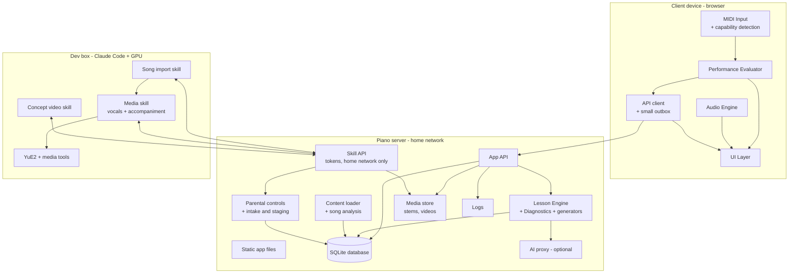
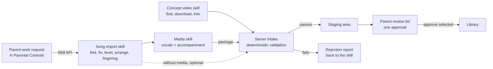

# Family Piano Tutor — Architecture

**Version 0.29** · Oct 1, 2026

The design of the Family Piano Tutor app, as it stands at this version. What changed in each version is in the [change log](architecture-changelog.md), and every earlier version of this file is in its git history (`git log --follow docs/architecture.md`).

**Changing this document:** edit it in place; don't rename or copy it for a new version. A design change raises the version (0.25 to 0.26), updates the date above, and adds an entry at the top of the change log, in the same commit or pull request as the change. Small fixes (typos, wording) keep the version.

## 1. Purpose and goals

A private, family-only piano tutor for kids that teaches like Simply Piano but plays only parent-approved songs. It runs in a browser on the home network, listens to a digital piano over MIDI, and adapts each practice session to the student.

**Goals**

- Interactive lessons with real-time right/wrong feedback from the MIDI keyboard.
- A proven learning sequence, adapted from an established piano method, stored as a skill map.
- Flexible progression: pass with good-enough accuracy, and automatically revisit weak spots.
- Every session mixes review with new material.
- A curated song library the parent controls; students choose only from approved songs.
- Progress tracking a parent can read: history, rate of progress, strengths, weaknesses.
- Scoring that encourages enjoyment and the pursuit of excellence without demanding perfection, based on an objective standard so parents do not need to be piano experts.
- An optional AI advisor, only where it proves useful (section 9; a potential feature, section 14).

**Non-goals (v1)**

- Microphone or acoustic-piano listening.
- Selling or publishing the app; multi-family accounts; access from outside the home network.
- Flashy game graphics or animation-heavy rewards.
- Bluetooth MIDI and headphone use (see potential features, section 14).

**Guiding principles**

- The app decides right and wrong from MIDI data; AI only advises.
- **Home-network only:** the app needs the family's piano server on the local network, but never the internet. Practice, progress and parental controls work with the internet down. Only the Claude skills (run by the parent) and the optional AI advisor need internet.
- **One source of truth:** app files, the database, the song library and media all live on the piano server. Any qualified device works for any child. The server is purely a server: Claude skills and GPU work run on the dev box.
- Nothing reaches the student that the parent has not approved. Content the app generates by fixed rules from approved material (drills, sight-reading pieces, fingering) counts as approved, because the parent approved the rules and the material it is built from.
- Hardware- and host-independent: the app runs on any device and server that meet the requirements in section 2. The family's current setup is configuration, not code.
- Missing optional hardware (for example a sustain pedal) turns off the features that need it; it never breaks practice.
- Build in small, testable chunks; each milestone produces something a child can use.

## 2. Platform and deployment requirements

The app is a web client plus a small server on the home network. The server holds the app files, the database, the song library and media. The family's current hardware is recorded separately in 2.7 and can change without code changes.

### 2.1 Client device requirements

- **Browser features:** Web MIDI, Web Audio and Screen Wake Lock, on a page served over HTTPS; storage that survives an app relaunch.
- **Network:** Wi-Fi access to the piano server on the home network. No internet needed.
- **Screen:** about 10 inches or larger, landscape. Touch is recommended; mouse or trackpad also works.
- **Performance:** smooth 60 fps staff scrolling; any recent mid-range tablet or laptop.

**Web MIDI:** a browser feature that lets a web page receive notes from a MIDI keyboard. The first time, the browser asks to allow MIDI access.

**Secure origin (HTTPS):** browsers only offer Web MIDI to pages loaded over HTTPS, the same privacy rule used for camera and microphone. It stops random websites from reading or controlling connected devices; it is not about piracy. Each client device trusts the piano server's certificate authority once (2.5).

**Screen stays awake:** a child playing the piano does not touch the screen, and piano notes do not count as activity, so the app holds a screen wake lock while practising (tested: the Wake Lock API stops Auto-Lock in MIDIWeb Browser; a silent looping video does not).

**Brief network drops:** if Wi-Fi drops mid-attempt, the client keeps the finished attempt in a small local outbox and sends it when the server is reachable again. If the server cannot be reached at startup, the app shows "Can't reach the piano server" with a retry button.

### 2.2 Supported client profiles

| Profile | Web MIDI | Touch | Child lockdown | Notes |
| --- | --- | --- | --- | --- |
| Chromebook (Chrome) | Built in | Touchscreen models only | Family Link supervised account; app pinning | Also good for development |
| Android tablet (Chrome) | Built in | Yes | Family Link; screen pinning | Typically $150–300 |
| iPad (MIDIWeb Browser app) | Supplied by the app | Yes | MIDIWeb Browser full-screen mode (address bar hidden), set by hand; the app shows a reminder when it is off. Stricter option: Guided Access, which also stops the app being closed | Safari and other iPad browsers lack Web MIDI. Full-screen mode survives lock/wake and app switches but is lost when the app relaunches, and a page cannot turn it on. Guided Access must be started by a parent each session, so it is optional |
| Desktop (Chrome or Edge on Windows, macOS, Linux) | Built in | Usually no | OS parental controls | Development and parent use |

Every new device passes the device qualification test (2.6) before children use it.

**Full-screen reminder (iPad):** the page cannot switch MIDIWeb Browser to full screen (the Fullscreen API is not offered there), but it can tell when full screen is off: the page is shorter than the screen by the height of the app's bars (87 px on the iPad A16, 0 px in full screen), and a resize event fires the moment it changes. The app checks on every load and resize and, when the gap is above the device's threshold, shows a calm reminder on the student picker to turn full screen on. The threshold is stored in the DeviceProfile (5). This is a nudge, not a lockdown.

### 2.3 Piano (MIDI keyboard) requirements

- **Connection:** class-compliant USB MIDI, standard on most digital pianos. (Bluetooth MIDI is a potential feature, section 14.) Check the specifications say so: some budget keyboards have a USB port only for playing music files or a flash drive (the Jikada JK-825 is one). Before buying, look for "USB MIDI" or "class compliant", velocity-sensitive keys and a sustain pedal jack; test a new keyboard on a computer before the iPad.
- **Port selection:** the app chooses the piano's MIDI input by name and ignores virtual ports (for example MIDIWeb Browser's own "MIDIWeb Out" and iPadOS's "Network Session 1", which appear even with no keyboard).
- **Sound:** the piano plays through its own speakers; app audio (metronome, accompaniment, vocals, spoken lessons) plays through the client device's speakers. The parent sets a comfortable balance during qualification. Headphone use is a potential feature (section 14).
- **Velocity-sensitive keys:** needed for dynamics scoring (about Level 3 and up).
- **Key count:** set by the parent (61 or 88 keys; other sizes can be added later as a key range). Notes outside the configured range are never used for practice or learning: arrangements are octave-shifted where possible, otherwise the song or skill shows "Needs 88 keys" and is unavailable. 61 keys covers about Level 4; later repertoire needs 88.
- **Sustain pedal:** optional.

### 2.4 Optional capabilities and graceful degradation

The app detects what the current setup supports and turns features on or off. Missing hardware never blocks core practice or progression.

**Built so far (v0.26):** detection only (the piano check records pedal and touch in the DeviceProfile, and the parent sets the keyboard size). The "if missing" behaviour below is not built: the family's piano has 88 velocity-sensitive keys and a sustain pedal (2.7), so it waits until another piano is used (section 14).

| Capability | How it is detected | If missing |
| --- | --- | --- |
| Sustain pedal | A pedal message (MIDI CC 64) arrives; parent can also set "No pedal" in settings | Pedal scoring is off; pedal markings show as hints only; pedal-specific skills show "Needs pedal" and never block unlocking |
| Velocity-sensitive keys | Spread of key velocities seen in early sessions; parent setting | Dynamics scoring is off; dynamics markings show as hints only |
| Key range | Parent setting (61 or 88 keys); a key played outside that range prompts the parent to check the setting | Octave-shifted arrangement where possible; otherwise the song or skill shows "Needs 88 keys" and is unavailable |
| Touchscreen | Browser pointer type | Same UI with mouse or trackpad |
| Internet (outside the home) | Server's online status | Claude skills and the AI advisor wait; practice, progress and parental controls are unaffected |
| Vocal or accompaniment audio | Stems present for the arrangement | Built-in choir voice and a soft chord pad (or plain metronome if the song has no chord symbols) |

Detected capabilities and the measured latency offset are saved in a **DeviceProfile** for each device and piano pair (section 5).

### 2.5 Server requirements

- **Required:** a machine on the home network that runs:
  - an HTTPS reverse proxy (currently Caddy) with a certificate the family's devices trust;
  - the **App API** (including the Skill API used by the dev box, 10.9) and **database** (proposed: Python with SQLite, section 4);
  - file storage for media (audio stems, concept videos).
- **Address and certificate (decided in v0.16):** the piano site is served at the server's fixed home-network IP address, `https://192.168.2.128/`, with a certificate for that address from the server's own certificate authority (Caddy `tls internal`, the same authority as the family knowledge base; its root is valid to 2036 and renews with no internet). Serving by address needs no name resolution, which matters because the router (TP-Link ER605, standalone) cannot hold local DNS names and tablets cannot edit a hosts file. A public certificate is not an option: no public issuer certifies an `.internal` name, and renewal would need the internet. Each client device installs and fully trusts the root certificate once (Server repo, `setup/docs/13-ipad-client.md`). If the address approach ever fails, the fallback is an mDNS name such as `piano.local`.
- **Static files:** the app is served from `/opt/piano/www` on the server, mounted read-only into Caddy; app deploys copy files there.
- **Network exposure:** the piano site is reachable from the home network only (section 11.1).
- **Optional:** AI proxy (holds the AI API key, section 9).
- **Dev box (Claude workstation):** a separate machine with an NVIDIA GPU that runs Claude Code, all three Claude skills, and the music engine (section 10). It reaches the server only through the Skill API, needs internet for Claude and song sources, and only needs to be on when the parent runs a skill.

### 2.6 Device qualification test (milestone M0)

Run on any new client profile before children use it. Each check passes or fails:

1. **Connect:** the app lists the piano by name over USB.
2. **Accuracy:** every key from lowest to highest lights up correctly; chords of 3 to 4 notes register fully.
3. **Latency:** measured, not guessed. See 2.6.1. Pass: key-to-screen under about 30 ms and a stable tap-along offset (spread under about 20 ms). Fast repeated notes are not dropped.
4. **Capabilities:** pedal, velocity, and key range are detected correctly, and the app behaves correctly with the pedal unplugged.
5. **Audio:** metronome and a demo track play cleanly, with no crackling, while notes are being played. The balance between the piano's speakers and the device's speakers is comfortable. On iPad, confirm app audio still plays with the silent switch on, or note that it must be off. After lock and wake, audio resumes (iPadOS marks it "interrupted"; the app resumes it when the page is shown again). Stems for a song at the 50% preset load and hold in memory.
6. **Touch:** buttons, scrolling, and the staff respond smoothly (or mouse, on non-touch devices).
7. **Rendering:** a grand-staff song with lyrics scrolls at a steady 60 fps and glides back smoothly on a rewind (the M0 tool checks, 12).
8. **Screen stays awake:** with Auto-Lock at its shortest, the screen stays on through several minutes of play without touches (wake lock).
9. **Resilience:** unplug and replug the piano; lock and wake the device; switch apps and return; turn Wi-Fi off and on mid-song. Note any cases where MIDI or sound stops, and whether reload fixes it. Confirm an attempt finished during a Wi-Fi drop is saved once Wi-Fi returns.
10. **No internet:** unplug the home router's internet connection. The app loads, a practice session runs, and progress saves.
11. **Lockdown:** apply the profile's child lockdown (table in 2.2) and confirm a child cannot reach any other site or app during practice. On iPad, confirm the full-screen reminder appears after the app is relaunched and disappears when full screen is turned on; decide whether Guided Access is needed.
12. **Soak test:** children use the build daily for one week.

**Decision rule:** pass on all checks, or only minor issues fixed by a reload button → device approved. Dropped notes, lag, frequent audio loss, or failed lockdown → use a different profile; no code changes needed.

#### 2.6.1 Latency measurement

Three measurements, all recorded in the DeviceProfile:

| Measurement | How | What it tells us |
| --- | --- | --- |
| Browser delivery delay (automatic) | The MIDI test page logs, for every note, the gap between the MIDI event's timestamp and the moment the app handles it, plus the audio latency the browser reports. It shows median and worst case. | Delay inside the device, and any jitter |
| Key-to-screen and key-to-sound (slow-motion video) | Film the keyboard and screen together with a phone in slow motion (240 fps, about 4 ms per frame). Press a key 10 times; count frames from key-down to the on-screen key lighting, and to the app's click sound in the audio track. | True end-to-end delay a child experiences |
| Tap-along offset (calibration) | The app counts in 4 clicks, then plays 24 more; the parent taps one key in time with them. The app records the average and spread (standard deviation) of tap time minus click time, leaving out stray taps more than 80 ms from the median; 16 of the 24 are needed. Built in Config > Latency calibration (v0.21). | The combined audio-output and MIDI-input offset. This offset is subtracted from every note time before timing is scored (section 7), and can be re-run from settings. |

### 2.7 Current family deployment (September 2026)

| Role | Current choice | Notes |
| --- | --- | --- |
| Student device | iPad A16 (USB-C) with MIDIWeb Browser (by 5of12) | HTTPS, storage, wake lock, audio, speech, video and rendering passed on Sep 24, 2026 (`feasibility/RESULTS.md`); MIDI and latency checks wait for a MIDI keyboard. Android tablet with Chrome is the planned fallback |
| Child lockdown (iPad) | MIDIWeb Browser full-screen mode, set by hand, plus the in-app reminder (2.2) | Full screen is lost when the app relaunches; Guided Access if the reminder proves insufficient |
| Development device | Chromebook (no touchscreen) |  |
| Piano | To be bought: class-compliant USB MIDI keyboard with 88 velocity-sensitive keys and a sustain pedal (2.3; decided in v0.26) | The Jikada JK-825 on hand has no MIDI (its USB port only plays music files). USB-C cable to the iPad; no headphones |
| Piano server | Existing Linux server that runs Docmost | Piano site at `https://192.168.2.128/`, behind the same Caddy, with the same internal certificate authority; bound to the home-network address only, no port 80. Server Wi-Fi measured 0.93 MB/s to the iPad; a Wi-Fi upgrade is planned |
| Dev box (Claude workstation) | Linux dev box, NVIDIA RTX 5070 Ti, 16 GB | Runs Claude Code, all three Claude skills, and the vocal and accompaniment engine YuE2 (confirmed by the M0-S spike; peaks at about 8 GB); talks to the server through the Skill API |
| AI provider (optional) | Claude API, via the AI proxy on the piano server |  |

**Tech stack (proposed; to be reviewed against existing server components during implementation):**

- **Client:** TypeScript, Svelte 5 with Vite (chosen in v0.18), SVG for the staff (one pre-rendered SVG per song; canvas tiles performed the same in testing), VexFlow for music notation, plain Web Audio for audio (Tone.js dropped in v0.18: the few nodes needed are simpler to own, and the song clock reads the `AudioContext` directly). All libraries and fonts are served from the piano server, never a CDN (VexFlow 5 loads its music fonts from a CDN by default, so its fonts must be self-hosted; 4.2.x embeds them).
- **Server:** Python (FastAPI) with SQLite, schema changes as numbered migrations; plain files for media. Python is shared with the Claude skills (music21, validation, fingerprint, fingering).

## 3. UI design

**Decision: use a moving staff with a fixed "play now" line for beginner and intermediate levels, then add a static page with a moving cursor for advanced levels.** Both views render the same song data, so supporting both costs little.

|  | Moving staff, fixed play line | Static page, moving cursor |
| --- | --- | --- |
| Eyes | Stay in one spot | Travel across and down the page |
| Best for | Beginners; learning note names and timing | Real sheet-music reading; reading ahead |
| Rewind | Staff glides back smoothly | Works, but page jumps feel abrupt |
| Risk | Kids react instead of reading ahead | Kids lose their place |
| Used in levels | 1 to about 4 | 4 and up, and all "real music" pieces |

The staff is real music notation, not colored falling blocks. Kids learn actual reading from day one. All students are assumed to read; on-screen text is not read aloud except in concept lessons.

### Two ways to play

The app offers **Guided** practice (the daily session from the skill map) and **Free Play** (any approved, unlocked song the student picks), like Simply Piano. Both are always one tap away on the Home screen. How each counts toward progress is defined in section 8.

### Screens

1. **Student picker:** large avatar cards, one per child, plus a small "Parent" button that asks for the PIN. Shows the full-screen reminder when needed (2.2).
2. **Home:** two big buttons, "Today's Practice" (Guided) and "Free Play". Shows today's session as 3 to 5 cards, a progress ring toward today's target minutes, the streak, and the stars earned today.
3. **Journey map:** the skill map as a winding, branching path of skill bubbles (see "Journey maps" below). Each bubble shows locked, current, passed, or mastered, plus two star rows. Tapping a bubble shows its concept lesson and practice songs; a tap anywhere else closes them (v0.29).
4. **Lesson intro:** a short interactive concept lesson, with an optional parent-approved video (see "Teaching concepts" below).
5. **Play screen:** the core screen (below).
6. **Result screen:** accuracy stars and timing stars (0.5 to 5), the trickiest measure, a small "practice mode" chip when practice aids were used (section 7.5), and "Practice tricky part", "Play again", "Next". After 3 tries at an item without passing, the main button becomes **"Try it another way"**, which opens gentle practice choices (8.1).
7. **Song library (Free Play):** approved, library-ready songs (6.8), grouped by level. Songs further along the map show "Coming soon" with the one skill that unlocks them: the last one still to reach, since the map leads there (v0.29; the whole list of skills was too long for later songs). Favorites heart.
8. **My Progress:** the student's own report: skills mastered, star trends, practice days, strengths and "working on" areas, written in kid-friendly words. Same data the parent sees.
9. **Parent mode (PIN):** see below.

### Screen layout rule: status at the top, controls below

**Decision (v0.16): the top strip of every screen shows status only; nothing a student needs to tap goes there.** In MIDIWeb Browser's full-screen mode, taps near the top of the screen (about one button high) do not register, so buttons and links there fail. The top strip holds things to read: song progress, stars, streak, the Parent-mode banner. Buttons start below it.

### Parent mode

The parent taps "Parent" on the student picker (or in the top bar) and enters the PIN. The PIN is checked by the server (section 11.1). Parent mode:

- shows the Parental Controls pages: students (add, edit, archive, delete), genre and song rules per child, the staging review list, content and analysis, full progress reports, and settings (work requests, concept videos and AI settings are potential features, section 14);
- **opens every skill bubble on every map** for review, including locked ones, so the parent can see exactly how a concept lesson, exercise or song looks and plays. This is the content preview; there is no separate preview page. Plays in parent mode are never recorded to a student;
- shows a clear "Parent mode" banner (with the "Log out" button placed below the top strip), and logs out automatically after 10 minutes without a touch, or when the device sleeps.

### Journey maps

**Proposal: three maps — Basic (Prep A to Level 2), Intermediate (Levels 3 to 6), Advanced (Levels 7 to 10).** Each map is a winding path divided into level "chapters" with headers. The skill map is branching (6.3): within a chapter the path forks into branches (for example a reading branch and a technique branch) that rejoin where a later skill needs both, so a child can move ahead on one branch while still working on another. Technique requirements are grouped so one bubble covers a level's set (for example "Level 5 scales" holds all its keys), keeping each map to roughly 150 bubbles or fewer. At higher levels each bubble is tinted by its track. A render test with 200 bubbles on the student device is part of M5; if a map is too large to scroll comfortably, fall back to one map per level. The exact shape of the branches is designed with each level's skill map (M3).

### Journey map star display

Each skill bubble shows two rows of 5 stars, rounded to the nearest half star:

- **Note accuracy** (music-note icon): best rating from the skill's exercises.
- **Timing** (metronome icon): best rating from play-along attempts; shows "–" until one exists.

Stars show the best result earned after practice-aid scaling (section 7.5), so they never drop. When a skill is due for review, a small refresh badge appears on the bubble instead.

### Teaching concepts

Every new concept (for example the I chord) is taught inside the app by a **concept lesson**: a 2 to 4 minute sequence of cards the student taps through. It uses the piano itself, which a video cannot.

| Card | What happens |
| --- | --- |
| Explain | 1 to 3 short sentences in kid-friendly words, read aloud by the device's built-in voice (tap to replay) |
| Show | Animated keyboard and staff diagram, for example the three keys of the C chord lighting up and the stacked notes on the staff |
| Hear | The app plays the example, then a contrast ("Here is C major... here is a wrong note, hear the difference?") |
| Try | The student plays it on the piano; MIDI confirms, with hints until correct |
| Check | 1 to 2 quick questions (tap the right keys on screen or on the piano); wrong answers loop back to Show |
| Watch (optional) | A parent-approved video on the topic, if one has been added. The card is built; the videos are a potential feature (section 14) |

On the Journey map, a skill's concept lesson opens from its bubble: the bubble's sheet starts with the concept lesson, then its practice songs. (Until v0.29 each bubble also had a small lightbulb bubble before it for the lesson; every skill has one lesson, reached from the sheet anyway, so the second bubble only crowded the map.) **One concept per bubble (v0.25):** each skill teaches one idea, with one Explain card, and its bubble holds only its own practice songs (6.8); the bubble, its sheet and the Explain card show the kind of idea (Notes, Rhythm, Technique, Theory, Musicianship). The concept lesson opens when the skill's prerequisites are passed (the bubble shows Ready to learn); finishing it makes that skill Current. The student can reopen any concept lesson later as a refresher.

**Concept videos (optional, never blocking; a potential feature since v0.26, section 14):** videos are found, downloaded, trimmed and converted by the **Claude concept-video skill** and submitted for the parent's approval like songs (section 10.6). If no video is added, the concept lesson works on its own, so a busy week never stalls the child.

**Decision: videos are stored on the piano server and played as plain video files. The app never embeds YouTube or any other video site.** Even a locked-down YouTube embed can show related videos, end screens, clickable titles, and channel links, so embedding cannot guarantee that only the chosen video plays. The Watch card plays the saved file with a simple built-in player: play, pause, replay. No links, no suggestions, nothing else to tap.

### Play screen elements

- **Staff area** (top 55%): notes scroll right-to-left toward the play line. Upcoming notes clear; played notes fade.
- **Play-now line:** vertical bar; the target note glows as it arrives.
- **Lyrics line:** words shown under the staff, each syllable lighting up with its note (karaoke style). Songs with several verses show the current verse.
- **Note feedback:** green for correct, amber for right note but off-time, red flash plus the note name for wrong keys. No harsh sounds. (A color-blind option is a potential feature, section 14.)
- **On-screen keyboard** (bottom 30%): 2 to 4 octaves around the song's range. Target key highlighted; pressed keys light up live from MIDI. Hints fade out as levels rise.
- **Hand and finger hints:** left/right hand colors and finger numbers (imported or generated, section 8.9). Finger numbers and letter names (under the heads) are switched on or off for each song by the parent, for every child, in Song and settings (v0.29). By default Prep A songs show finger numbers and later levels don't, and letter names show on the pre-staff songs (Prep A Units 1 to 3), on white keys only: the early units teach black keys by their groups. When the parent switches letter names on for a song, its black keys are named too (C♯, B♭), so the switch also works on a song played only on black keys; such a song starts with letter names off. Which helps children more is still being learned, so each song can be changed.
- **Status strip (top):** song progress bar, current tempo preset and mode, shown only (see the screen layout rule above).
- **Control strip (between the staff and the on-screen keyboard):** Back (to the screen that opened the song, as it was left: the same scroll position and the same pop-up open, v0.29; the tab bar still opens every screen fresh), the two mode buttons (each starts and pauses its mode), Rewind, the bars picker (All bars or a section), hands, tempo presets (50%, 75%, 90%, 100%), **vocals on/off**, metronome on/off (v0.18).
- **Song and settings (the gear, parent mode only):** Needs improvement (10.7), the song's finger numbers and letter names, and the device and parent settings. A tap outside closes it and does nothing else (v0.29).
- **Modes:** Play (the default: play-along with smooth automatic rewind, below) and Listen (the app plays it, with accompaniment and vocals). Either runs over all bars or a chosen section, which then repeats (the section loop; v0.18). The screen opens paused in Play mode.
- **Rewind button:** while playing, glides back a set number of bars (2 by default, from the start of the current bar; never before the section start) and plays on after the count-in; while paused, moves the resume point back; after the end, returns to the start. In Play mode it counts as a rewind for the practice-aid factor (7.5). Wait mode is a potential feature (section 14).
- **Smooth rewind:** see "Play and smooth rewind" below; section loops use the same glide.
- **Count-in and metronome:** visual beat dots plus an optional click. The metronome is one choice per student for every song (v0.29): once the student turns it on, it stays on for every song until they turn it off. Until they first choose, songs with singing play without it. A Diagnostics remedy can turn it on for its item (8.8). The count-in always clicks.

### Play and smooth rewind

**Decision: the main way to practice is normal play-along with automatic smooth rewind.** The music keeps moving. When a phrase goes wrong, the staff glides back and the student simply plays it again: no pop-ups, messages, or sounds. It should feel like a teacher gesturing "let's take that again", not like an interruption. Getting this to feel natural is a priority for M1.

**Phrases:** each arrangement is divided into phrases, 2 measures long at Prep levels and 4 measures from Level 1. The song import skill may move boundaries to rests, phrase marks, or lyric line ends. Phrases are stored with the arrangement.

**When it rewinds (first version, tuned with the children in M1):**

| Trigger | Rule | When the rewind starts |
| --- | --- | --- |
| Too many errors | Missed plus wrong notes in the current phrase reach 6, or 25% of the phrase's notes, whichever is larger (v0.18; 2 in v0.17). A wrong key counts twice: the written note is missed and the key is a wrong note. Timing alone never triggers a rewind | At the end of the phrase, so the music is not cut off mid-phrase |
| Lost place | No notes played for 2 beats while notes are expected | At the next bar line |

**Where it goes back to:** the start of the phrase with the errors. If the first error was on the phrase's first beat, it goes back one more phrase for a run-up. In section loop it never goes before the section start.

**How it moves:**

1. Vocals and accompaniment fade out over about 0.2 seconds; the metronome keeps a soft pulse so the beat is never lost.
2. The staff glides back over about 0.6 to 0.8 seconds with eased motion (slow, fast, slow). The on-screen keyboard stays still, and the first note of the phrase glows softly.
3. One bar of count-in (visual beat dots and soft clicks).
4. Play resumes in time; vocals and accompaniment resume from the matching point with a short fade-in.

Notes played during the glide and count-in are ignored. Nothing on screen announces the rewind.

**Limits:** after 3 rewinds of the same phrase in one attempt, the music keeps going, so there is never an endless loop. That phrase becomes the tricky spot on the result screen, where "Practice tricky part" loops it at the next slower tempo preset. (To try in M1: playing the third pass of a phrase one preset slower.)

**Setting:** auto-rewind is on by default and can be turned off per student in parent mode.

**Scoring:** each phrase counts its last pass, so fixing a phrase earns the credit; each rewind lowers the attempt's practice-aid factor, so 5 stars needs a clean run (7.5).

**Technical notes for smoothness:** the staff is pre-rendered, so the glide only moves it and never re-lays it out (tested: a 64-measure grand staff with lyrics, about 22,000 px wide, scrolled and glided at a steady 60 fps on the iPad A16, worst frame 24 ms); audio stems are decoded in advance, so they can restart instantly from any point (tested: 691 MB of decoded audio held and played, 2 x 6-minute stems decoded in 0.5 s, restarts at a new point with no audible delay); one song-clock position drives the staff, audio, lyrics, and scoring, so they cannot drift apart (tested in v0.17 with real songs and aligned stems: 60 fps with no frame over 25 ms in a 3-minute run with 9 rewinds and tempo switches).
- **The song clock** reads the audio clock through `getOutputTimestamp()`. It uses a time stamp only when it is fresh (under 250 ms old) from a running audio context; after the iPad sleeps, a stale time stamp once jumped the clock minutes ahead. Otherwise it falls back to `currentTime` minus the reported latencies, which read about 12 ms off on the iPad.
- **Audio vs display clock:** they agreed within 8–32 ppm on the iPad (2–6 ms over 3 minutes), so no drift correction is needed.
- **Display offset:** the staff is drawn a per-device offset behind the estimated audio clock (DeviceProfile, 5; "ahead" before v0.18 was wrong). 80 ms lined the notes up with the play line on the iPad A16. This is separate from the MIDI latency offset used for scoring.

At resume, the evaluator re-anchors its MIDI-to-song clock mapping. Rewinds are tested with the MIDI replay adapter (11.4).

### Tempo presets

Tempo is chosen from four presets: **50%, 75%, 90%, and 100%** of the written tempo. Fine-grained tempo control is not needed for practice at these levels. Teachers usually work in a few steps (slow, medium, nearly there, full tempo), and a small set keeps the choice simple for children, keeps practice-aid scoring clear, and lets vocals and accompaniment be rendered in advance for every setting. The 90% step is the "nearly there" stage before full tempo. Generated technique drills use the same presets of their target tempo; if later levels need finer metronome steps for technique, drills can use any tempo because they have no recorded audio.

### Accompaniment and singing

Accompaniment and vocals are audio **stems** produced for each arrangement by the Claude media skill before the song is submitted (section 10.5), so the parent hears them when approving the song.

- **Accompaniment stem:** a backing that stays behind the piano part, in instruments matched to the song's genre (10.5). **Since v0.22** it is rendered with FluidSynth from the arrangement's own notes (the score's ensemble parts, a hymn's alto, tenor and bass, or its chord symbols). YuE2's backing is kept only for a song with words and no backing notes. Its level is set in the media pipeline for tablet speakers, and the student can adjust the volume. An instrumental piece has an accompaniment stem and no vocal.
- **Vocal stem:** a sung vocal in a style matched to the song's genre, with a **Vocals on/off** button on the Play screen, remembered per song. Known YuE2 limits: a melisma (one syllable over several notes) is sung as one held pitch, the first word can be soft or unclear, and a take can put a stretch of words on other notes than the staff shows. Each song's check results are stored with its stems and shown in the parent's review list, so a badly affected song can be re-rendered or left with vocals off.
- **When stems play:** Listen and Play modes, at every tempo preset (100%, 90%, 75%, and 50%); each is rendered in advance.
- **No vocals or accompaniment in wait mode:** recorded audio cannot pause mid-word or mid-bar. If wait mode is built (a potential feature, section 14), it plays only the metronome and the student's own notes.
- **Solo piano pieces (v0.21):** the pianist's other hand is the accompaniment. When a child practises one hand, the app plays the other on its sampled piano (a per-student setting, on by default); Listen mode uses the same piano for every note.
- **No stems yet:** the Audio Engine plays a **soft chord pad** from the arrangement's chord symbols and the **choir voice** (the melody on a soft "ooh" sound) with lyrics highlighted, so every song has something to sing along with.

### Visual style

- Bright but calm palette, rounded shapes, large type, big tap targets (at least 48 px).
- A simple friendly mascot for encouragement messages; no video-game clutter.
- Rewards: half-star ratings, stickers per skill mastered, streak flame for practice days.
- Encouraging language only: "Almost! Let's try measure 3 again", never "Fail".
- A light theme, with high contrast for the staff at all times (a dark theme is a potential feature, section 14).

## 4. System architecture

The client handles only real-time work: MIDI input, note-by-note evaluation, audio, and the screens. Everything that is stored or planned lives on the piano server: the database, the Lesson Engine, Diagnostics, generators, parental controls, and media. The Claude skills and the music engine run on the dev box, which reads from and submits to the server only through the Skill API (10.9). The server itself runs no Claude skills and no GPU work.

**Why the Lesson Engine is on the server:** it reads and writes the same database as everything else, shares Python code with the skills (music analysis, fingering, validation), and keeps the client simple. Session planning is one API call at the start of a session and one small call after each item; on the home network this is instant.

**Client modules**

| Module | Responsibility | Key interfaces |
| --- | --- | --- |
| MIDI Input | Connect to the piano (chosen by name, ignoring virtual ports), emit note-on/off and pedal events with timestamps, handle reconnects, detect capabilities (pedal, velocity, range). Has a replay adapter that feeds recorded events for tests. | `onNote(pitch, velocity, time)`, `onPedal(value, time)`, `getCapabilities()` |
| Performance Evaluator | Match played notes to expected notes in real time; decide when to rewind; run the scorers enabled for the level and device; apply the latency offset and practice-aid factor (section 7) | `start(arrangement, mode, conditions)`, emits `NoteResult`, returns `AttemptResult` |
| Audio Engine | Demo playback on a sampled piano, the other hand in one-hand practice, stems, chord pad, choir voice, metronome, count-in; resumes audio when the page is shown again after a lock or app switch | `play(arrangement, tempo)`, `metronome(bpm)` |
| API client | Load the student's session, songs and media; post attempts (with an outbox for Wi-Fi drops); post client logs | `getSession()`, `postAttempt()`, `log()` |
| UI Layer | Screens, staff rendering, keyboard, feedback, parent mode; holds a screen wake lock during practice; full-screen check and reminder | Consumes the modules above |

**Server modules**

| Module | Responsibility |
| --- | --- |
| Static hosting | Serves the app over HTTPS on the home network |
| App API | Students, progress, sessions, parental rules, media, parent login, logs |
| Database | SQLite: content, library, student progress, rules, staging, logs (section 5) |
| Lesson Engine | Skill states on the branching map, mastery, spaced review, stuck handling, session queue, adaptive length, unlocking, end-of-content handling (section 8) |
| Diagnostics | Finds persistent error patterns in attempt data and proposes remedies (section 8.8) |
| Generators | Drills, sight-reading pieces, ear-training phrases, and finger numbers, built only from approved material and known skills (section 8.9) |
| Content loader and song analysis | Loads skill map and lesson files into the database; analyzes every arrangement's required skills and map point; the parent re-runs analysis from Parental Controls (section 6) |
| Intake and staging | Validates packages from the Claude skills and holds them in staging until the parent approves (section 10) |
| Skill API | The dev box's only way in: reads the skill map, library summary, deleted list, coverage, and (a potential feature, 14) work requests; receives packages and media uploads (10.9) |
| Media store | Audio stems and concept videos as files |
| AI proxy (optional) | Holds the AI API key; daily call limit; provider is swappable |

**Timing note:** MIDI events carry high-resolution timestamps. The evaluator converts them to the song clock using one fixed mapping between the MIDI clock and the audio clock, taken when playback starts, then subtracts the device's measured latency offset (2.6.1). Scoring stays accurate even if the display stutters.

## 5. Data model

Everything is stored in the server's SQLite database, except media files (in the media store) and the content source files (in a git repository, loaded into the database by the content loader). The client keeps only a device id and the small outbox of unsent attempts. Both survive an app relaunch in MIDIWeb Browser, but iPadOS does not grant persistent storage, so they could be cleared if the device runs low on space; the client then registers again as a new device. Content never changes because of student activity.

**Content (authored files, loaded into the database)**

| Entity | Key fields |
| --- | --- |
| Skill | id (stable, never reused), name, map (basic, intermediate, advanced), level, **sequence** (suggested order along the map, unique; used for layout and to choose which available skill to introduce first), track (reading, rhythm, technique, theory, repertoire, musicianship), staff (treble, bass, grand), **prerequisites\[\]** (define the map's forks and joins; each must have a lower sequence), requiredCapabilities\[\] (e.g. pedal, velocity, 88 keys), constraints (allowed notes or hand positions, rhythms, keys, time signatures, hands, staff, range; since v0.24 also intervals, two notes at once, held-note hands together, ties, rests and pre-staff `letters`), unit?, targetTempo?, conceptLessonId?, sourceMethods\[\], bookRefs\[\]?, description |
| Lesson | id, skillIds\[\], type (concept, exercise, drill, song, review), drillParams? (e.g. scale, key, octaves, hands, target bpm), arrangementId?, cards\[\] (concept lessons), passCriteria |
| ConceptCard | kind (explain, show, hear, try, check, watch), text, diagram (declarative: keys to light, staff notes, timing), audioExample, expectedNotes\[\], questions\[\] |
| Genre | id, name, genreStyle (e.g. "traditional hymn"), defaultVocalStyle, defaultAccompanimentStyle (named instruments and how they play, 10.5), defaultAllowed (false for every genre: the map's practice songs are allowed whatever their genre, 10.1) |
| ContentVersion | version, loadedDate, analysisRunDate, notes |

**Library (approved songs and media)**

| Entity | Key fields |
| --- | --- |
| Song | id, title, composer, genreIds\[\], arrangementIds\[\], source (site, url, id), license, licenseEvidence, addedDate |
| Arrangement | id, songId, level, hands, keyboardSize needed, **notation** (see below), **requiredSkillIds\[\]** (used for unlocking, 6.8), **mapPoint** (sequence of its highest required skill; used for placing it on the map and grouping, not for unlocking), featuredSkillIds\[\], skillMeasures (skill → measures where it is used), fingeringSource (imported, generated, edited), vocalStyle? (overrides genre default), phrases\[\] (measure ranges used for rewind), vocalStems{100, 90, 75, 50}?, accompanimentStems{100, 90, 75, 50}?, mediaReport? (engine, style text, seed, alignment method, check results: notes on pitch, words off the staff and where, first word sung, backing on the written chords), fingerprint |
| DeletedSong | fingerprint, title, composer, source ids\[\], deletedDate, reason? |
| StagedItem | batchId, kind (new song, media update, concept video), full data for that kind, source, licenseEvidence, estimatedLevel, flags\[\], claudeNotes, validationResult, selected (true/false); batches also record date, genre, and skill version |
| ConceptVideo | conceptLessonId, sourceUrl?, videoFile, trimStart, trimEnd, durationSec, status (staged, approved, removed), addedDate |
| WorkRequest (potential feature, 14) | id, kind (find songs in a genre, import a supplied file, render media, change vocal style, find a concept video), params, attachment? (e.g. a parent's MusicXML file), status (pending, in progress, submitted, failed), createdDate, resultBatchId? |

**Arrangement notation**

| Part | Fields |
| --- | --- |
| Header | keySig, timeSig, tempo (initial), pickupBeats (anacrusis), range (lowest, highest) |
| Measures | number, keySig?, timeSig?, tempo? (changes take effect at that measure), repeat start/end, volta number(s) |
| Navigation | D.C., D.S., segno, coda, Fine markers; a computed **playback order** (expanded measure list) used for playing, scoring and lyrics. **Built:** repeats and first and second endings. D.C., D.S., segno, coda and Fine are built with the level map that first teaches them (v0.26); until then the song import skill writes them out as plain measures |
| Notes | `{pitch (MIDI number), spelled {step, alter, octave}, start (beats), duration (beats), hand, voice, finger?, velocity?, articulation?, tieToNext?, isMelody?}`. Beats, not seconds, so tempo can change freely. The spelling is needed to draw F♯ vs G♭ and to name chords (v0.17); rests are not stored, the renderer fills the gaps |
| Other events | pedalEvents\[\], dynamics\[\], sections\[\] (named ranges in playback order), chordSymbols\[\] (beat, symbol) |
| Lyrics | syllables with note index and **verse number**, so repeats can show verse 1, then verse 2 |

**Students and progress**

| Entity | Key fields |
| --- | --- |
| Student | id, name, avatar, startDate, status (active, archived), settings (hints, default tempo preset, auto-rewind on/off, accompaniment volume, the app playing the other hand in one-hand practice, vocals off for songs\[\], tempo preset per song, metronome on/off for every song (v0.29)) |
| ParentSettings | pinHash, failedAttempts, lockedUntil, aiEnabled, autoLogoutMinutes |
| DeviceProfile | deviceId, pianoName (the MIDI input to use), keyboardSize (61 or 88, parent-set), hasPedal, velocitySensitive, touch, latencyOffsetMs, latencySpreadMs, **displayOffsetMs** (staff drawn behind the estimated audio clock; 80 ms on the iPad A16), fullScreenGapPx (threshold for the full-screen reminder), lastChecked |
| GenreRule | studentId, genreId, allowed (true/false) |
| SongRule | studentId, songId, allowed (true/false); overrides GenreRule |
| Attempt | id, studentId, lessonId or songId, arrangementId, contentVersion, deviceProfileId, context (guided / free), date, mode, **conditions** (mode, tempoPreset, hands, sectionOnly, extraHints, rewinds), conditionsFactor, rawAccuracy, rawTiming, accuracy, timingScore, accuracyStars, timingStars, perMeasureErrors\[\], noteErrors\[\] (expected vs played, hand, measure), noteResults\[\] (each written note of the scored pass: its timing, or missed; v0.21), **rawEvents** (compact list of played notes: time, pitch, velocity, duration, pedal), latencyOffsetMs, skillIdsExercised\[\], durationSec, completed (true/false) |
| SkillState | studentId, skillId, status (locked, current, passed, mastered), capabilityHold (true/false), **mastery** (0 to 1, stored running value, 8.2), **bestMastery**, bestAccuracyStars, bestTimingStars, attemptsWithoutPass (completed attempts while Current), **stuck** (true/false), stuckSince?, lastPracticed, reviewStep (0 to 7), nextReviewDate |
| ErrorPattern | id, studentId, kind (note confusion, rhythm, hands together, position shift, tempo ceiling), details, skillIds\[\], firstSeen, lastSeen, remediesTried\[\], status (active, improving, resolved, stuck) |
| PracticeDay | studentId, date (local calendar day), guidedMinutes, freeMinutes, targetMinutes, sessionCompleted |
| Session | studentId, date, queue\[\] (item, slot, reason), currentIndex, completedItems\[\], aiAdviceId? |
| Favorite | studentId, songId, addedDate |
| Reward | studentId, kind (sticker), skillId, earnedDate |
| AIAdvice (potential feature, 14) | id, studentId, date, kind, summarySent, response, applied (true/false), outcome |
| ClientLog | time, deviceId, studentId?, level (info, warning, error), message, context |

The streak and "stars this week" are calculated from PracticeDay and Attempt, not stored.

**Import path:** songs arrive as MusicXML, MIDI, ABC or Humdrum files and are converted to this format by the song import skill (section 10). Songs written for the curriculum are authored the same way (section 6.9), and every song reaches the library the same way (10.7).

**Schema changes:** database changes use numbered migration scripts from the start (a standard, low-cost practice). A mapping for renamed or merged skills is not built until it is first needed; the one rule now is that skill ids are stable and never reused. How students' existing progress and unlocked songs are handled when the skill map changes is a potential feature (section 14).

## 6. Curriculum and skill map

The curriculum uses established, published progressions so it can run from first notes to advanced playing. Beginners follow a concept order drawn from standard published beginner methods. From there, the skill map follows The Royal Conservatory (RCM) Certificate Program, which runs from Preparatory A through Level 10 plus diploma levels. App levels use the same names (Prep A, Prep B, Level 1 to Level 10) so progress can be compared to a real, recognized standard.

### 6.1 Combining method books

The methods are not mutually exclusive. Our skill map is our own, so we can take the best of each:

- **One spine for order and pacing:** one method's order of concepts, chosen because it lines up well with the RCM backbone.
- **Borrow from others:** other methods' concepts and practice ideas fill gaps and add extra exercises where the spine moves too fast for our kids.
- **One reading approach at first:** methods broadly differ in how they start reading (some lean on landmark notes and reading by intervals, others on fixed hand positions around middle C). The first few weeks follow the spine's approach only, so a new reader is not taught two ways at once; blending starts once basic reading is secure.

The repository names no method book (v0.25): the map, lessons and pieces are our own, and each skill has a general type (Notes, Rhythm, Technique, Theory, Musicianship) rather than a book reference.

### 6.2 Using the family's method books

The family owns physical method books (a lesson book, a theory book, a technique book and a performance book per level). Ownership does not allow copying their pieces, text, or illustrations into the app, but the teaching design they contain can be reused freely: which ideas come first, and in what order.

| We reuse (ideas, order, facts) | We do not copy (protected expression) |
| --- | --- |
| Order of concepts | The books' pieces and their arrangements |
| New notes, positions, rhythms, keys, and terms introduced at each stage | Explanatory text, stories, lyrics and titles written for the books |
| Pacing: how much practice each concept gets before the next | Illustrations and page layouts |
| Kinds of technique exercises and theory questions | Exact exercises and worksheets |
| Which public-domain tunes suit a level | The books' arrangements of those tunes |

**Nothing in the repository links to the books (v0.25):** the repository is public, so it names no method book, its units or its pages, and no piece or lesson borrows a book's title or wording. The map's units are our own groupings.

**Workflow, one level at a time as the children approach it:** photograph each book's table of contents and the pages where new material is introduced (kept in `Background/`, never committed). Claude reads the photos and drafts that level's skills (with prerequisites, constraints and sequence), concept lessons, drill types and a core-piece plan in our own words and music. A piano teacher checks the level, then it goes into the content files.

**Book references (optional, private):** the family's own page references for each skill live in `content/private/book-refs.yaml`, which is never committed. The content build merges them into the built skill map when the file is present, and parent mode shows them, so a parent or teacher can also assign a page from the physical book. Without the file, no skill shows book pages. Book pieces played this way are not scored by the app.

**Done for Prep A (v0.24; one concept per skill and no book links in v0.25):** the family's first-level books were photographed page by page. The Prep A map has 46 skills, one idea each, in our own units; the page references are in the private file. A piano teacher's check is still to come (6.3 step 6). The photographed books cover Prep A only: the Prep B map needs the next level's four books, photographed the same way.

**At the early intermediate level,** the RCM levels take over as the backbone; the teacher review confirms where the method books and the RCM levels line up.

### 6.3 Building the skill map (no transcription)

We only need the **order of concepts and requirements**, not the books' pages or music. That is a short list per level, not a transcription project.

1. **Beginner order (Prep A to Level 1):** photograph the tables of contents and unit openers of the family's method books, level by level (6.2). Claude reads the photos and drafts the skill list. Claude can also draft this sequence from standard piano teaching practice, aligned to RCM Preparatory A and B.
2. **Levels 1 to 10:** the RCM Piano Syllabus (2022 edition) lists each level's technical requirements (scales, chords, arpeggios, with keys and tempos), musicianship (sight-reading, ear tests), and repertoire lists. Claude turns them into skills, a level at a time, as the children approach it.
3. **Map shape and sequence:** the skill map is a set of branches, not one line. Each skill's **prerequisites** say which skills must be passed first, so the map can **fork** (two skills that both build on the same earlier skill, for example a reading skill and a technique skill) and **join** (a skill that needs skills from two branches, such as hands together needing both hands' reading). A child can move ahead on one branch while still working on another. Every skill also gets a unique **sequence number**: a suggested order that interleaves tracks the way the method does, used to lay out the map and to choose which available skill to introduce first. Prerequisites must always have a lower sequence number; the content loader checks this.
4. **Exercises:** 2 to 4 per skill, written with Claude's help. Technical drills (scales, chords, arpeggios) are generated by the app itself.
5. **Songs and pieces:** public-domain works, including the many classical pieces that appear on RCM repertoire lists, plus folk songs and hymns.
6. **Review and pilot:** a piano teacher checks each new level's skill map; the kids' results guide pacing.

### 6.4 Roadmap from beginner to advanced

| Stage | App levels (RCM) | Map | What the app does | New app capabilities | Build phase |
| --- | --- | --- | --- | --- | --- |
| Beginner | Prep A, Prep B | Basic | Guided lessons, concept lessons, play with smooth rewind | Core app (M0 to M10) | Phase 1 |
| Elementary | Levels 1 to 2 | Basic | Guided lessons; hands together, first scales | Tempo ramp, generated scale drills | Potential feature (section 14, v0.26) |
| Late elementary | Levels 3 to 4 | Intermediate | Lessons plus repertoire practice | Dynamics scoring, static-page cursor view | Phase 2 (M11) |
| Intermediate | Levels 5 to 6 (Intermediate map); 7 to 8 (Advanced map) | Intermediate / Advanced | Practice coach: technique, repertoire, musicianship tracks | Pedal and articulation scoring, generated sight-reading and ear training, long pieces with sections | Phase 3 (M12) |
| Advanced | Levels 9 to 10 and beyond | Advanced | Practice coach and progress tracker | Memory mode (staff hidden), record and play back for self-review | Phase 4 (M13) |

### 6.5 How the app changes at higher levels

In early levels the app teaches every step. From about Level 3, it shifts toward being a **practice coach** with three tracks, each filling slots in the same daily session plan (review, new, practice, reward):

- **Technique:** generated drills for the level's scales, chords, and arpeggios in every required key. Target tempos come from the syllabus; the tempo steps up as stars improve.
- **Repertoire:** each piece is split into sections, learned hands separately, then together, from slow to full tempo, then joined up. Section loops and smooth rewind do the heavy lifting.
- **Musicianship:** generated sight-reading pieces at the student's level, and ear training (the app plays a phrase, the student plays it back). Scoring is in 7.8.

MIDI already carries what advanced scoring needs: key velocity (dynamics), the sustain pedal, and exact note lengths (legato and staccato). No new hardware is required, as long as the pedal is plugged into the digital piano.

### 6.6 Built in from the start, so later levels need no redesign

- The skill map supports any number of levels, tracks, maps, and branches.
- The notation format stores velocity, dynamics, articulation, pedal events, repeats, key/time/tempo changes, chord symbols and verses from day one, even before they are used.
- The Performance Evaluator is a set of pluggable scorers (notes, timing, dynamics, pedal, articulation), each switched on at the level where it is introduced.
- Lessons can be **generated** from parameters (for example: G major scale, 2 octaves, hands together, 80 bpm), so technique content scales to all keys without hand authoring.

Each skill has a track: **reading**, **rhythm**, **technique**, **theory**, **repertoire**, or **musicianship**. Tracks let reports show strengths and weaknesses by category, and let the session planner balance practice at higher levels.

**Concept lessons:** every skill that introduces something new gets a concept lesson (section 3, "Teaching concepts"). Its Explain text follows the method book's order and vocabulary but is written in our own words. Claude drafts the card text and quiz questions during content authoring; the parent reviews them in parent mode before they go live.

### 6.7 Staff progression

**Since v0.24 the staff follows the method spine's reading approach** (6.1: the first weeks follow one method's reading approach). Each step is a skill in the map, with its own concept lesson.

| Step (Prep A unit) | Staff shown | What the student plays |
| --- | --- | --- |
| 1. Pre-staff (Units 1–3) | Grand staff, each white key's letter name printed just under its note head (`letters`; inside an enlarged head before v0.27) | Black-key groups, then C D E, F G A B, the C 5-finger scale and the left hand down from C, read by letter names; hands take turns |
| 2. Landmarks (Unit 4) | Grand staff | Middle C, Treble G and Bass F; two notes together; a note held in one hand while the other plays |
| 3. Middle C position (Units 5–7) | Grand staff | Treble C to G and bass C down to F, hands taking turns; steps, then skips and two notes at once |
| 4. C position (Unit 8) | Grand staff | The left hand down to Bass C |
| 5. Hands together (Level 1) | Grand staff | Both hands moving at once |

v0.9 planned a treble-only step and then a bass-only step. The spine instead reads the grand staff from the first staff unit, with the hands taking turns, and the map follows it. Left-hand practice still matters: the left hand is usually the weaker one, and reading bass notes is a separate skill from reading treble notes. Hands-separate practice also continues at every level: any hands-together piece or section can be practiced one hand at a time first, and the Repertoire track uses this routinely.

### 6.8 Songs in the curriculum

Method books teach through their own pieces, but those pieces and their arrangements are copyrighted, so we use only the books' concept order. We can use the same public-domain tunes many methods use (folk songs, "Ode to Joy", and so on) in our own arrangements.

**Decision: every arrangement is analyzed for the skills it requires, and it unlocks for a student by those skills. Nobody hand-assigns songs to lessons.**

**1. Every skill defines its constraints.** Each skill lists what a piece may contain once that skill is learned: notes or hand positions, rhythms, keys, time signatures, hands, staff, and range. For example, "C position right hand" allows C to G in the right hand, quarter and half notes, 4/4, treble staff only. Since v0.24 a skill can also allow melodic intervals (steps, skips), two notes at once in one hand, hands together over a held note, ties and rests; a pre-staff skill (`letters`) counts only letter-named pieces. Each kind is checked only when some skill in the map names it, so a map that doesn't use it analyses as before.

**2. Every arrangement is analyzed.** A script reads each arrangement's notes and records:

- **Required skills:** every skill whose constraints the arrangement needs. These decide when it unlocks.
- **Map point:** the highest sequence number among its required skills. This is where the arrangement is shown on the map and grouped in the library.
- **Featured skills:** the newest one or two skills it uses heavily. These are the skills it practices.
- **Skill measures:** which measures use each required skill (used for implicit review, 8.4).

**3. Unlocking.** For unlocking, a skill counts as **passed** when it is Passed (3 stars or more), Mastered, or on capability hold (8.1).

| Readiness | Rule | Where it is used |
| --- | --- | --- |
| **Guided-ready** | Every required skill is passed, except at most one, which is a Current skill (being learned now): "passed skills + 1" | Guided sessions, so every Current skill always has pieces to practice |
| **Library-ready** | Every required skill is passed | Free Play, the song library, and the Reward slot |

A song is visible in the library when at least one of its arrangements is library-ready and the song is allowed for the child.

**4. Practice songs and other songs (one kind of song since v0.27).** Every song is a library song, approved by the parent in the review list, whatever made it (10.7). What makes a song part of the curriculum is only that the map names it:

| Kind | What it is | Role in Guided sessions |
| --- | --- | --- |
| Practice songs | The songs a skill names as its practice songs (its `pieces` list, the songs in its Journey bubble), at least 2 per skill (v0.25), each a practice song of one skill. At Prep A they are short songs written for the curriculum (with Claude's help) strictly within each skill's constraints; any library song can be one | New and Practice slots; guarantee every skill always has material |
| Other songs | Every other song in the library | Practice and Review slots when they feature the skill and are Guided-ready; Reward slot and Free Play when library-ready |

For the earliest skills (for example three black keys, or five notes in C position), almost no existing songs fit, so songs written for the curriculum carry Prep A and Prep B. As skills accumulate, more library songs become ready and take over a growing share of practice.

**5. How the session picks a piece.** For a skill's slot, the engine chooses a Guided-ready piece that features that skill and is allowed for the child, preferring one the student has not played recently, and favorites for the Reward slot (library-ready only). A skill's practice songs are allowed for every child, whatever their genre (until v0.27, songs written for the curriculum had their own "Lesson pieces" genre instead). If a parent blocks a piece, the engine picks another piece featuring the same skill or generates a drill, so progress never stalls.

**6. Coverage report.** Config › Content and analysis lists, for each skill, its practice songs and the other songs that feature it; the content build refuses a map where a skill has fewer than 2 practice songs (6.10). The song import skill can use the gaps to look for songs ("need songs using G position, left hand"). A per-child view, after each child's song rules, is a potential feature (section 14).

### 6.9 Content authoring and preview

**Initial recommendation, expected to change after the first few tests:**

| Content | Authored as | Notes |
| --- | --- | --- |
| Skill map | One YAML file per level: skills with id, sequence, track, constraints, prerequisites, capabilities, book refs | Drafted by Claude from the book photos and syllabus |
| Concept lessons | YAML, one file per skill in `content/lessons/`, with a list of cards (explain, show, hear, try, check, watch); notes as `C4 D4:2 [C4,E4,G4]` (v0.20) | The Show card is declarative (keys to light, staff notes, order and timing), so no animation authoring is needed |
| Songs | MusicXML (e.g. from MuseScore) or ABC, with a small YAML header (title, composer, genre, level, hands, source, license), one file per song in `content/pieces/` | Converted to the notation format by the shared converter. Every song's source is kept in git, whether it was written here or imported (`promote` moves an approved import's source in); the songs themselves reach the app through the library (10.7) |
| Drills | Parameters only (6.6); built by the generators | No notation files |

The content lives in a git repository. The parent reviews new content on the student device in **parent mode** (section 3), which opens every bubble so each lesson can be seen and played exactly as a child will see it. No separate preview page is built.

### 6.10 Content loading and re-analysis

**The skill map and lessons are loaded by deploying them (since v0.20); songs never are (v0.27).** The content build (`tools/build_content.py`, run by `tools/deploy.sh`) validates the map and lessons against every song source in `content/pieces/` (unique sequences, prerequisites earlier, constraints parse, at least 2 practice songs per skill that feature it and need only it and the skills before it, concept lessons present) and stops on any error. It writes the map and lessons for the app, and every song, built, to `build/songs/` for the library. The deploy puts the same map into the client and the App API.

**A map may name only approved songs (v0.27).** Every song lives in the server's library (10.7). Before a deploy, `tools/library_check.py` compares the map's practice songs with the library and stops the deploy if one is missing; a song whose notes changed here since it was approved is a warning (the children keep the approved one until the change is reviewed). So a new level is added in two steps: its songs are submitted and approved in the review list, then the map that uses them is deployed. The songs built into the app before v0.27 came into the library once, as approved, through `deploy.sh --seed-songs` (the API adopts `content/seed/` when it starts, for songs it doesn't have and the parent never deleted).

**Library songs are analysed at intake** (10.7) and again at approval, against the skill map deployed at the time. **Re-analysis after a map change (built in v0.27):** when the App API starts with a deployed skill map that differs from the one the library was last analysed against (a hash of each skill's id, sequence, prerequisites and constraints), it recomputes every approved library song's required skills, map point, featured skills and skill measures against the new map. Config › Content and analysis lists the songs whose required skills or beyond-the-map parts changed, before and after. So a song beyond the Prep A map unlocks once the Prep B map that teaches it is deployed.

## 7. Performance evaluation and scoring

The evaluator turns a performance into two numbers, accuracy and timing, using fixed, published rules so results are objective and repeatable: the same playing always earns the same stars, and a parent does not need to judge. The rules are designed to reward steady improvement: small slips cost little, most scores land in a range where the next star feels reachable, and 5 stars means excellent playing under full conditions.

All numbers below are a first version, to be tuned against recorded performances in M2 (7.10).

### 7.1 Timing windows by level

Played note times are first corrected by the device's latency offset (2.6.1).

| Level band | On time | Early or late | Match window |
| --- | --- | --- | --- |
| Prep A to Prep B | within ±150 ms | ±150 to 300 ms | ±450 ms |
| Levels 1 to 2 | within ±120 ms | ±120 to 250 ms | ±400 ms |
| Levels 3 to 4 | within ±100 ms | ±100 to 220 ms | ±350 ms |
| Level 5 and up | within ±80 ms | ±80 to 200 ms | ±300 ms |

The match window is never more than half the gap to the next expected note of the same pitch, so fast repeated notes cannot match the wrong target.

### 7.2 Matching played notes to the music

**Play-along mode:** each played note is matched to the nearest unmatched expected note of the same pitch within the match window. Expected notes with no match are **missed**. Played notes with no match are **extra**. So a wrong key in place of a written note is **two errors**: the written note is missed (no credit) and the key is extra (the extra-note penalty). The rewind rule (3) counts both.

**After a rewind:** only the last pass of each phrase is scored. Earlier passes stay in the raw events, so Diagnostics still sees every mistake.

**Wait mode (optional, built later):** the music stops at each event (a note, or a chord of notes that start together). The event is complete when all of its notes are held down together, or pressed within 0.5 seconds of each other (children often press chord notes one at a time).

**Not counted as extra notes:**

- **Brushes:** a key pressed very softly (velocity under 15) or released within 40 ms.
- **Re-strikes:** the same correct key pressed again within 150 ms.
- **The other hand** when the item is for one hand only.

**Held notes:** before Level 3, how long a note is held is not scored. From Level 3, a note released before half of its written length earns 0.75 credit. The articulation scorer (7.7) refines this later.

### 7.3 Accuracy

Each expected note earns credit:

| Situation | Credit |
| --- | --- |
| Play-along: matched | 1.0 |
| Wait mode: correct on the first press at that event | 1.0 |
| Wait mode: correct after one or more wrong keys at that event | 0.5 |
| Missed | 0 |

**Accuracy = (total credit − extra-note penalty) ÷ number of expected notes**, never below 0.

- **Extra-note penalty (play-along):** 0.25 per extra note, capped at 10% of the expected notes. A few slips cost a little; a flurry of wrong notes cannot wipe out a good performance. In wait mode, wrong keys already reduce credit, so there is no separate penalty.
- **Chords:** each note of a chord counts separately, so a chord with one wrong note still earns most of its credit.

### 7.4 Timing

Timing is scored in play-along mode only. Each matched note earns timing points:

| Note time (after latency correction) | Points |
| --- | --- |
| On time | 1.0 |
| Early or late | 0.5 |
| Outside the early/late window (but still matched) | 0 |

**Timing score = timing points ÷ matched notes.** Missed notes affect accuracy, not timing. Timing stars are shown only when accuracy is 50% or more, so a student cannot earn high timing stars by playing a few notes. The result screen says whether the student was mostly early (rushing) or late (dragging).

### 7.5 Practice conditions and the practice-aid factor

Practice aids (slower tempo presets, smooth rewinds, one hand, section loops, extra hints, and wait mode if built) are encouraged, and every attempt shows a result. But the full star range is only available under **normal conditions**:

- play-along mode;
- the 100% tempo preset (of the arrangement's written tempo, or the skill's target tempo for drills);
- no rewinds;
- the whole item (the full piece or the full assigned drill);
- hands as written (both hands if the item is hands together);
- the level's default hints.

Each aid multiplies the score by a factor before stars are given. Factors multiply when several aids are used. They apply to both accuracy and timing.

| Aid used | Factor | Best possible stars with only this aid |
| --- | --- | --- |
| Tempo preset below 100% | 90%: 0.92 · 75%: 0.86 · 50%: 0.78 | 4.5 at 90%, 4 at 75%, 3 at 50% |
| Smooth rewinds in the attempt | 1 rewind: 0.95 · 2: 0.90 · 3 or more: 0.85 | 4.5, 4, 3.5 |
| Wait mode (optional mode; no timing score) | 0.80 | 3.5 |
| One hand when the item is hands together | 0.85 | 3.5 |
| Section only (loop or tricky part) | 0.90 | 4 |
| Extra hints beyond the level default | 0.95 | 4.5 |

**Decision: practice aids are for practice. Stacked aids do not pass a skill.** Aids let a student slow down, take one hand, or loop a spot until they can press the keys properly; they are not a route around the pass standard. What this means in practice:

- Every aided attempt shows its stars and counts as practice (implicit review, Diagnostics, practice minutes).
- **Passing (3 stars) needs near-normal conditions.** A single aid can still pass with accurate playing: for example about 87% accuracy with one hand only, or about 95% at the 50% preset. Stacked aids, such as the 50% preset with one hand (at most 66%), cannot reach 3 stars. This is deliberate, so a skill is never passed by practice-mode playing alone.
- **Only attempts of the whole item can pass a skill.** Section loops and "Practice tricky part" are practice.
- **Mastery** (4 stars) in practice needs the 90% or 100% preset with few rewinds.
- **5 stars** needs normal conditions.
- Playing again or restarting is never penalized. An attempt stopped part-way is saved as not completed and does not count toward passing or mastery.
- When a student has trouble passing, the app offers gentle "Try it another way" options and adjusts the session (8.1); it never shows a "failed" message.

The result screen shows the stars earned, plus a small "practice mode" chip listing the aids used and one friendly line such as "Play at full speed with both hands to earn up to 5 stars!".

### 7.6 Star ratings (5 stars, half-star steps)

Accuracy and timing each get their own star rating from this table, after the practice-aid factor. The curve is steeper at the top so 5 stars means excellent playing.

| Score | Stars | Meaning shown to the parent |
| --- | --- | --- |
| Under 40% | 0.5 | Just starting |
| 40% | 1 | Just starting |
| 50% | 1.5 | Keep practicing |
| 60% | 2 | Keep practicing |
| 67% | 2.5 | Getting there |
| 74% | 3 | Passed: ready to move on |
| 80% | 3.5 | Good |
| 86% | 4 | Mastered: solid |
| 91% | 4.5 | Very good |
| 96% and up | 5 | Excellent |

### 7.7 Later-level scorers

Dynamics (from key velocity), pedal timing (from the sustain pedal), and articulation (from note lengths) are separate scorers, each with its own star row. A scorer runs only when the level introduces it **and** the setup supports it (section 2.4); otherwise that star row is not shown. Their rules are designed in Phase 2 and 3 (section 13).

### 7.8 Theory and musicianship scoring (first version)

| Activity | How it is scored | Stars |
| --- | --- | --- |
| Theory questions (Check cards and theory drills): note names, intervals, key and time signatures, rhythm counting, terms and symbols, chord names | Right on the first try: 1.0; right on the second try: 0.5; otherwise 0. Score = points ÷ questions | Accuracy stars only |
| Rhythm tapping (rhythm track) | The student taps the rhythm on any key; only timing is scored, using 7.4 | Timing stars only |
| Sight-reading | A generated piece built only from passed skills, one difficulty step easier than the student's newest passed skills, seen once; played in play-along mode with a count-in; scored by 7.3 and 7.4 with the timing windows one level band easier. Only the first play counts as sight-reading; later plays are ordinary practice | Accuracy and timing |
| Ear training: play back | The app plays a 2 to 8 note phrase using only known notes; the student plays it back. Accuracy = 1 − (note edit distance ÷ phrase length). Rhythm is not scored until Level 3; then each note's length ratio must be within ±25% of the original. Up to 2 replays of the phrase, each applying a 0.9 factor | Accuracy stars |
| Ear training: identify | Name an interval, chord quality, or major/minor by tapping an answer; scored like theory questions | Accuracy stars |

**Built (v0.21):** in concept lessons, Check questions (a key, or a button answer after an optional phrase to listen to) and **Echo** cards (play-back) are scored as above. The lesson's points go to the server with the lesson; a **theory** skill, which has no play-along piece, passes on 3 stars and its mastery moves with each score. Rhythm tapping is the generated rhythm drill: any key counts as the drill's note, and the result shows timing stars only.

### 7.9 Worked example

A 40-note play-along piece at full tempo, both hands, default hints (factor 1.0):

- 36 notes matched, 4 missed, 3 extra notes. Accuracy = (36 − 0.75) ÷ 40 = 88.1% → **4 stars**.
- Of the 36 matched notes, 30 on time, 5 late, 1 outside the window. Timing = (30 + 2.5) ÷ 36 = 90.3% → **4 stars**.
- The same playing at 75% tempo: 88.1% × 0.86 (the 75% tempo factor) ≈ 76% → **3 stars**, with the chip "Play at full speed to earn more stars".
- The same playing at 75% tempo with one hand only: 88.1% × 0.86 × 0.85 ≈ 64% → **2 stars**. Good practice, but it does not pass the skill (7.5).

### 7.10 Tuning the numbers

In M2, build a set of recorded performances (perfect, one wrong note, rushed, dragging, extra notes, rolled chords, rewind cases (errors that should and should not trigger a rewind, losing place), and a few real performances by the children). Each gets expected scores. The windows, penalties and factors are tuned until the results feel fair to the parent and remain objective; the fixtures then guard against changes (section 11.4). A piano teacher can optionally listen to a few recordings and confirm the star meanings.

## 8. Lesson engine

The lesson engine plans every session with simple, predictable rules: score each attempt (section 7), update skill states and mastery, schedule reviews, set today's target length, then build a balanced session. It runs on the server and works with no AI at all.

### 8.1 Skill states and unlocking

Each skill has one of four states, in order:

| State | Meaning | How it is reached |
| --- | --- | --- |
| Locked | Not yet reachable | Starting state. A skill stays locked until all of its prerequisites are passed |
| Current | The student is learning it | All prerequisites are Passed, Mastered, or on capability hold, and its concept lesson (if any) is finished. Several skills can be Current at once, on different branches |
| Passed | Good enough to move on | Any completed attempt of the whole item earns 3 or more accuracy stars (after the practice-aid factor, 7.5). **Rhythm-track skills** also need 3 or more timing stars in the same attempt (rhythm-tapping items, which have timing stars only, need 3 timing stars) |
| Mastered | Learned securely | The mastery rule in 8.2 |

When all of a skill's prerequisites are passed, its concept lesson opens (the bubble shows Ready to learn) and the next Guided session schedules it in the New slot. Finishing the concept lesson makes the skill Current.

**No minimum practice to pass, and no cap on new skills per day.** Some skills are easy and some are hard; a student who passes a skill quickly moves on straight away, and when a Current skill passes mid-session, the New slot continues with the next available skill. Spaced review and polish practice (8.3) then bring each passed skill up to mastery over time, tracked by its stars.

A skill that needs a capability the current setup lacks (for example a pedal) is marked **capability hold**: it shows "Needs pedal" on the map, is skipped by the session planner, counts as passed for the skills that depend on it and for unlocking, and becomes Current as soon as the capability is detected.

**Unlocking:** Passed, Mastered, and held skills count as passed. A skill unlocks when all of its prerequisites are passed. Arrangements unlock by their required skills (6.8): Guided sessions may use pieces that need one Current skill beyond the passed skills ("passed skills + 1"); Free Play and the library show only pieces whose required skills are all passed.

#### Gentle options when a skill is hard

After 3 completed attempts at an item without passing, the result screen's main button becomes **"Try it another way"**, with friendly choices:

- **Listen first:** the app plays it, with accompaniment and vocals.
- **Practice the tricky part:** loop the hardest phrase.
- **Slower:** the next tempo preset down.
- **One hand at a time.**
- **See the idea again:** reopen the concept lesson.
- **Try something else:** the item returns later in the session or on the next day.
- **Free Play:** pick any library-ready song.

The wording is encouraging ("This one's tricky! Want to try it another way?"). The app never shows "Failed", and it never passes a skill the student has not played at the pass standard. The practice-aid choices are practice (7.5); the student comes back to a full attempt when ready.

#### Stuck skills

A Current skill is marked **stuck** when it has not passed after 6 completed attempts across at least 2 days (first version, tuned in M5 and with the children). The goal is for the student to keep building capability around the hard skill, without passing a student who cannot yet play it at the pass standard. While a skill is stuck:

- **More support practice:** the Practice slot grows to about 30% of the target time (taken from the New slot's time on the stuck skill) and fills with **support pieces**: Guided-ready pieces and drills that exercise what the stuck skill builds on (its prerequisites and skills on the same track) but do not require the stuck skill itself.
- **Other branches continue:** Current skills on other branches of the map keep their place in the New slot, so progress continues elsewhere.
- **Short, regular contact:** the stuck skill appears once per session as a short, low-pressure item, so it is practiced regularly without dominating the session: the tricky section one day, the whole piece one preset slower the next (v0.19: a section alone never passes a skill).
- **Find the cause:** Diagnostics (8.8) looks for an underlying error pattern; its remedy takes the first Practice position.
- **Parent visibility:** the stuck skill appears in the parent's progress report.

A skill stops being stuck as soon as it passes.

### 8.2 Mastery

- **Mastery (0 to 1)** is a stored running value, updated after every completed attempt that exercises the skill: *new mastery = old mastery + 0.3 × (the attempt's practice-aid-scaled accuracy − old mastery)*. The first attempt sets it directly. Recent attempts count most and older ones fade gradually. Free Play updates use half the step (0.15, 8.7). The step size is a first version, tuned with the practice simulator (11.4).
- **Best-so-far:** each skill also keeps its **best mastery** ever reached and its best accuracy and timing stars. Journey-map stars and reports show best-so-far, so they never drop; the running value drives mastery, review and polish decisions.
- A skill is **Mastered** when mastery reaches **0.86 (4 stars)** on 2 separate days, and at least one of those attempts has 3 or more timing stars. (Skills with no play-along part, such as theory, need only the accuracy rule.)
- Because of the practice-aid factor, mastery needs the 90% or 100% preset with few rewinds, while passing does not.

### 8.3 Spaced review and polish practice

**Review ladder (mastered skills):** each mastered skill steps through review intervals of 1, 3, 7, 14, 30, 60, then 120 days. After the 120-day review it stays on a 120-day cycle.

| Review result | Effect |
| --- | --- |
| Good (4 stars or more) | Move up one step on the ladder |
| OK (3 to 3.5 stars) | Repeat the same interval |
| Weak (under 3 stars) | Back to 1 day; the running mastery value is lowered by 10% (best-so-far is kept); after two weak reviews in a row, the concept lesson is offered as a refresher and the skill returns to Passed until it meets the mastery rule again |

**Polish practice (skills below 5 stars):** passed skills keep getting practice until they are mastered, and mastered skills keep getting occasional practice until they reach 5 stars.

| Skill | Polish cadence | Priority |
| --- | --- | --- |
| Passed, not yet mastered | A polish item about every 3 days, lowest mastery first | High |
| Mastered, best accuracy under 5 stars | About every 10 days, when the Practice slot has room | Low |

At most 2 polish items per session, so polish never crowds out new material.

**What a review or polish item is:** a short exercise, drill, or song section from that skill, chosen to differ from the last one used. It is not a repeat of the concept lesson.

**Backlog after a break:** due skills are ranked by how overdue they are and by lowest mastery. The review slot stays at about 25% of the session, so a backlog after a vacation is worked off over several days instead of one long review session.

### 8.4 Implicit review

Any strong use of a skill counts as a review of it, so explicit review stays small as the skill map grows to hundreds of skills.

- **Featured skills** of the arrangement played (and the skill the item was assigned for): a completed attempt with 4 or more accuracy stars (after the practice-aid factor) counts as a good review and updates mastery, once at least half the current review interval has passed since the last review (v0.19).
- **Other required skills:** count as a good review only if the measures that use that skill (from the analysis, 6.8) scored 4 stars or more on their own. They get review credit only; their mastery is not changed. This stops one good overall score from hiding a weak spot in a particular skill.
- **Free Play:** the same review rules apply. Mastery updates for featured skills use half the step (8.2, 8.7).

### 8.5 How a Guided session runs

**Decision: the session auto-sequences. The student does not hunt for bubbles on the map.**

1. Tapping "Today's Practice" asks the server to build today's queue from the session plan (review, new, practice, reward).
2. Before each item, a short "Up next" card shows the skill, the reason ("Review", "New", "Tricky spot", "Polish", "Support", "Your pick"), and a big Start button. The student taps to begin, so there are no surprises.
3. After the result screen, "Next" moves to the following item. The student may skip an item once; it moves to the end of the queue.
4. The Reward slot lets the student choose from library-ready, allowed songs.
5. If the student leaves mid-session, the queue resumes where they stopped, the same day, on any device.

The Journey map shows the same information visually: refresh badges on due skills and a "Today" marker on each Current skill. Tapping a due bubble on the map starts that review directly and counts toward today's session, but the map is never required to follow the plan.

**Session plan**

| Slot | Content | Share of target time |
| --- | --- | --- |
| Warm-up | Review items due today | About 25% |
| New | Current skills, lowest sequence first: concept lesson plus exercises. When one passes, the next available skill follows, in no more time than the items it replaces (v0.19) | About 40% |
| Practice | In priority order: an active diagnostic remedy; support practice for a stuck skill (8.1); polish for passed-not-mastered skills; a tricky song section; polish for mastered skills under 5 stars | About 20% (about 30% while a skill is stuck) |
| Reward | Student's choice from approved, library-ready songs; time the other slots leave unplanned adds more picks, up to 4 (v0.19) | About 15% |

### 8.6 Adaptive session length

Today's target length starts at 15 minutes and adjusts automatically between 10 and 30 minutes. It is a goal, never a limit: the app never stops or locks the student out. All "days" are the local calendar day on the server.

- **Weekly step up (+2.5 min):** practiced on 5 or more of the last 7 days, completed at least 80% of sessions, and mastered at least 1 new skill that week.
- **Hold:** 3 to 4 practice days, or steady but slow progress.
- **Step down after a gap:** after 3 or more days without practice, the target drops 2.5 minutes for every 3 days missed (minimum 10 minutes), then builds back up by the weekly rule.
- **Session content scales with length:** longer sessions add more new material and review items, not just more repetition.
- **Completion:** when today's Guided items are done, a small, non-intrusive banner says "Today's Practice Complete!" with a star burst. The student can keep going with more Guided lessons or Free Play.
- **Streak:** the number of consecutive calendar days with a practice day.

### 8.7 Guided vs Free Play: what counts

**Decision: both count as practice, but only Guided practice completes the daily session.** Free Play is real practice and should be rewarded, but the daily session must still guarantee the review-plus-new balance.

| Effect | Guided | Free Play |
| --- | --- | --- |
| Completes "Today's Practice" | Yes | No |
| Counts as a practice day (streak, consistency) | Yes | Yes, if 5+ minutes |
| Updates skill mastery | Full step | Half step, for the song's featured skills |
| Counts as implicit review (8.4) | Yes | Yes |
| Earns stars and song badges | Yes | Yes |
| Counts toward session-length step up | Yes | Consistency only |
| Shown in progress reports | Yes | Yes, as "Free Play minutes" |

The engine may also pull a Free Play favorite into the Reward slot of the next Guided session, so interests feed back into lessons.

### 8.8 Weakness diagnostics

Mastery scores show *that* a skill is weak; Diagnostics finds *why*, using the per-note error data. It is rule-based and runs after each session, looking at the last 14 days of completed attempts.

| Pattern | Detected when (first version) | Remedy the engine inserts |
| --- | --- | --- |
| Note confusion | The same wrong note is played for the same written note at least 3 times, in at least 2 sessions, and in at least 30% of that written note's occurrences (e.g. G played for F on the bass clef) | Generated reading drill built around the confused notes |
| Rhythm | For one rhythm figure (e.g. eighth-note pairs, dotted quarters, a note after a rest): at least 12 occurrences over 2 or more sessions, with the same direction (early or late) in at least 70% of them and an average offset beyond half the on-time window | Rhythm-only tap drill, then the passage with metronome |
| Hands together | Over the last 3 hands-together attempts on a piece, accuracy is at least 15 points below the lower of the two hands-separate accuracies on the same material | Hands-separate step, then slow hands-together |
| Position shift | Over at least 3 attempts, the error rate on the 2 notes after a hand-position change is at least twice the student's error rate elsewhere in the piece, and at least 25% | Isolated shift drill looping the two measures around it |
| Tempo ceiling | With at least 3 attempts at each, accuracy at one tempo preset is at least 15 points lower than at the next slower preset | Practice at the slower preset, then step up through the presets |

Each detected pattern becomes an ErrorPattern record. **Priority:** one remedy per session in the Practice slot (two if the target length is 20 minutes or more), choosing first patterns that affect a stuck or Current skill, then the pattern with the most occurrences, then the oldest. A pattern is resolved when the affected notes or measures score 4 stars or more on 2 separate days. If it has not improved after 3 remedies or 2 weeks, it is marked **stuck** and highlighted in the parent's progress report.

**Built (v0.21, `api/app/diagnostics.py`):** each attempt stores every written note of its scored pass with its timing (or missed). Each wrong key is paired with the missed written note within half a beat, so the pair (written, played) is known. The first-version choices beyond the table:
- accuracy is before the practice-aid factor;
- rushing or dragging on every note is one pattern, "a steady beat", and a figure then counts only when it is further off than the rest;
- the 2 good days must come after the pattern was found;
- a pattern not seen for 14 days is set aside;
- a resolved pattern is found again only from later attempts.

The remedies are session items with the reason **Focus**, listed in the table's order. A remedy counts as tried when one of its items is done.

### 8.9 Generators

All generators build material only from notes, rhythms, keys and hand positions of skills the student has already passed, so their output counts as parent-approved (section 1).

- **Drill generator:** scales, chords, arpeggios, reading drills, rhythm drills, shift drills and tempo ramps, from parameters (6.6).
- **Sight-reading and ear-training generators:** short phrases and pieces at a set difficulty (7.8).
- **Finger-number generator:** gives every note a finger number when the source has none. It is shared by the drill generator and the song import skill.

**Finger-number generator (first version):**

1. **Keep what exists:** fingering in an imported edition is kept; generated numbers fill only the gaps.
2. **Fixed positions:** when the skill's constraints define a hand position (for example C position), each key gets that position's finger (right hand C=1 to G=5; left hand C=5 to G=1).
3. **Scales and arpeggios:** standard fingerings from a lookup table for each key.
4. **Everything else:** choose, for each hand, the sequence of fingers with the lowest total "effort" (a standard dynamic-programming search). Effort is added for:
   - stretches beyond a comfortable span for that pair of fingers (larger cost beyond a practical span);
   - crossings, except thumb-under or a finger over the thumb in the direction of the melody;
   - the thumb (or fifth finger) on a black key;
   - the same finger on two different consecutive notes;
   - hand-position changes, with less cost at rests and phrase ends.
5. **Chords:** fingers in ascending order for ascending notes, within the span table; chords wider than an octave are flagged.

**Built (v0.21):** the scale table covers all 12 major and harmonic minor scales, and root-position arpeggios on white-key roots (black-key roots are left to the search). The drill generator makes reading, rhythm, scale, arpeggio and five-finger drills as §5 notation, stored per student and served to the Play screen like any piece.

Test goal: at least 80% agreement with the printed fingering in a set of public-domain editions that include fingering. Parents or a teacher can correct fingering through the song import skill (fingeringSource becomes "edited").

### 8.10 End of content

The skill map is authored a level at a time, so a student can reach the end of what exists.

- **Runway alert:** parent mode shows, for each child, how many skills remain before the end of authored content and an estimate in days at the child's current pace. An alert appears when fewer than 15 skills or about 3 weeks remain.
- **At the end:** Home shows "New lessons coming soon!" The New slot's time goes to polish practice, repertoire (library-ready songs), and review, so every session is still full and useful. Nothing is shown as an error.
- **Only capability-held skills left:** the same behavior, and the parent sees which capability would unlock more.

### 8.11 Progress metrics for reports

Shown to both student (kid-friendly wording) and parent (full detail):

- Skills mastered per week (rate of progress).
- Accuracy and timing star trends over 4 weeks.
- Strengths and weaknesses by track (reading, rhythm, technique, theory, repertoire, musicianship).
- Active, stuck, and recently resolved error patterns, and any stuck skills ("working on" areas).
- Practice days, Guided minutes, Free Play minutes, streak, and current target session length.
- Content runway (parent only).

## 9. AI advisor (optional, exploratory; a potential feature, section 14)

**Status: exploratory.** It is not yet clear where AI would improve learning beyond the rule-based engine, so the advisor is not designed in detail. The first step is to define how AI could help; only then do we decide how to use and measure that help.

**Candidate uses to evaluate** (after the engine and diagnostics have run for a few weeks with real data):

| Candidate | Why it might help |
| --- | --- |
| Suggest a new approach when a diagnostic pattern or a skill is stuck | Needs judgment across many signals |
| Spot a hidden root cause across skills (e.g. rhythm errors that are really reading hesitation) | Hard to write as rules |
| Plain-language weekly progress summary for the parent | Useful writing, low risk |

**Fixed constraints if anything is built:**

- The app decides right and wrong and runs fully without AI.
- AI suggestions go only to the Lesson Engine, which validates them; drills are built by the app's own generators from known skills. The AI never adds songs, lyrics, or media.
- Summaries sent to the AI contain no names.
- The parent can see every request and response and can turn the advisor off.
- The API key lives only in the AI proxy on the server (section 2.5).

## 10. Song library, media, and parental controls

The library contains only songs the parent has approved, and each student sees only the songs the parent has allowed for them. There is no browsing, search, or download from outside the app.

### 10.1 Parental Controls

One Parental Controls area (in parent mode) handles everything a parent approves. Each song belongs to one or more genres, and access is set per child.

- **Library:** a song exists in the app only if the parent approved it from the staging review list. Every song, including ones the parent supplies by hand, arrives through the song import skill (10.4). This is the base safeguard.
- **Genre rules per child:** allow or block whole genres (for example Hymns, Folk, Classical, Holiday, Movie/TV, Pop) for each child. **Defaults:** every genre is **blocked** for each child until the parent allows it, including genres added later and children added later. The songs the Journey map uses for practice are allowed for every child whatever their genre (v0.27; before, songs written for the curriculum had an always-allowed "Lesson pieces" genre).
- **Song rules per child:** allow or block individual songs; a song rule overrides the genre rule, and can block even a practice song (the engine then uses the skill's other songs or a drill).
- **Newly approved songs:** follow each child's genre rules automatically and show a "New" badge, with a play button to preview the song, including its vocal and accompaniment.
- **Delete song:** takes the song and all its arrangements out of the library, which holds only approved songs (v0.23). They move back to the review area (10.7) as deleted songs, with their files and their record (title, composer, source ids, and melody fingerprint), so intake rejects them if they are ever offered again. The Review list's "Deleted songs" section lets the parent send one back to review (to approve again), send it for improvement with a note (to be corrected and resubmitted), or forget it (files and record removed; it may be offered again). Children's practice history for the song is kept, labeled "(removed song)".
- **Change vocal style (potential feature, section 14):** the parent can pick a different vocal style for a song; this is saved as a work request that the media skill picks up through the Skill API, and the new media returns through staging as a media update (10.7). The song keeps its current media until the update is approved.
- **Concept videos (potential feature, section 14):** a list of upcoming concepts for each child, with a suggested search phrase. Videos arrive through the concept-video skill (10.6) and staging. Optional; concepts without a video still teach fully in the app.
- **Students:** add, edit, archive (hidden, progress kept), or delete (progress removed, with a prompt to export the student's data first). There is no fixed number of students.
- **Content:** the coverage report and each piece's song analysis (6.8), and the list of songs whose analysis changed after a map change (6.10); content runway (8.10). Content itself is loaded by deploying it (6.10).
- **Requests (potential feature, section 14):** queue work for the Claude skills on the dev box: find songs for a genre or for coverage gaps, import a file the parent uploads, change a song's vocal style, or find a concept video. Each request shows its status and links to the staged batch it produced.

**Student choice:** within allowed songs, students pick freely. Library-ready songs can be played; songs further along the map show "Coming soon" with the one skill that unlocks them (v0.29).

### 10.2 Sources

| Source | Examples | Notes |
| --- | --- | --- |
| Public domain in the US (published in 1930 or earlier, as of 2026; the year advances each January 1) | Folk songs, nursery rhymes, hymns, Beethoven, Bach, Mozart | Free to use; arrange at each level. The edition must also be openly licensed |
| Graded teaching pieces | Beyer, Burgmüller, Gurlitt, Köhler, Czerny | Free on IMSLP |
| Original exercises | Short tunes written for each skill | Written by us or generated, then parent-checked |
| Modern copyrighted songs | Hymns or kids' songs published after 1930 | Supplied by the parent to the import skill; private family use; never shared |

### 10.3 Pipeline overview

**Decision: finding, cleaning, and enriching content is done by Claude skills; validating, staging, and approving it is done by the app. Each song reaches the parent once, complete with its media, for a single approval.**

| Step | Done by | Why |
| --- | --- | --- |
| Find songs in a genre across sources, or take a file the parent supplies | Song import skill | Sites differ and change; needs judgment |
| Check license and public-domain status | Song import skill, then server whitelist | Claude reads the evidence; the server only accepts listed licenses |
| Fix conversion errors (wrong notes, split hands, lyric syllables) | Song import skill | Needs musical judgment and comparison against other versions |
| Estimate level, write simplified arrangements, add chord symbols and fingering | Song import skill, using the skill map rubric and the shared finger-number generator | Judgment, guided by clear rules |
| First pass on lyrics for family-friendliness | Song import skill | Flags anything questionable for the parent |
| Render vocals and accompaniment and check them | Media skill | Needs the dev box GPU |
| Schema, range, playability, and required-skill analysis | Server intake | Deterministic |
| Duplicate and deleted-list check (source ids and melody fingerprint) | Server intake | Deterministic, and must never be skipped |
| Review, deselect, approve | Parent in Parental Controls | Parent decision |

Each skill is a folder with instructions and scripts, run from Claude Code on the dev box. The skills use a Python library shared with the server (convert with music21, validate, analyze, fingerprint, fingering, package); the server uses the same library only for its deterministic intake checks and re-analysis. Claude runs the same validator the server uses, so most problems are fixed before upload. The skills read what they need and submit packages through the Skill API (10.9).

### 10.4 Song import skill

**Built (v0.21), first version:** a project skill in the repository (`.claude/skills/import-song/`), so it travels with the code it uses, with `tools/import_song.py`:
- **convert:** MusicXML through xml2abc (LGPL, vendored like abc2xml), with kern, MIDI and MEI first through music21, to a draft piece file.
- **check:** the content build's own code, plus bar lengths, metadata, the source and licence fields, the deleted list (`content/deleted.yaml`) and duplicates by melody fingerprint.
- **compare:** lines the piece's notes up with a reference file, by line (melody, a hand, or everything).
- **report:** `REVIEW.md` for the parent.
- **promote:** moves approved songs' sources into `content/pieces/`, so every song's source is kept in git (v0.27).

Batches are made in `content/incoming/`, which builds and deploys ignore, and are sent to the server's review list with `import_song.py submit` (v0.23, 10.7). Songs written here for the map are submitted the same way, from `content/pieces/` (v0.27). The edition licence must be public domain, CC0, CC BY, CC BY-SA, parent-supplied or our own (`original`, for songs written for the curriculum); otherwise the notes are retyped and the edition is only used to check them.

Contents:

- Instructions: approved sources, license rules (composition must be public domain *and* the edition openly licensed, except parent-supplied private files), the family-friendly lyrics check, the leveling rubric, arrangement guidelines, and chord-symbol guidelines.
- The current skill map ids, sequences, prerequisites and level definitions, so arrangements are tagged with required skills.
- Scripts from the shared library.

**Songs added by hand** go through the same skill: the parent gives it the file (MusicXML, MIDI, ABC, or a downloaded MuseScore file), directly on the dev box (uploading it in Parental Controls as a work request is a potential feature, section 14), and it is fixed, leveled, arranged, checked, and submitted like any other song.

**Import package:** one JSON file per batch in the app's own format, plus per-song source, license evidence, estimated level, arrangements (with chord symbols and fingering), lyrics with verses, flags (for example "lyrics need review", "needs 88 keys", "low confidence", "no media"), and short notes from Claude on anything it changed ("fixed 3 wrong notes against a second edition"). Normally the package is passed to the media skill before upload; it can also be uploaded without media, in which case the song uses the chord pad and choir voice until a media update is approved.

**Batch size:** about 20 to 50 songs per skill run keeps each run reliable; several runs can feed one review. The target of about 100 per genre is reached over a few runs.

**Candidate sources** (named in the skill's instructions, easy to change): Mutopia Project, OpenScore public-domain collections, Hymnary.org, traditional folk-song collections in ABC or Humdrum format, and IMSLP files offered as MusicXML or MIDI. MuseScore.com general uploads are not collected automatically (site terms); the parent can hand individual downloaded files to the skill.

**Arrangements:** each song can have several versions (Level 2 right-hand only, Level 4 hands together, and so on). Each has its own required skills, so the library shows the version that matches each student.

**Conversion notes (tested in v0.17 on Open Hymnal and music21-corpus sources, `feasibility/sync-probe/convert.py`):**
- **ABC Plus (Open Hymnal):** music21 can't read it; it merges the four voices and drops the lyrics. Convert it with abc2xml (LGPL) to MusicXML first.
- **Pitch spelling:** keep each note's spelled pitch (5).
- **Repeats, endings and verses:** unroll them into the playback order, with each pass's verse under its notes.
- **Key:** YuE2's `K:` field needs the key the song is in, which can differ from the written signature (What Child Is This is written with two sharps but is in E minor). Take the tonic from the final bass note.
- **Hymns without chord symbols:** derive them from the four voices on each beat.
- **Phrases:** they come from the metric grid, moved to include a pickup at a word start.

### 10.5 Media skill: vocals and accompaniment

**Decision (v0.22): what makes the backing.** The backing is rendered from notation whenever the arrangement has backing notes. YuE2 sings the vocals, and its backing is the fallback.

| Kind of piece | Vocal stem | Accompaniment stem |
| --- | --- | --- |
| Solo piano piece (the pianist's two hands are the whole piece) | none | none: the app's own piano plays the other hand in one-hand practice (3). A FluidSynth orchestration of the other hand is optional (for example a waltz's bass and chords) |
| Has backing notes: ensemble parts in the score, a hymn's four-part harmony, or chord symbols | YuE2, when it has words | **FluidSynth with MuseScore General**, from those notes (below) |
| A song with words and no backing notes (a bare melody) | YuE2 | YuE2's backing, with the steps below |

**Built (v0.23): media skill v1.** The project skill `.claude/skills/make-media/` with `tools/media/` (`media.py plan | make | vocal | backing | package | report`, `setup.sh`) runs every step below: YuE2 inputs, renders through the `generate-music` skill, alignment, the checks, the FluidSynth backing, levels and packaging. Each piece's stems and `media.json` (engine, take, `padBeats`, the playback length they were made for, the checks) go to `content/media/<id>/` (gitignored, like the other generated media), or wait with an import batch in `<batch>/media/<id>/`; `import_song.py submit` sends them with the piece to the review list (10.7). The content build copies a deployed piece's stems into the client and refuses media made for a different playback length or tempo.

**Backing from notation (FluidSynth; `tools/media/backing.py` and `synth.py`, prototype `feasibility/fluid-probe/`):**
1. **Parts:** taken from the arrangement's notes, laid out in playback order:
   - the score's own ensemble parts, such as Pachelbel's canon, where violins 2 and 3 are the melody one and two rounds behind;
   - a hymn's alto, tenor and bass (not the soprano, which is sung and played). A hymn is typed with all four parts and `play: melody`: the child plays the soprano, and the other voices are kept for the backing (v0.23);
   - a round's own later entries (Row, Row, Row Your Boat: the melody again, 2 and 4 bars behind, v0.23);
   - chord symbols, or chords from the left hand, voiced in a genre style;
   - the piano's left hand, orchestrated, for a piano arrangement of an ensemble piece.
2. **Style by genre:** the "FluidSynth backing" column of the genre table below. Each style is a small set of General MIDI instruments and a pattern (sustained, waltz, arpeggio). A piece can choose another (`media: {backing: …}` in its file). Patterns follow the real bar lines, so a pickup bar counts back from its bar line.
3. **Render:** MIDI at each preset's tempo, FluidSynth to audio, and a one-beat lead-in (`padBeats`) so a note on beat 0 can start early. Each preset is rendered at its own tempo, not stretched.
4. **Timing:** each part's attack is measured alone (the time to 30% of its rise). Slow parts start that much early, up to 250 ms. Pass: every part within 20 ms of its beat.
5. **Level:** the same loudness as the YuE2 accompaniment stems (about −26 dB RMS where it plays), tuned on the iPad.
6. **With a YuE2 vocal:** the vocal still goes through steps 1–5 and 7–8 below. Its accompaniment is discarded, and the backing check (step 6) isn't needed. Two more checks:
   - the vocal's tuning is within 10 cents of A440, because FluidSynth is exact;
   - the demixed vocal carries no audible YuE2 backing. Demucs separation can leave some, and it would clash if YuE2's harmony differed. **Measured (v0.23)** by least squares on the magnitude spectrograms, away from the voice's harmonics: how much of YuE2's own accompaniment stem is found in the vocal stem, as a level against the vocal. On a test take it read −32 dB as rendered, −29 dB with 3% of the backing mixed back in and −22 dB with 10%. First threshold: −25 dB, to tune by listening. (Measuring the vocal stem's level in the score's rests didn't work: children's songs have almost none.)

**Cost:** under a second per preset on the CPU, and about 1 MB per minute at 128 kbps. It needs no GPU, so an instrumental piece's media is only a few seconds of work.

The media skill adds a sung vocal and an accompaniment to each arrangement before submission, on the dev box's GPU. It runs directly on that machine, so no job queue or polling worker is needed; it picks up pending media work (new songs, vocal-style changes) from the Skill API.

**Engine is a plugin.** The skill calls a music engine through one interface.
- **Input:** the melody (in YuE2's native two-voice ABC dialect, converted from the arrangement), the lyrics (all verses in playback order), the sung syllables with their beats, chord symbols, key, tempo, and the style text.
- **Output:** a vocal stem and an accompaniment stem.
- **Current engine:** YuE2 (confirmed by the M0-S spike, `feasibility/yue2-probe/RESULTS.md`). It runs through the general-purpose `generate-music` Claude skill (backup in `skills/`), whose `piano-master` profile applies the input rules in this section.
- **Other engines:** Suno v6 (via a third-party API) is a possible fallback (open question), and newer engines (e.g. a future YuE3) can be added without changing the rest of the pipeline. The alignment and checks don't depend on the engine.

**One note per sung syllable (v0.17).** YuE2 pairs lyric syllables with melody notes by itself: there is no field that ties a syllable to a note (no `w:` lines, no slurs). When a score has more notes than syllables (a melisma: one syllable over several notes), it drifts words onto the wrong notes. So:
- **Merge melismas:** each melisma is merged into one note on its first pitch, with the combined length. Only the melody sent to YuE2 changes; the student's staff and piano part don't.
- **Syllables:** they come from the source's own lyric splits (MusicXML lyrics, ABC `w:` lines).
- **Check:** the `generate-music` skill refuses a score unless its melody has exactly one note per syllable, each on its syllable's beat, and the syllables spell the lyrics.
- **Result:** words more than 0.3 s off the staff fell from 39% to 12%, and notes on pitch (with the words placed) rose from 60% to 85%.
- **Cost:** the singer holds one pitch where the staff shows a slur. That's a known limitation, accepted.

**Style by genre.** Each genre has a default genre style, vocal style and accompaniment style. A song can override the vocal or accompaniment.
- **Name the backing instruments and how they play**, with one solo voice and no "or choir" alternatives. With vague tags, YuE2 guessed; with specific ones, its backing followed the written chords in 81% of chord spans instead of 58%, and listening preferred it (v0.17).
- **No piano in the backing:** the child plays the piano part.

| Genre | Genre style | Default vocal style | FluidSynth backing (v0.22, the default) | YuE2 accompaniment (fallback: no backing notes) |
| --- | --- | --- | --- | --- |
| Hymns | Traditional hymn | Warm clear solo voice | **Strings on the alto and tenor, cello on the bass**, from the four-part score (chosen by listening); church organ as the alternative | Soft pipe organ and warm string ensemble playing steady sustained chords, gentle, reverent |
| Holiday | Traditional holiday carol | Warm clear solo voice | Strings and harp arpeggios from the chords (to test) | Warm string ensemble and harp arpeggios, light sleigh bells, gentle, steady |
| Folk | Gentle folk song | Clear natural solo folk singer | Guitar and bass from the chords (to test; General MIDI guitar is a weak spot, so this genre may keep YuE2's backing) | Fingerpicked acoustic guitar, soft upright bass, light brushed percussion, steady |
| Nursery and kids' songs | Children's song | Bright friendly solo voice with very clear words | **Soft strings on the chords, a pizzicato bass on the strong beats, glockenspiel chimes between them** (`kids`, built v0.23, to listen); a round plays its own later entries on flute and clarinet (`round`) | Strummed acoustic guitar, soft glockenspiel, light hand percussion, steady |
| Classical | Light classical art song, or the instrumental original | Light clear classical solo voice (songs with words) | **The score's own ensemble parts** (a canon's voices), else strings and cello from the chords or the left hand; a waltz as basses on 1 and horns and strings on 2 and 3 (tested) | Soft string quartet playing sustained chords, gentle, steady |
| Movie/TV, Pop | Light pop song | Clean light solo voice | Bass and soft pad from the chords (to test) | Light brushed drums, warm bass guitar, soft synth pad chords, steady |

Hymns and Holiday YuE2 styles were tested by listening in v0.17. The FluidSynth styles were tested for hymns and classical in v0.22. The kids' style and the round were built in v0.23 with the kids' songs batch and wait for the parent's listen; the rest are checked with their first songs. A genre whose FluidSynth style doesn't pass the listen keeps YuE2's backing.

**Steps**

1. **Prepare:** build the engine input from the arrangement:
   - unroll repeats and verses;
   - pad the pickup bar with rests;
   - one note per syllable, with the syllables sidecar;
   - chord symbols kept on the melody. Without them YuE2 chooses its own harmony, and the backing followed the written chords in only 40% of spans.

   Add a **throwaway lead-in bar**: one sung "Oh" on a different pitch from the first note, muted after alignment. Without a lead-in, YuE2 ignores the rests before the pickup, starts 1.1–1.7 s early, and sometimes drops the first word. With it, the first word was sung in every take.
2. **Generate:** render 2–3 seeds. The engine returns a single mix, so Demucs separates the stems.
3. **Align:** time-warp both stems to the arrangement's beat grid with one Rubber Band time map (R3 engine, command-line tool; a second, correcting pass removes its 25 ms lag). This step is always needed:
   - even with one note per syllable, YuE2's pace is its own (about 0.7% off, up to 3%, plus rubato on held notes);
   - after the best single tempo correction, 5% of the song is still over 160 ms off.

   The map comes from the sung pitch curve, lined up with the score in 3-second windows. If that map is fooled by a repeated melody or the lead-in, lyric forced alignment of the known words sets the rough map instead. The offset before the first anchor is held constant. Both rough maps (pitch DTW and words) are run on every take and the better result kept. Two v0.23 fixes: a map point in the first half second made Rubber Band's whole output about 90 ms late, so such points are dropped (the held offset covers the start); and the correcting pass is kept only when it measures better than the first.

   Pass rule: a sustained offset (median over a phrase) above about 50 ms fails the take. Single windows aren't judged, because the measurement's own p95 error is about 45 ms. Aligned takes sat 4–9 ms (median) off the grid.
4. **Pitch check:** the vocal's pitch is tracked and compared with the melody that was sent, note by note. At least 90% of notes must be sung on the correct pitch (nearest semitone, any octave; YuE2 often sings an octave below).
5. **Word check:** lyric forced alignment (an MMS CTC aligner) places each known word in the aligned vocal. It flags stretches of words more than 0.3 s from their notes, and whether the first word was sung. Whisper transcription isn't needed: the words are known. **Rule (v0.23):** words off the staff fail a take when they are over 10% of the words, or when a stretch of them lasting 1.5 s or more falls in the first 15 s; a shorter stretch, or one later, is a flag for the parent's listen, not a failure. The sync probe's best takes had 2–10% off, and a two-word stretch shouldn't cost a re-render. A run of 4 or more notes sung on other pitches fails the take when it lasts 1.5 s or more. The first rules counted notes and words, tuned on slow hymns; at a children's song's real tempo that failed takes for sub-second slips. Words are found phrase by phrase in the aligned vocal: one alignment over a whole song drifted by seconds on a refrain repeated nine times.
6. **Accompaniment check and level:**
   - **Harmony:** the written chord should be the backing's strongest in most chord spans. Start with an 80% threshold and tune it: the tested takes averaged 58–81%, depending on the prompt.
   - **Timing:** the onset check is too weak on soft backings to judge. The backing is warped with the vocal's map, so they stay together.
   - **Level:** YuE2's backing is mostly bass (87–100% of its energy below 250 Hz), which tablet speakers barely play, and it swings 11–37 dB within a song. So the level is set from what the speakers play: cut below 120 Hz, then set the backing about 4 dB under the vocal as measured above 250 Hz (tuned on the iPad). The prompt doesn't change this; a slow automatic backing level for the swings is still to build.
7. **Tempo versions:** Rubber Band produces the 90%, 75% and 50% versions from the same map. Stretched 50% sounded fine on the iPad; YuE2 can't render a real slow take (asked for 50 BPM, it sings at about 73).
8. **Choose, retry or package:**
   - **Choose:** each take is scored: share of notes on pitch, minus share of words off the staff, minus penalties for a missing first word or misplaced words in the first 15 s. The best take is kept.
   - **Retry:** if none passes, re-render (up to 3 tries). The skill renders 2 takes, and a third only when neither passes.
   - **Package:** loudness is set, and the stems and check report are added to the package.
   - **Vocals with remaining flaws** can still be submitted: the parent sees the report, and the Vocals on/off button covers a badly affected song. If a stem is unusable, the arrangement is flagged "no vocal" or "no accompaniment".

The parent hears the vocal and accompaniment in the staging review list, so media reaches children only after that single approval.

**Known YuE2 limitations (accepted for a family app; revisit when the engine is replaced):**
- **Melismas** are sung as one held pitch.
- **The first word** can be soft or unclear.
- **Words on other notes:** some takes put a stretch of words on other notes than the staff shows; seeds differ, which is why 2–3 are rendered.
- **Backing:** it varies in level and instruments within and between songs.
- **Pace:** YuE2 doesn't keep the score's pace, so step 3 is always needed.

**Dev box software (standard open source, installed with pip in a Python virtual environment or a Docker container):**

| Component | Purpose |
| --- | --- |
| NVIDIA driver + CUDA, PyTorch | GPU runtime (the build must support the machine's GPU generation) |
| Music engine (currently YuE2, official m-a-p repo) | Sings the melody and generates the accompaniment in the requested style; weights download from Hugging Face |
| Demucs | Separates stems if the engine returns a mix |
| music21, abc2xml | Read MusicXML and ABC sources; abc2xml converts ABC Plus, which music21 misreads |
| librosa | Pitch tracking (pYIN) for alignment and the pitch check; chroma for the harmony check |
| ctc-forced-aligner (MMS model, ONNX) | Places the known lyric words in the vocal, for the word check and the fallback map |
| Rubber Band 4 (command line) | Pitch-preserving time-warp to the beat grid (time map) and the tempo versions; the Python bindings can't pass a time map |
| FluidSynth 2.6 (conda-forge) and the MuseScore General SoundFont (MIT) | Renders the backing from notation at each tempo preset (v0.22); the SoundFont's acknowledgements go in the app's credits |
| Skill scripts (ours) | Run the steps and build the package (prototypes in `feasibility/sync-probe/`) |

### 10.6 Concept-video skill

**A potential feature (section 14, v0.26):** the design is kept here for when it is built. Replaces downloading on the server.

1. The parent picks a concept from the upcoming-concepts list in Parental Controls and runs the skill on the dev box (or, if work requests are built, section 14, queues it as a work request), optionally with a link or a video file (for example a parent's own phone recording).
2. Without a link, the skill searches for suitable short videos for children, preferring creators who permit downloads, and proposes one with a short reason.
3. It downloads a private copy (yt-dlp, kept up to date on the dev box) and proposes trim start and end times to cut intros, ads and "subscribe" outros, using the transcript.
4. It converts to a standard MP4 (H.264, 720p), checks length and audio, and submits it to staging with its source link and trim times.
5. The parent previews the trimmed video in the review list and approves or rejects it.

YouTube's terms of service restrict downloading, so this is for private family viewing only.

### 10.7 Intake, staging, and parent review

**Staging, not a flag on the library.** Pending items live in a separate staging area on the server, in the same format as library items. Approving moves them into the library. Keeping them apart means a pending item can never reach a child by a missed filter, which a simple "not approved" flag would risk.

**Built (v0.23)** in `api/app/library.py` (migration 005), `client/src/screens/parent/ReviewPage.svelte` and `RulesPage.svelte`, and `tools/import_song.py submit`:
- **Staging and the library are folders beside the database** (`staging/<package>/<item>/` for every song not in the library, `library/<id>/`), each piece as the app's piece JSON with its stems. Approving moves a song's folder into the library and rewrites its stem URLs; `library/index.json` is every song the app and the lesson engine have (v0.27: no songs deploy with the app).
- **Intake** is deterministic: the piece's format, a notation on the piano, the license whitelist (10.2), a source, a new id, no melody match of 0.8 or more with a song in the library or on the deleted list (0.6–0.8 is a warning), and song analysis re-run against the deployed map (for the skill the song is a practice song of, if any). Songs written for the curriculum come through intake like any other since v0.27. A refused song is reported straight back to the skill and never staged; stems are uploaded one file at a time and checked against their stated size.
- **Staged songs are the parent's only:** their pieces and stems need the parent's session, and a staged song opens in the Play screen under a `staged--` id that is never a library id.
- **Rules:** the lesson engine builds each child's session from their allowed songs only, and the Songs and Journey screens show only those; the parent sees everything.
- **Deleting** a song moves all its arrangements, with their files, from the library back to staging as deleted songs, the same state "Never allow" gives. Intake refuses a deleted song (title and composer, source ids, a melody match of 0.8 or more) until the parent forgets it; a deleted song sent for improvement is accepted again as the fix. (Migration 007 replaced the first version's separate deleted list and `removed/` folder.)
- The browser check runs the whole flow: a skill submits a song, it opens from the review list, is approved, and appears in Songs with its New badge.

**Parent review (revised in v0.23, after the first real review):** the review list is one list of every song waiting, in the order they arrived: title, composer, genre, source, license, tempo source, level, lyrics, the media checks and flags, and Claude's notes, with a button to open it in the Play screen (piano, vocal and backing at every tempo). Each song has its own decision:
- **Approve:** into the library. It follows each child's genre rules and gets a "New" badge.
- **Needs improvement:** the parent writes what should change (for example "too fast: several words run together"). The song leaves the waiting list for a "Sent back for changes" list, where it can still be heard. The note is stored with it, and the skills read it (`GET /api/skill/feedback`, `import_song.py feedback`), fix the song and submit it again under the same id. The new version replaces the old one and comes back to the list with the note beside it.
- **Never allow:** deleted. It moves to "Deleted songs" at the bottom of the list, and intake refuses it from now on.

Below the waiting list, **Deleted songs** holds the songs never allowed here and those deleted from the library (Songs and genres). Each can go **back to review** (onto the waiting list, to approve again), be sent for **improvement** with a note (the skills correct it and resubmit it, as above), or be **forgotten** (its files and record are removed, and the skills may offer it again). Keeping deleted songs in the review area leaves the library holding only the family's approved songs.

A song stays on the list until the parent decides on it. (The first version approved the selected songs of a batch and discarded the rest in one step; reviewing one song at a time, the parent lost four songs they hadn't listened to yet.)

**Updating a live song (v0.27).** Songs in use keep turning up things to improve, so any library song can be updated without leaving the children:
1. **Ask:** in the Play screen's gear pop-up (Song and settings, parent mode), **Needs improvement** takes a note, started with the bar the staff is at ("Bar 5: …") once the song has moved past its start (v0.29). It becomes a request in the review area that names the live song (`staged_items.live`, migration 009); it shows under "Sent back for changes" as a live song, where it can be cancelled. One request per song.
2. **Fix:** the skills read it with the other feedback (`GET /api/skill/feedback` marks it live; `import_song.py feedback` names the song's source and the submit command). Fixing it is manual for now, in a Claude Code session on the dev box.
3. **Resubmit:** intake takes the fix under the same id while the request is open (otherwise an id in the library is refused). It replaces the request in the review list and keeps the link to the live song.
4. **Review:** it waits as **Update to a live song**, with the note and what changed from the live song: the bars whose notes differ, the tempo, the words, new media, and a warning when the skills it needs changed (a child who hasn't reached them would lose the song). **▶ Live version** plays the live one to compare. The decisions are **Approve update**, **Needs more work** (another note; the live song still plays) and **Discard update** (the live song stays as it is). **Never allow** isn't offered: it would delete the live song.
5. **Approve:** the fix replaces the live song in place: same id and first approval date (no New badge again), so every child's stars, attempts and skill progress carry on. Diagnostics matches attempts note by note only on the song's current notes: each attempt records its song's version (a hash of its notes), and attempts on older notes are left out of Diagnostics, since their note results point at notes the fix may have moved.
Deleting a song cancels its open update. Videos are still to come (a potential feature, section 14).

### 10.8 Melody fingerprint

**Built (v0.21)** in `api/app/fingerprint.py`, shared by the import skill's checks and the server's intake (v0.23).

Used to catch duplicates and deleted songs, even in a different key, tempo, or arrangement.

1. **Melody line:** notes marked as melody (or the highest right-hand note at each moment), in playback order, with ties merged and grace notes dropped.
2. **Intervals:** the sequence of pitch steps between consecutive melody notes, in semitones. This ignores key and tempo.
3. **Fingerprint:** the set of all runs of 6 consecutive intervals, stored as hashes. A song's fingerprint is the union over its arrangements.
4. **Similarity:** shared runs ÷ runs in the smaller fingerprint. This handles a short excerpt against a full song.
5. **Rules (first version, tuned in M7 against known duplicates; v0.27: a run of one repeated note doesn't count, and a melody of fewer than 3 runs gets no verdict, after beginner studies on Middle C matched each other; v0.28: two of our own songs, both with the `original` composition license, are never checked against each other, since studies on two or three keys share their shape by design):** 0.8 or higher → treated as the same song (a deleted song is rejected; a duplicate is rejected with a note); 0.6 to 0.8 → flagged "possible duplicate" for the parent. A match on source id, or on normalized title plus composer, also counts.

### 10.9 Skill API (dev box to server)

**Decision: the dev box reaches the piano server only through the Skill API.** The server stays purely a server: it runs no Claude skills, no GPU work, and no downloads. The skills never touch the database or media folders directly, so the server remains the only writer and the dev box can be replaced without changes.

**Built (v0.23)** under `/api/skill/...` (Caddy routes only `/api/` to the API): `GET library`, `GET deleted`, `GET skill-map`, `POST packages` (intake, with the report straight back), `PUT packages/{id}/items/{item}/media/{file}` (one stem at a time, up to 64 MB), `POST packages/{id}/submit` (a song sent back for changes is replaced by its resubmission) and `GET feedback` (the parent's notes on songs sent back). A song already waiting for review can't be submitted twice. Tokens are made in Config › Dev box connection or with `python -m app.admin skill-token NAME` in the container, stored as hashes, and can be revoked. Work requests, the arrangement read for re-rendering and the concept endpoints are still to build.

| Direction | Endpoint (sketch) | Used by | Purpose |
| --- | --- | --- | --- |
| Read | `GET /skill-api/requests` | All skills | Pending work requests, with any attached files (potential feature, section 14) |
| Read | `GET /skill-api/skill-map` | Song import | Skill ids, sequences, prerequisites, constraints, level definitions, content version |
| Read | `GET /skill-api/library` | Song import | Songs, arrangements, source ids, and fingerprints, to avoid duplicates before submitting |
| Read | `GET /skill-api/deleted` | Song import | Deleted-song records |
| Read | `GET /skill-api/coverage` | Song import | Skills that need more songs, per child |
| Read | `GET /skill-api/arrangements/{id}` | Media | Full notation, lyrics, chord symbols, and style, for rendering or re-rendering |
| Read | `GET /skill-api/concepts/upcoming` | Concept video | Upcoming concepts and search hints |
| Write | `POST /skill-api/media` | Media, concept video | Upload stem and video files (resumable for large files); returns media ids |
| Write | `POST /skill-api/packages` | All skills | Submit a package to intake; returns the validation report straight away |
| Write | `POST /skill-api/requests/{id}/status` | All skills | Mark a request in progress, submitted, or failed |

- **Access:** home network only. Each skill has its own token, scoped to read and submit. No token can approve, change rules, delete, or read student progress; approval always stays with the parent in staging.
- **Uploaded media** stays in staging storage until its package is approved, and is removed if the package is rejected.
- **Typical run:** the parent opens Claude Code on the dev box and asks it to process pending requests (or to find songs for a genre). The skill reads what it needs, does the work, submits, and reports what it sent.

## 11. Operations: security, backup, logging, testing

### 11.1 Security

| Area | Measure |
| --- | --- |
| Network | The reverse proxy is bound to the server's home-network address only, port 443 only (no port 80), behind the firewall; no port forwarding. HTTPS uses the server's own certificate authority (2.5). Remote access (for example a VPN) is a future option |
| Student functions | No login on the home network; choosing a student is enough. The family accepts this, since the student side only records practice |
| Parent functions | Require a parent session. The PIN is checked by the server against a stored hash (scrypt); 5 wrong tries lock parent login for 5 minutes, doubling with each further lockout. The session ends after 10 minutes idle (the parent can change this) or on logout. A PIN is 4 to 8 digits. The first PIN is chosen in the app on a new server; a forgotten one is cleared on the server with `python -m app.admin reset-pin` in the API container (v0.19) |
| Skill API | Home network only; per-skill tokens (kept in each skill's configuration on the dev box) scoped to read and submit; no token can approve, change rules, delete, or read student progress; the parent can rotate tokens |
| AI proxy (optional) | Callable only by the App API, not by clients; daily call limit; the API key lives only in the server's environment file |
| Downloads | The server never fetches URLs on request; all downloading happens in the Claude skills |

### 11.2 Backup

The piano app is added to the server's existing backup procedure. What must be covered:

| Area | Notes |
| --- | --- |
| SQLite database | Take a consistent copy with SQLite's online backup (or `VACUUM INTO`) just before the file backup runs |
| Media store | Audio stems (all tempo versions) and concept videos |
| Content repository | Skill map, lessons and every song's source (git, with a remote copy); the songs themselves are in the library, on the server |
| Skills | The three skill folders and the shared library (git) |
| Server configuration | Reverse proxy site, environment file with tokens and keys (encrypted as the existing system does) |
| Staging area | Optional; can be recreated by re-running the skills |

Restore is tested once after M4, then after major changes. Since M4 the database holds the students, their settings, skill states, sessions and practice days as well as attempts. A per-student data export remains available in parent mode.

### 11.3 Logging

- The client sends errors and key events (MIDI connect and disconnect, audio start failures, latency statistics, Wi-Fi drops, outbox resends) to the App API, stored as ClientLog records.
- The server writes its own logs to files with standard rotation. Client logs are kept for 90 days.
- Parent mode shows a short "Recent problems" list.

### 11.4 Testing strategy

| Layer | What is tested | How |
| --- | --- | --- |
| Performance Evaluator | Matching, accuracy, timing, practice-aid factors (including stacked aids never reaching a pass) | Unit tests plus **recorded performance fixtures** with expected scores (7.10); grown over time from real attempts' raw events |
| Server rules | Lesson Engine, branching-map unlocking (Guided-ready and library-ready), running mastery and best-so-far, gentle options and stuck handling, review and polish, diagnostics, generators, fingering, fingerprint | Python unit tests (pytest) |
| Practice simulator | Whole-engine behavior over time | Simulated students (fast, slow, inconsistent learners; one skill much harder than the rest; planted error patterns) over 8 or more weeks on a branching map: review timing, backlog handling, session mix, polish cadence, stuck detection and support practice, progress on other branches while a skill is stuck, end-of-content behavior, and pattern detection |
| Content validation | Every content load | The loader's checks (6.10); the same validator runs in the skills |
| Parental safety (must never fail) | Blocked songs, staged items, and deleted songs never reach a student; parent functions reject requests without a parent session; intake rejects deleted fingerprints | Automated API tests on every change |
| End to end | Real screens with scripted playing | Browser automation (Playwright) with the MIDI Input replay adapter playing fixture performances |
| Devices | Each new device, and after major browser or app updates | The qualification test (2.6); a short smoke checklist before each deploy |
| Media | Every rendered stem | Automatic checks in the media skill (10.5) |

### 11.5 Updates

The app is family-only: the parent deploys new versions when nobody is practicing. No in-app update handling is built.

## 12. Implementation milestones

Each milestone ends with something testable at the piano. Curriculum work (M3) runs in parallel with coding from the start, and the media feasibility spike (M0-S) runs alongside M0 and M1.

| # | Milestone | Delivers | Done when |
| --- | --- | --- | --- |
| M0 | Hosting, device qualification, and tool checks | **Done in the feasibility tests (Sep 24, 2026):** piano site over HTTPS by IP address; storage, wake lock, audio (resume, memory, instant restart), speech, video, and VexFlow grand-staff scrolling and glide at 60 fps on the iPad; full-screen detection. **Done in M1 and M2 (Sep 28, 2026):** App API and SQLite skeleton. **Dropped:** Tone.js (plain Web Audio, v0.18). **Built, waiting for the keyboard (Sep 28, 2026):** the MIDI test page (pressed keys, pedal, velocity, capability detection, delivery-delay log; detected pedal and touch saved to the DeviceProfile) and the tap-along latency calibration; `docs/keyboard-day.md` is the checklist. **Remaining:** running them with the new keyboard (88 velocity-sensitive keys and a sustain pedal, v0.26); the no-internet check; the lockdown decision | Device qualification test (2.6) passes on the target student device, including latency measurements and the no-internet check |
| M0-S | Media feasibility spike (parallel) | YuE2 on the RTX 5070 Ti with one short song: memory use, whether it sings the exact melody, accompaniment quality and separation, pitch and word checks, 90%, 75%, and 50% time-stretch. **Done: proceed with YuE2** (`feasibility/yue2-probe/RESULTS.md`). **Extended in v0.17** with real hymns and songs, the song clock and alignment on the iPad (`feasibility/sync-probe/RESULTS.md`): YuE2 input rules, alignment method and checks settled (10.5) | Decision recorded: proceed with YuE2, try another engine, or rely on chord pad and choir voice |
| M1 | Play screen prototype | Scrolling staff, play line, on-screen keyboard, play-along with **smooth automatic rewind** (phrases, triggers, glide, count-in), tempo presets, simple note matching, lyrics line, 3 hard-coded songs. **Built (Sep 28, 2026)** at `https://192.168.2.128/app/` with a placeholder skill map and 6 songs; the acceptance test waits for the MIDI keyboard | A child plays "Twinkle Twinkle" start to finish at the 50% preset on the student device, and child and parent agree the rewinds feel natural (thresholds and glide timing tuned here) |
| M2 | Scoring and results | Evaluator per section 7 (matching, accuracy, timing, practice-aid factor, latency offset), star ratings, rewind-aware scoring (last pass per phrase, rewind factor), result screen with practice-mode chip and "Practice tricky part", section loop; the first recorded fixtures. **Built (Sep 28, 2026)** with the App API storing attempts and raw events, and 16 scripted fixtures; recorded fixtures and the "fair over 10 plays" check wait for the MIDI keyboard | Fixture suite passes; ratings feel fair to the parent over 10 test plays; with the pedal unplugged, pedal features are hidden and nothing breaks |
| M3 | Content pipeline and skill map (**built without the books, Sep 28, 2026:** content build with validation, song analysis, coverage report, concept-lesson format and player, finger-number generator v1, grace notes, tuplets, clef changes, per-note hands, songs with several arrangements; **the Prep A map from the family's method books, Sep 30, 2026 (v0.24), one concept per skill (v0.25):** 46 skills, a concept lesson for each and 108 songs written for it, all passing validation (in the server's library since v0.27); still to come: a teacher's check and the Prep B map; Level 1 and 2 maps moved to section 14 in v0.26) | Content formats (6.9), converter, content loader with validation, song analysis (required skills, map point, featured skills, skill measures), finger-number generator v1, Prep A and Prep B skill maps with prerequisites (branches) and sequence numbers, concept lessons, practice songs (2 or more per skill, v0.25, approved in the library before the map deploys, v0.27), coverage report, re-analysis of library songs after a map change (6.10; built in v0.27) | The skill map and lessons load with no hand edits and pass validation |
| M4 | Students, progress, and parent mode | Server database and API for students and attempts (with raw events), student picker, parent mode (PIN login and logout, all bubbles open), My Progress, DeviceProfile, client outbox, client logging, backup added to the server procedure; per-student settings moved out of the Play screen into each student (set by the parent in Config), device settings in Config > Device settings (v0.18). **Built (Sep 28, 2026)** with API tests for the PIN lockout, parent-only functions and separate progress, and the browser check adding two students from a new server; the backup and restore test are with the Server repo, and the two-device check waits for real use | Two children's progress stays separate and follows each child between the iPad and the Chromebook; a restore test succeeds |
| M5 | Lesson engine | Skill states on the branching map, Guided-ready and library-ready unlocking, running mastery with best-so-far, rhythm-skill pass rule, "Try it another way" options and stuck handling with support practice, review ladder with polish and implicit review, session queue with "Up next" cards, adaptive session length, Guided vs Free Play rules, end-of-content behavior, Journey maps with branches and star rows (render test with 200 bubbles). **Built (Sep 28, 2026)** in `api/app/engine.py`; the practice simulator runs fast, slow, inconsistent and one-hard-skill learners for 8 weeks on a generated 60-skill branching map (`api/tests/test_simulator.py`); the 200-bubble render test is in Config and ran at 59 fps in desktop Chromium, and waits for the iPad | Two months of simulated practice produce the expected unlocking, stuck handling (support practice rises, other branches keep progressing, no skill passes below standard), review timing, polish cadence, backlog handling, and session mix |
| M6 | Diagnostics and drill generator | Five error-pattern detectors with first-version thresholds, generated remedial drills, stuck marking, theory and ear-training scoring. **Built (Sep 28, 2026)** in `api/app/diagnostics.py` and `api/app/drills.py`, with scale and arpeggio fingering tables, Check and Echo scoring in the concept lessons, and the planted-pattern simulator (`api/tests/test_planted.py`); tuning waits for real attempts from the keyboard | Errors planted in simulated data are detected and get the right remedy |
| M7 | Parental Controls and song import | Genre and song rules with defaults, song deletion, intake, staging and review list, melody fingerprint, import tokens, song import skill v1, full progress reports. **Built (Sep 29, 2026):** the song import skill v1 and the melody fingerprint (Sep 28); intake, staging and the review list, the library on the server, the Skill API with its tokens, genre and song rules, song deletion and the deleted list (v0.23, 10.7); remaining: media updates for approved songs in the review list, and the acceptance test on the iPad with real children's rules | A blocked song never appears for that child; a staged batch can be reviewed, deselected, and approved, and nothing staged ever reaches a child; a deleted song is never offered again |
| M8 | Media | Media skill v1: YuE2 vocals with all checks and tempo versions, and backing rendered from notation with FluidSynth (v0.22), with YuE2's backing as the fallback; stem playback (accompaniment-only stems work since v0.22); chord pad and choir voice. **Started (Sep 29, 2026):** media skill v1 (`.claude/skills/make-media/`, `tools/media/`), whose songs go to the review list (M7), tested on a batch of five kids' songs and a children's hymn; remaining: chord pad and choir voice (or another backing for the songs written for the curriculum, which have no stems or chord symbols), and a third genre for the acceptance test | 3 test songs from different genres pass all media checks, stay on the beat at all four tempo presets, and are approved in one step |
| M10 | Polish | Stickers, mascot, visual polish (streaks and favorites are built) | The children use it daily without help |
| M11 | Phase 2: Levels 1 to 4 | Level 1 to 4 content (the Level 1 and 2 maps are a potential feature, section 14), tempo ramp, dynamics scoring, static-page cursor view, Intermediate map | Design section 13.1 written first; the children progress into Level 3 material |
| M12 | Phase 3: Levels 5 to 8 | Pedal and articulation scoring, generated sight-reading and ear training at level, long pieces with sections, Advanced map | Design section 13.2 written first |
| M13 | Phase 4: Levels 9 to 10 | Memory mode, record and play back for self-review | Design section 13.3 written first |

M9 (the AI advisor) moved to section 14 in v0.26, with concept videos (from M8), work requests, vocal-style changes, wait mode, the dark theme and the Level 1 and 2 maps; the other milestone numbers are kept.

**Next steps**

- [x] Choose the base method book spine and photograph the four first-level books (v0.24)
- [x] Sketch the branch shape of the Prep A map and build it (`content/skillmap/prep-a.yaml`, v0.24)
- [ ] A piano teacher checks the Prep A map, its lessons and practice songs (6.3 step 6)
- [ ] Photograph the next level's four method books and draft the Prep B map (6.2)
- [ ] Listen to the Prep A lessons and practice songs in parent mode (Journey: every bubble opens; Needs improvement in the gear pop-up for anything to fix)
- [ ] Easy arrangements of the library's kids' songs for Prep A (quarter, half and whole notes in C position), as second arrangements
- [ ] Buy a class-compliant USB MIDI keyboard with 88 velocity-sensitive keys and a sustain pedal (2.3); test it on a computer, then run the MIDI and latency checks on the iPad
- [x] Serve the piano site over HTTPS on the home network (by IP address with the internal certificate authority, 2.5)
- [ ] Run the no-internet check (router WAN unplugged) on the iPad
- [ ] Check audio and speech with the iPad's silent mode on
- [ ] Re-measure server download speed after the server Wi-Fi upgrade
- [x] Record the M0-S decision on YuE2: proceed, with the alignment step built in (`feasibility/yue2-probe/RESULTS.md`)
- [x] Prototype the MusicXML / ABC → notation and native ABC converter, the alignment and the media checks (`feasibility/sync-probe/`; M3 and M8 build the real ones)
- [x] Settle the YuE2 input rules: one note per syllable (checked by the `generate-music` skill), chords kept, "Oh" lead-in, named backing instruments (10.5)
- [ ] Listen to the untested genre defaults (Folk, kids' songs, Classical, Pop) with their first songs
- [ ] Build a slow automatic backing level for YuE2's swings within a song (10.5 step 6; only for the YuE2 fallback since v0.22)
- [ ] Continue M0 (App API and SQLite skeleton, MIDI test page)
- [ ] When the keyboard arrives: run `docs/keyboard-day.md`
- [x] Feasibility test: backing rendered from notation with FluidSynth (`feasibility/fluid-probe/RESULTS.md`): adopted, with MuseScore General (v0.22)
- [x] Build the FluidSynth backing into the media skill: parts from notation, genre styles, the timing and level steps (10.5): media skill v1 (v0.23)
- [ ] Listen to the kids' songs batch in Config › Review list and approve or reject each song; allow the Kids' songs and Hymns genres for the children who should see them; tune the `kids` style and the bleed threshold from what's heard
- [ ] Server: include the library's folders in the backup check (`docs/server-brief-m7-library.md`)
- [ ] Listen to the untested FluidSynth genre styles (holiday, folk, kids' songs, pop) with their first songs
- [ ] Put the classical batch (`content/incoming/classical/`) through the song import skill, with FluidSynth backings for its ensemble pieces
- [ ] Make the Staff draggable/movable by the student, so the student could drag the Staff backwards or forwards to the position that they want, and the app would start practice/listen (whichever mode it was already in) from that point.
- [x] Some of the songs have the note Letter written in the middle of the note head.  This makes the notes look strange and makes it difficult to distinguish a Whole Note from a Half Note, etc.  Can these Letter helpers be added just below the note heads, similar to how the finger numbers are added above the note heads?  If so, lets make that change, then the note heads will look the same whether or not those helpers are present.
- [x] No mechanism decides whether we add Finger Number or Note Letter next to the note head in a Staff display. We should have the early Prep A songs default to having them on as aids, but later levels should default to having them off.  Currently we don't know which is more helpful for kids learning.  In the Gear pop-up 'Songs Settings', add a checkbox to turn each individual song's Finger Number and Note Letter On/Off.
- [x] When Back button is pressed from the Song page, can the previous page that the user was on (from which they had trigger to go to that Song page) be displayed in the same state as it was left (i.e. same scroll position, same pop-ups visible, etc)?  This makes it much easier for the user to go back and move to the next song, etc, as needed rather than trying to find where they were previously.
- [ ] Update all curriculum core songs which currently have lyrics but no vocals, so that these go through YuE2 to generate vocals to go with them
- [ ] Add Backing instruments for curriculum core songs which have no backing.  This is an optional item that we could do, but we need to decide between the options: a) write simple backings and render them with the media skill; b) for well-known songs there might be chords already written and available for free.
- [x] How is metronome handled - is that automatically On for all songs, or auto-On up until a certain skill level, or configurable in Settings?  We should probably make this sticky per student, so if a student turns it On, then it will stay On for that student for all songs, until they turn it Off at which point it would stay Off for all songs.
- [ ] Add skill or define workflow to copy the current curriculum songs from the server database, and file them in the repo so they could be installed with the app during a fresh install.
- [x] In the Journey Map, there are double Bubbles at every Skill node, the first bubble is the lesson concept and the second bubble is the practice songs for that lesson.  But since there is always a lesson concept with every practice session, and we can already access the lesson from the main practice bubble anyway, why do we need that first 'light-bulb' concept bubble shown on the map?  It seems like this 'light-bulb' bubble should be removed to simplify the look of the map.
- [x] On the Journey Map, can you add the ability so the user can tap anywhere on the non-popup area of the app to close the currently display Skill pop-up?
- [ ] Add a set of standard traditional Christmas songs to the library.
- [x] When browsing the Song Library, each song shows "Coming soon - learn" and then a list of the skills the student needs to learn to unlock that song.  But for the later songs, this list is very long which makes this song library look awkward.  Instead, have each song list the last remaining single skill that unlocks that song.  Obviously the student will have to work through the whole Journey Map to get to that skill to unlock it.  This means that each Song in the library should list a single skill for the unlock condition.
- [x] Add feature so a tap outside the Gear icon 'Song Settings' pop-up will close that pop-up and go back to the Song play page.
- [ ] For the Play page, the vertical white space between the header bar and the Treble Staff seems to be more than it needs to be.  Can this vertical white space be cut in roughly half?  But if there is a good reason (e.g. sometimes an important musical symbol is shown there), then we don't need to do this.

## 13. Later-phase design (placeholders)

Each of these is written before its milestone starts.

### 13.1 Phase 2 (M11): Levels 1 to 4

- Dynamics scorer: velocity bands per marking, how relative dynamics are judged, star rules.
- Static-page cursor view: page layout and line breaks, cursor movement, rewind in the page view.
- Tempo ramp: stepping through the presets, and whether technique drills need finer steps.
- Intermediate map layout and chapters.

### 13.2 Phase 3 (M12): Levels 5 to 8

- Pedal scorer: pedal change timing against markings, star rules.
- Articulation scorer: legato and staccato from note lengths.
- Sight-reading generator: difficulty model and piece structure at each level.
- Ear-training progression at each level.
- Long pieces: section design, joining sections, hands-separate to hands-together plan.
- Advanced map layout.

### 13.3 Phase 4 (M13): Levels 9 to 10

- Memory mode: hiding the staff progressively, scoring without the staff.
- Record and play back: storage of recordings (MIDI and optional audio), self-review screen.
- Expressive timing (rubato) and how timing scoring relaxes for it.

## 14. Potential features

Not planned for the first version; each is revisited when there's a reason to build it. Features that aren't core move here from the milestones (v0.26).

| Enhancement | Notes |
| --- | --- |
| Bluetooth MIDI | Needs latency and jitter testing; USB only for now |
| Headphone use | Route app audio to the piano (aux-in, Bluetooth audio, or MIDI Out to the piano's own sounds) |
| Placement quiz and parent override | Start a child who already plays further along the map; parent marks skills as known |
| Parent notifications | Email or push digest: stuck skills and patterns, content runway, new staged items |
| Color-blind option | Shapes or icons alongside green/amber/red feedback |
| Skill id mapping | Carry progress across renamed, split or merged skills |
| Content changes behind a student's progress | When the skill map changes (a new skill added among skills a child has already passed, new prerequisites, renumbered sequences) or re-analysis changes a song's required skills, decide how existing progress and unlocked songs are kept. Ideas: sparse sequence numbers (steps of 10 or 100); auto-pass or review-only for new skills behind a child's progress; songs already played stay unlocked; a dry run before a deploy that lists per-child effects. Until then, the parent deploys skill-map changes with care and checks the list of songs whose analysis changed (6.10) |
| Remote access | Parent access from outside the home, for example over a VPN |
| AI advisor | See section 9; was milestone M9 until v0.26. Needs weeks of real practice data first |
| Work requests | The parent queues work for the Claude skills in Parental Controls (find songs, import an uploaded file, find a concept video), with status and a link to the staged batch (10.1, 10.9). Until then the parent runs the skills on the dev box |
| Vocal-style changes | The parent picks another vocal style for a song; the media skill re-renders it and the new media comes back as a media update (10.1) |
| Wait mode | The music stops at each note until it is played (7.2); no vocals or accompaniment. Built only if smooth rewind proves not to be enough |
| Dark theme | A dark theme alongside the light one; the staff keeps high contrast |
| Level 1 and 2 maps | The rest of the Basic map: hands together, first scales, the tempo ramp and scale drills (6.4). Needs those levels' method books |
| Other pianos | 61-key and smaller keyboards (octave-shifted arrangements, "Needs 88 keys"), no sustain pedal ("Needs pedal", pedal markings as hints) and keys without touch sensitivity (dynamics as hints) (2.3, 2.4) |
| Concept videos | The concept-video skill (10.6), the Concept videos page in Parental Controls and staged videos; was part of M8 until v0.26. The lesson format's Watch card is built and plays a video when one is added. Concept lessons teach fully without videos |
| Per-child coverage | The coverage report counted after each child's genre and song rules (6.8) |

## 15. Open questions and decisions log

**Open questions**

- **Lesson Engine on the server (section 4):** follows from moving all data to the server; confirm.
- **Journey maps (section 3):** confirm the Basic / Intermediate / Advanced split (Prep A–Level 2, Levels 3–6, Levels 7–10) and the ~150-bubble limit; verified by the M5 render test.
- **Skill map branches (6.3):** the shape of the forks and joins is designed with each level's skill map, starting with Prep A in M3.
- **Gentle options and stuck thresholds (8.1):** 3 tries before "Try it another way", 6 attempts over 2 days before a skill is stuck, and the 30% support share are first versions; tune in M5 and with the children.
- **Mastery step (8.2):** the 0.3 running-value step is a first version; tune with the practice simulator.
- **Lockdown:** is the full-screen reminder (2.2) enough, or is Guided Access needed? Full-screen mode alone is not reliable: it is lost when the app relaunches. Decide in M0.
- **Suno fallback:** Suno is only available through unofficial third-party APIs; acceptable as a fallback for a personal project?
- **Method spine:** confirm the method spine and its supplement with the piano teacher.
- **Ages:** what ages are the current students? This affects visual style (all students are assumed to read).
- **Song import:** which genres to import first?
- **Scoring numbers (section 7) and diagnostic thresholds (8.8):** first versions; tune after M2 fixtures and real use.
- **Content authoring formats (6.9):** initial recommendation; confirm after the first few lessons are authored.
- **Smooth rewind:** thresholds (6 errors from v0.18), glide timing, and the "slower third pass" option are first versions, tuned with the children in M1.
- **Wait mode:** a potential feature (14); build it only if smooth rewind proves not to be enough.
- **AI advisor:** where, if anywhere, does AI improve learning (section 9)?

**Decisions made**

| Decision | Choice | Reason |
| --- | --- | --- |
| Remedies (v0.21) | Diagnostics' remedies are Focus items at the head of the Practice slot; a generated drill is served per student | One remedy a day keeps the session balanced; drills are built from what the student has passed |
| Rhythm tapping (v0.21) | A rhythm drill counts any key as its note and shows timing stars only | The point is the rhythm, not finding the key (7.8) |
| The app's piano (v0.21) | A sampled piano served by the piano server plays Listen mode and the other hand in one-hand practice | Solo piano pieces are accompanied by the other hand; it works offline and needs no alignment |
| Backing (v0.22) | FluidSynth with MuseScore General renders the backing from the arrangement's notes; YuE2 sings the vocals, and its backing is the fallback for songs without backing notes; solo piano pieces use the app's other-hand piano | Exact beat, written harmony, clean at every preset, no GPU; it sounded better than YuE2's backing in the listening test |
| Media skill (v0.23) | One project skill (`make-media`) runs the YuE2 vocal, the FluidSynth backing, alignment, checks and packaging; stems are not in git; they go with the song to the server's review list | Media is regenerable and large (about 5–25 MB a song for four presets) |
| Deleted songs in the review area (v0.23) | "Never allow" and "Delete" both move a song, with its files, to the review area's Deleted songs; from there it can go back to review, be improved, or be forgotten | The library holds only approved songs; a deleted song can be corrected instead of lost; one place for every song not in the library |
| Review one song at a time (v0.23) | Each waiting song has Approve, Needs improvement (with a note the skills read) and Never allow; it stays on the list until decided | The parent listens song by song; a batch-wide approval discarded songs not yet heard |
| Library on the server (v0.23) | Approved songs live in the piano server's data folder and are served by the API; the app merges them with the deployed pieces; songs arrive through the Skill API and the review list, with no deploy | The single approval (10.3) in the app; staging kept apart from the library, so nothing pending reaches a child |
| Tempo (v0.23) | The 100% preset is the natural performance tempo, from a metronome mark or recordings, recorded as `tempoSource`; songs sung in two are written in cut time | Guessed tempos from teaching sheets came out at half speed |
| Word check (v0.23) | Words off the staff fail a take above 10%, or a stretch of 1.5 s or more in the first 15 s; a melody slip fails at 1.5 s; shorter slips are flagged for the listen | The best takes still have 2–10% off; counted in notes, the rules failed fast songs for sub-second slips |
| Hymn backing (v0.23) | Hymns are typed in four parts with `play: melody`; the child plays the melody and the backing plays the rest | The real harmony, as in the Amazing Grace test, without a second file |
| Import batches (v0.21, updated v0.27) | Batches wait in `content/incoming/` and go to the review list (`submit`); approved songs' sources are promoted into `content/pieces/` | Every song's source in git; the parent approves in the app |
| One song library (v0.27) | Every song is in the server's library and reaches it through the review list, whatever made it; the map names its practice songs by id, and may name only approved songs; the 108 songs built into the app before were seeded into the library once, as approved | Songs written for the curriculum and imported songs are the same to the family and the app; any song can become a practice song at a later level; one way to fix a song in use |
| Song helpers (v0.29) | Finger numbers and letter names on or off for each song, set by the parent for every child (Song and settings; `song_display`, migration 010); by default finger numbers in Prep A, letter names on the pre-staff songs | Which helps children more isn't known yet; it's a property of the song, so one choice covers every child |
| Metronome (v0.29) | One choice per student for every song, not per song | A child who wants the click shouldn't have to turn it on song by song |
| Back from a song (v0.29) | The screen that opened the song comes back as it was left (scroll, open pop-up); one bubble per Journey skill (no lightbulb); pop-ups close on a tap outside | Moving on to the next song is easier when the child doesn't have to find their place again |
| Updating a live song (v0.27) | Needs improvement on any song (gear pop-up, parent mode); the fix comes back under the same id as an update, with what changed; approving replaces the song in place; Diagnostics reads only attempts on the current notes | The children keep the live song until the fix is approved, and keep their progress after |
| Song analysis (v0.20) | Each thing used is credited to the earliest skill allowing it; anything no skill allows is beyond the map and never unlocks | Replaces hand-assigned songs; a library song can't open before the map teaches what it needs |
| Re-run analysis (v0.20, updated v0.26) | The map is checked against every song source in every content build; library songs at intake and approval, and again automatically when a deploy changes the map (6.10, v0.27) | Content ships with the deploy, so there is no Load content or Re-run button; the library on the server (v0.23) is what needs re-analysis |
| Beginner fingering (v0.20) | A finger over the thumb costs more than a hand shift; the thumb passing under is cheap | Matches printed beginner fingering and the standard scale fingering |
| Stuck contact (v0.19) | The tricky section one day, the whole piece one preset slower the next | In the simulator a section-only contact never passed, so the skill stayed stuck |
| New slot after a pass (v0.19) | Replacement items take no more time than the ones they replace | Otherwise a quick learner's session never ends and the target never steps up |
| Implicit review (v0.19) | Counts once half the current interval has passed | One day of good plays must not climb the review ladder |
| Content on the server (v0.19) | The deploy bundles the built skill map and index into the App API until the M3 content loader | The engine and the client plan from one content version |
| First PIN and reset (v0.19) | Chosen in the app on a new server; cleared with a server command | No secret to set up in the server's environment; a forgotten PIN needs the server, not the app |
| Rewind threshold (v0.18) | 6 missed plus wrong notes per phrase, or 25% of its notes; tighten after the MIDI tests if needed | A wrong key is 2 errors (a missed note and a wrong note), so 2 rewound on a single slip |
| Client audio (v0.18) | Plain Web Audio; Tone.js dropped | Only stems, clicks and a simple tone are needed; the song clock reads the `AudioContext` directly |
| Display offset direction (v0.18) | The staff is drawn behind the estimated audio clock | Corrects v0.17's "ahead"; matches the code and the iPad test |
| YuE2 input (v0.17) | One melody note per sung syllable (melismas merged onto the first pitch), checked against a syllables sidecar; chord symbols kept (`plan full`); `L:1/32`; a sung "Oh" lead-in bar | Words on the wrong notes fell from 39% to 12%; chord-free input made the backing ignore the written chords; without a lead-in YuE2 starts early and drops the first word |
| Backing prompt (v0.17) | Genre defaults name the backing instruments and how they play, with one solo voice; no piano | The backing followed the written chords in 81% of spans (vague defaults 58%); preferred by listening |
| Alignment (v0.17) | Every take is time-warped with a Rubber Band time map from windowed pitch alignment; lyric forced alignment for the word check and as the fallback map; fail on a sustained phrase offset over about 50 ms | YuE2 keeps its own pace even with one note per syllable; onset picking failed; the measurement's own p95 is about 45 ms |
| Word check (v0.17) | Forced alignment of the known lyrics instead of Whisper transcription | The words are known; it also shows where each word landed |
| Backing level (v0.17) | Cut below 120 Hz; backing about 4 dB under the vocal, measured above 250 Hz | YuE2's backing is mostly bass that tablet speakers barely play; 200% of the first level was right on the iPad |
| Vocals button (v0.17) | Vocals on/off on the Play screen, remembered per song; check results stored and shown to the parent | YuE2's vocals help a lot but some takes have flaws; a better engine can replace YuE2 later |
| Song clock (v0.17) | `getOutputTimestamp()` when fresh, else `currentTime` minus latencies; per-device display offset (80 ms on the iPad A16) | 60 fps, 8–32 ppm drift on the iPad; a stale time stamp after sleep jumped the clock |
| Slow tempo versions (v0.17) | Rubber Band time-stretch of the aligned stems | Stretched 50% sounds fine; YuE2 can't render slow takes |
| Media engine (v0.16) | YuE2 through the `generate-music` skill; Demucs for stems; the alignment step (10.5 step 3) is required | M0-S spike (`feasibility/yue2-probe/RESULTS.md`): 92-98% of notes on pitch with a supplied melody, about 8 GB peak on the 16 GB GPU, a 2-minute song in about a minute; timing only roughly follows the score. Non-expert listeners rated all takes usable |
| Hosting address and certificate (v0.16) | `https://192.168.2.128/` with the server's own certificate authority (Caddy `tls internal`); each device trusts the root once | Router cannot hold local DNS; no public issuer for `.internal`; works with the internet down. Tested on the iPad in MIDIWeb Browser |
| Network exposure (v0.16) | Reverse proxy bound to the home-network address only, port 443 only, no port forwarding | Answers the v0.13 open question; enforced by the Server repo setup |
| Screen layout (v0.16) | Top strip is status only; controls sit below it (Play screen: between the staff and the keyboard) | Taps near the top are ignored in MIDIWeb Browser full-screen mode |
| Full screen on iPad (v0.16) | Set by hand; the app detects when it is off from the page height and shows a reminder | A page cannot turn it on, and it is lost when the app relaunches |
| Screen wake (v0.16) | Screen Wake Lock during practice | Piano playing does not count as touch activity; tested to stop Auto-Lock (a silent video did not) |
| Staff rendering (v0.16) | One pre-rendered SVG per song, moved with a transform; libraries and fonts served locally | 60 fps with glides on the iPad A16; SVG and canvas tiles tested equal, SVG is simpler |
| Keyboard (v0.16) | Buy a class-compliant USB MIDI keyboard | The JK-825 on hand has no MIDI |
| Skill map shape (v0.15) | Branching map: prerequisites create forks and joins; several skills can be Current at once; sequence is a suggested order for layout and for choosing which skill to introduce first | Skills develop in parallel; one hard skill does not freeze all progress |
| Unlocking (v0.15) | A skill passes at 3 stars. Guided sessions may use pieces that need one Current skill beyond the passed skills; Free Play and the library unlock only when every required skill is passed | Current skills always have material to practice; the library stays at the level the child has shown |
| Stacked practice aids (v0.15) | Aids are practice; stacked aids cannot reach a pass; only whole-item attempts pass | Students practice until they can press the keys properly, without passing on practice-mode playing |
| Gentle options and stuck skills (v0.15) | After 3 tries, "Try it another way" choices (listen, tricky part, slower, one hand, concept lesson, something else, Free Play); a stuck skill gets more support practice that does not require it, while other branches continue; never a "failed" message, never a free pass | Encouraging, and builds capability without passing students below the standard |
| Rhythm skills (v0.15) | Passing a rhythm-track skill also needs 3 or more timing stars | Rhythm skills are about timing |
| Pacing (v0.15) | No minimum practice to pass; no daily cap on new skills | Skills differ in difficulty; spaced review and polish bring each skill to mastery over time |
| Mastery (v0.15) | Stored running value updated after every attempt (step 0.3; half step for Free Play); best-so-far mastery and stars kept | Supports review penalties; displayed stars never drop |
| Content changes behind progress (v0.15) | Deferred to potential features | Not needed before the first levels are stable |
| Skill API (v0.14) | The dev box (Claude Code, skills, YuE2) reaches the server only through a token-scoped Skill API; the server runs no Claude or GPU work | Server stays purely a server and the only writer to its database |
| Work requests (v0.14) | The parent queues song, media, and video requests in Parental Controls; the skills pick them up | One place for the parent to ask for content |
| Tempo presets (v0.14) | 50%, 75%, 90%, 100% | Enough for practice; keeps scoring clear; stems rendered for each |
| Main practice mode (v0.14) | Normal play-along with smooth automatic rewind; wait mode optional, built later, with no vocals or accompaniment | Keeps the music flowing and feels natural |
| Rewind scoring (v0.14) | Last pass of each phrase counts; each rewind lowers the practice-aid factor | Credit for fixing mistakes; 5 stars needs a clean run |
| Data location (v0.13) | App files, database (SQLite), library, and media all on the piano server; client stores only a device id and an outbox | Any device works for any child; one place to back up |
| Network (v0.13) | Home network only; no internet needed for practice | The app depends only on the local server |
| Lesson Engine location (v0.13, proposed) | Server, in Python | Same database and shared code with the skills; thin client |
| Server stack (v0.13, proposed) | Python with SQLite; reviewed against existing server components during implementation | Simple, shared with the skills |
| Security (v0.13) | Home-network-only site; server-checked parent PIN with lockout; import tokens; no student login | Protects parent functions at low cost |
| Parent mode (v0.13) | PIN login and logout on any device; opens Parental Controls and every skill bubble | Preview uses the real screens; no separate preview page |
| Evaluator (v0.13) | Fixed matching, accuracy, and timing rules with level-based windows (section 7) | Objective and repeatable; forgiving of small slips |
| Practice-aid factor (v0.13) | Aids scale the score; 5 stars only under normal conditions | Encourages aids without giving full credit for them |
| Latency (v0.13) | Measured three ways; tap-along offset applied to timing | Timing scores reflect the child, not the device |
| Mastery threshold (v0.13) | 0.86 (4 stars) on 2 days, with timing of at least 3 stars | Matches the star table; mastery needs real-tempo playing |
| Polish practice (v0.13) | Passed and not-yet-5-star skills get regular practice | Every skill is brought up to mastery over time |
| Implicit review (v0.13) | Featured skills by overall stars; other skills by their own measures | A good overall score cannot hide a weak skill |
| Diagnostics thresholds (v0.13) | First-version numbers (8.8) | Makes detection testable |
| Song media (v0.13) | Vocals and accompaniment produced by a Claude media skill before submission; one parent approval per song | Nothing reaches a child unapproved; one review step |
| Accompaniment (v0.13, updated v0.14) | Audio stems at every tempo preset for Listen and Play; none in wait mode; chord pad and choir voice when a song has no stems | Background music that fits the song and never blocks practice |
| Hand-added songs (v0.13) | Go through the song import skill | Same checks for every song |
| Concept videos (v0.13) | Found, downloaded, and trimmed by a Claude skill; approved in staging | Server never downloads on request; single approval |
| Genre defaults (v0.13, updated v0.27) | Every genre blocked until allowed; the map's practice songs allowed whatever their genre (was: the "Lesson pieces" genre allowed) | Safe by default |
| Generated content (v0.13) | Drills, sight-reading, and fingering generated from approved material count as approved | Parent oversight of the rules and inputs |
| iPad lockdown (v0.13, updated v0.16) | MIDIWeb Browser full-screen mode as baseline, with the in-app reminder; Guided Access if needed | Less daily friction |
| Arrangement (v0.13) | First-class entity with full notation (repeats, verses, changes, chord symbols) | Ready for advanced repertoire |
| Fingering (v0.13) | Finger-number generator in the shared library | Imported songs rarely include fingering |
| Melody fingerprint (v0.13) | Interval 6-gram fingerprint with similarity thresholds | Catches duplicates across keys and arrangements |
| Re-analysis (v0.13) | Parent runs it from Parental Controls | Parent knows when the map changes |
| Public domain (v0.13) | Published in 1930 or earlier (as of 2026) | Current US rule |
| Bluetooth MIDI, headphones (v0.13) | Potential features | USB and speakers for v1 |
| Platform (v0.8) | Any client meeting section 2.1: Chromebook, Android tablet (Chrome), iPad (MIDIWeb Browser), desktop Chrome/Edge; each device must pass qualification | Keeps options open as hardware changes |
| Hosting (v0.8, updated v0.13, v0.16) | HTTPS site on the home network; currently the Docmost server, by IP address (see v0.16) | Host-independent |
| Optional hardware (v0.8) | Pedal and velocity detected; missing capabilities hide features only | App works on any reasonable digital piano |
| Keyboard size (v0.9) | Parent sets 61 or 88 keys; out-of-range notes never used | Supports both common piano sizes |
| Students (v0.9) | Any number; add, edit, archive, delete | Family can change over time |
| Staff progression (v0.9, changed v0.24) | The method spine's order: letter names before the staff, then the grand staff with landmark notes, Middle C position with hands taking turns, C position, hands together | The first weeks follow one method's reading approach (6.1) |
| Prep A map (v0.24) | 16 skills in the method's 10 units, forked where units are independent; own lessons and pieces, book pages as references (private since v0.25) | The method's proven order, without copying its pieces |
| One concept per bubble (v0.25) | 46 Prep A skills, one idea each, with one Explain and 2 to 4 practice songs; ideas the notes can't show are practised by the pieces written for them | Quicker, clearer progress for the child; stars that describe one or two songs; nothing required the grouping |
| Pre-staff pieces (v0.24) | Note heads carry letter names; the analysis counts them only for pre-staff skills | Beginners read letters first, as in the books; staff reading is a separate skill |
| Song import (v0.10) | Claude skill finds, fixes, and levels songs; server validates and stages them; parent approves from the review list | Judgment-heavy work goes to Claude; deterministic checks and approval stay in the app |
| Song deletion (v0.9) | Full delete plus a do-not-re-add record | Deleted songs never come back by accident |
| Input | MIDI only | Microphone detection is unreliable |
| Play view | Moving staff with fixed play line; cursor view later | Easier for beginners; builds real reading later |
| Curriculum (v0.8) | Combined method order (one spine, other methods as supplements) for beginners; RCM levels Prep A to Level 10 as the backbone | Best of both methods on a recognized standard |
| Spaced review (v0.8) | Ladder of 1, 3, 7, 14, 30, 60, 120 days, plus implicit review from any strong use of a skill | Long-term retention without a growing review burden |
| Session flow (v0.8) | Auto-sequenced queue with "Up next" cards; map is optional | Student never has to hunt for what to do next |
| Diagnostics (v0.8) | Rule-based error-pattern detection with targeted remedies | Fixes the cause of weak skills, not just the score |
| AI role (v0.8, updated v0.13) | Optional and exploratory; define where it helps before designing it | Justifies the development cost |
| Ratings (v0.2) | 5 stars in half steps, separate accuracy and timing | Finer feedback; shows rhythm vs notes |
| Session length (v0.2) | Adaptive 10 to 30 min, starts at 15, soft goal only | Grows with ability and consistency; never locks out |
| Free Play (v0.2) | Counts as practice; only Guided completes the day | Rewards interest while keeping the review-plus-new balance |
| Student reports (v0.2) | Students see their own progress report | Not sensitive; motivating |
| Map stars (v0.2) | Best-earned stars, plus review badge when due | Stars never drop; review still visible |

**Superseded:** "Accompaniment tags always include soft, sparse, background, no lead melody" and the v0.13 genre tag table (replaced by named instruments in v0.17); "Whisper transcribes the vocal to check the words" (replaced by lyric forced alignment in v0.17); "Onsets are time-warped to the beat grid" (replaced by windowed pitch alignment in v0.17); "Local DNS entry on the router, certificate possibly from a public issuer" (replaced by the IP-address site with the internal certificate authority in v0.16); "Top bar with pause, restart, tempo and mode buttons" (moved below the status strip in v0.16); "Storage: local IndexedDB with backup file" (replaced by the server database in v0.13); "Vocals rendered by a polling worker and shown with a New vocal badge" (replaced by the media skill and single approval in v0.13); "Concept videos downloaded by the server" (replaced by the concept-video skill in v0.13); "Songs unlock by map point against a single frontier" (v0.13; replaced by required-skill unlocking on a branching map in v0.15); "Nobody gets stuck: offer an easier step after three low scores" (v0.13; replaced by gentle options and stuck handling in v0.15); "Mastery as a weighted average of the last 5 attempts" (v0.13; replaced by a stored running value with best-so-far in v0.15).

**Version history:** see the [change log](architecture-changelog.md).
